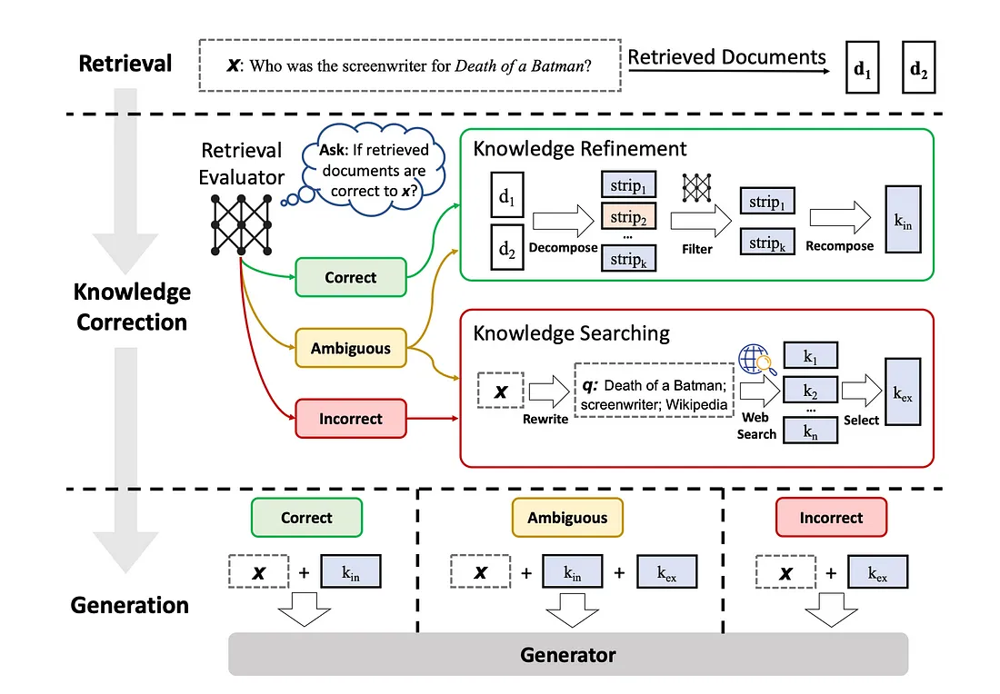
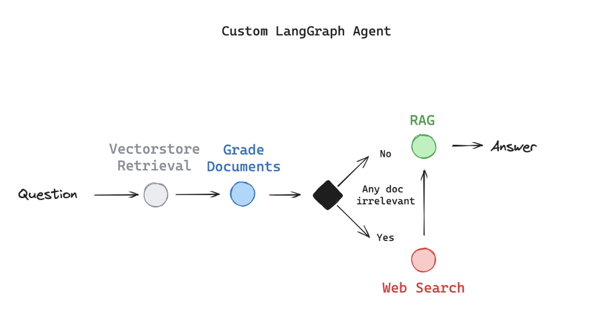

## 背景

在[RAG 实践入门](/rag-from-scratch-overview/) 一文中，我们介绍过 RAG（检索增强生成）在 LLM 应用中的实践，RAG 是当前 AI 信息检索领域的主流方式。随着大模型上下文窗口（context window）不断增加，RAG 在信息检索领域也面临着长文本（long-context）的挑战。

### RAG

一个标准的 RAG 分为 Indexing（索引）和 Retriever-Generation（检索-生成）部分。

#### Indexing

1. Loader: 加载知识库
2. Splitter: 对知识库的文档（Document）进行拆分成文本片段
3. Store: 将文本片段经过 Embedding 后存入向量数据库（VectorStore）


#### Retrieve-Generation

1. Retrieve: 基于用户输入 query，从向量数据库查询匹配片段（splits）
2. Generation: 将用户 prompt，结合 Retrieve 数据，请求 LLM 返回最终结果


#### RAG 的缺陷

1. Retrieve 阶段文档召回的精度至关重要，需要建立一套召回文档的检索评估（retrieve evaluation）系统
2. 对文本进行切片处理，然后再进行检索，在多轮对话过程中，很容易导致丢失上下文间的相互依赖关系
3. RAG 只能解决局部信息检索能力，无法处理多个模块间的关联场景

针对 RAG 缺陷，学术和工业界都有不少优化策略，其中来自中科大的论文，[Corrective Retrieval Augmented Generation](https://arxiv.org/abs/2401.15884) 的针对 Retrieve 阶段召回文档的精度优化提出了新策略。

## CRAG

CRAG (Corrective Retrieval Augmented Generation，可纠正 RAG) 系统可针对 Retrieve 召回文档进行评估（evaluation），如果评估结果为 `Incorrect` 或 `Ambiguous`, 就判定召回文档没有相关性，此时调用「搜索引擎」检索公开文档，并与评估结果为 `Correct` 的文档合并为检索上下文，作为 Prompt 一部分发送到 LLM 返回结果。



了解了 CRAG 系统思想，接下来我们用 Langgraph 来设计一套简易的工程架构来实现。

### 场景

1. 给定若干文档来源，对文档进行分块，写入向量数据库。
2. 对用户提问去向量数据库进行检索，并对检索文档进行评估打分，1：有相关性，0：无相关性
3. 如果评估结果至少一次出现「无相关性」，调用「搜索引擎工具」查询外部公开文档
4. 将两类文档统一作为 RAG 上下文，作为 Prompt 发送大模型，输出答案



### 实现方案

#### 1. 定义图数据结构

```typescript
export type GraphState = {
  /**
   * The LLM to use for the graph
   */
  llm: AzureChatOpenAI;
  /**
   * 用户查询
   */
  query: string;
  /**
   * 结果输出
   */
  result: string | null;
  /**
   * web 查询结果
   */
  needSearch: boolean;
  /**
   * 检索匹配文档
   */
  documents: Document[];
  /**
   * 阶段
   */
  steps: string[];
};
```

#### 2. 定义节点

```typescript
// 1. retrieval 检索节点
export async function retriever(
  state: GraphState
): Promise<Partial<GraphState>> {
  const { query } = state;
  const vectorstore = await FaissStore.load(directory, embeddingModel);
  const retriever = vectorstore.asRetriever(8);

  // rag 上下文检索
  const contextRetrieverChain = RunnableSequence.from([
    // 传递参数
    (input) => input.query,
    // 检索返回文档
    retriever,
  ]);

  const result = await contextRetrieverChain.invoke({
    query,
  });

  return {
    documents: result,
    steps: ["retriever"],
  };
}

// 2. 对检索结果进行评估，打分
export async function gradeDocuments(
  state: GraphState
): Promise<Partial<GraphState>> {
  const { llm, query, documents, steps } = state;

  const gradePrompt = ChatPromptTemplate.fromMessages([
    [
      "system",
      `You are a teacher grading a quiz. You will be given: 
1/ a QUESTION 
2/ a set of comma separated FACTS provided by the student

You are grading RELEVANCE RECALL:
A score of 1 means that ANY of the FACTS are relevant to the QUESTION. 
A score of 0 means that NONE of the FACTS are relevant to the QUESTION. 
1 is the highest (best) score. 0 is the lowest score you can give. 

Explain your reasoning in a step-by-step manner. Ensure your reasoning and conclusion are correct. 

Avoid simply stating the correct answer at the outset. \n\n {format_instructions}`,
    ],
    ["user", `FACTS: \n\n {document} \n\n QUESTION: {query}`],
  ]);

  const gradeSchema = z.object({
    score: z
      .string()
      .describe(`Binary score for Documents relevant to question`),
  });
  const parser = StructuredOutputParser.fromZodSchema(gradeSchema);

  const gradeChain = gradePrompt.pipe(llm).pipe(parser);

  // 挑选匹配文档，非匹配文档调用查询工具
  const filterDocuments = [];
  let needSearch = false;

  for (const doc of documents) {
    const result = await gradeChain.invoke({
      query,
      document: doc.pageContent,
      format_instructions: parser.getFormatInstructions(),
    });
    const { score } = result;
    if (score === "1") {
      filterDocuments.push(doc);
    } else {
      needSearch = true;
      continue;
    }
  }

  return {
    steps: steps.concat("gradeDocuments"),
    documents: filterDocuments,
    needSearch,
  };
}

// 3. 调用工具，搜索公开信息
const tavilySearchTool = new TavilySearchResults();

export async function webSearch(
  state: GraphState
): Promise<Partial<GraphState>> {
  const { query, documents, steps } = state;

  const result = await tavilySearchTool.invoke(query);

  let searchResult = [];
  try {
    const searchJSON = JSON.parse(result);
    searchResult = searchJSON.map((d: any) => ({
      pageContent: d.content,
      metadata: { url: d.url },
    }));
  } catch (err) {
    console.error(`parse err: `, err);
    searchResult = [];
  }

  return {
    steps: steps.concat("webSearch"),
    documents: documents.concat(searchResult),
  };
}

const prompt = ChatPromptTemplate.fromMessages([
  [
    "system",
    `
    You are an assistant for question-answering tasks. 
    Use the following documents to answer the question.
    If you don't know the answer, just say that you don't know.
  `,
  ],
  [
    "user",
    `
    Documents: {documents} 
    Question: {query}
    Answer:
    `,
  ],
]);

// 4. 完成 RAG，输出结果
export async function generation(
  state: GraphState
): Promise<Partial<GraphState>> {
  const { llm, query, documents } = state;

  // 构建 Rag 链条
  const ragChain = RunnableSequence.from([
    // 将 context 和 query 传递给 prompt
    prompt,
    // 构建完毕的 prompt 传递给 llm
    llm,
    // 解析生成文本
    new StringOutputParser(),
  ]);

  const result = await ragChain.invoke({
    query,
    documents: documents.map((d) => d.pageContent).join(`\n\n`),
  });

  return {
    result,
    steps: state.steps.concat(["generation"]),
  };
}
```

#### 3. 定义图，节点，连线

```typescript
const validateSearch = (state: GraphState): "webSearch" | "generation" => {
  return state.needSearch === true ? "webSearch" : "generation";
};

function createGraph() {
  const graph = new StateGraph<GraphState>({
    channels: graphChannels,
  });

  graph.addNode("retriever", retriever);
  graph.addNode("gradeDocuments", gradeDocuments);
  graph.addNode("webSearch", webSearch);
  graph.addNode("generation", generation);

  graph.addEdge(START, "retriever");
  graph.addEdge("retriever", "gradeDocuments");
  graph.addEdge("webSearch", "generation");
  graph.addConditionalEdges("gradeDocuments", validateSearch);
  graph.addEdge("generation", END);

  const app = graph.compile();
  return app;
}

async function main(query: string) {
  const app = createGraph();

  await app.stream({
    llm,
    query,
  });
}

// 测试一：标准场景
main("What are the types of agent memory?");

// 测试二：异常 case
// main("Who won the 2024 NBA championShip?");
```

## 总结

1. CRAG 针对 retriever 返回不准确，为 RAG 设计了一套纠正（corrective）策略，提升了返回的可靠性
2. CRAG 设计的核心是 evaluator，需要设计一套更普遍适用、精准可衡量的评价指标
