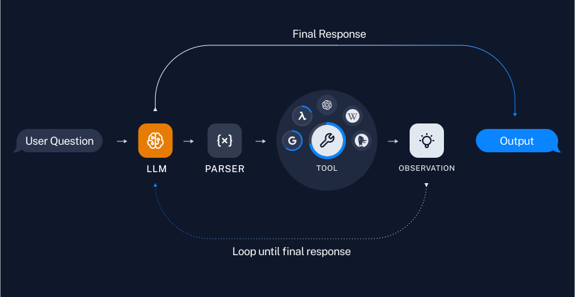
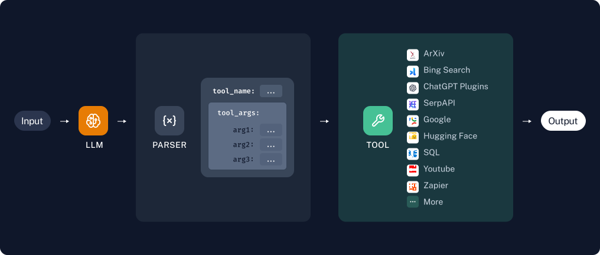
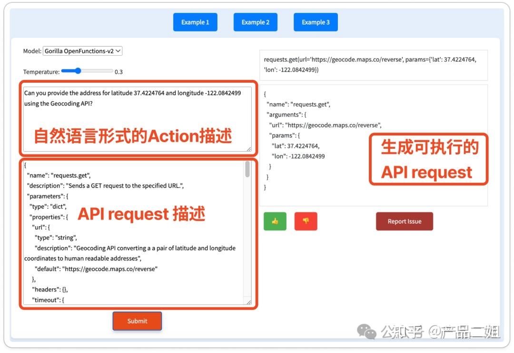
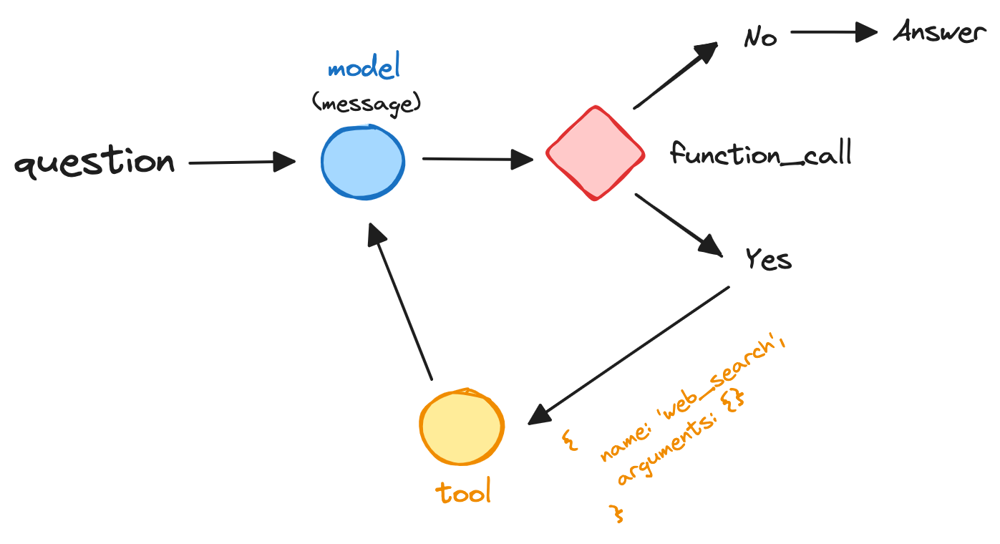

## 前言

人类最显著特征之一就是能够使用工具。人类通过创建、修改和使用外部对象，来完成超出自身能力之外的任务。对于 AI Agent 来说，调用外部工具，可以扩展 LLM 既有能力的边界，包括代码执行能力、上下文扩展能力和三方能力集成等。

Agent 集成外部工具的流程如下:



1. 基于用户的提问，LLM 会设计并规划一个解决方案的思路。类似于人类的思考方式：针对问题 XX，应该选择什么工具来解决，用户提问的关键参数包括哪些？

2. 模型选择合适的工具，提取参数传递给工具执行，获取输出结果（observation），再次传递给 LLM 进行评估，并重新开启 Action(执行) => Observation(输出) => Reflection(思考) 的循环

3. 当模型判断已经掌握了足够多的信息，可以给出最终答案之后，结束循环，并给出最终输出（output）



> tool-use agent parser

## Function calling

LLM 调用外部工具的能力是基于 Function calling 实现，Function calling 是指根据 LLM 规划出来的 Action 描述，按照 tools 中定义的 API，生成正确的调用方式。



Agent 的执行能力强烈依赖于模型的 function calling 能力，同样的代码使用不同模型运行，会出现完全不同的输出，所以选择合适的模型是关键因素。幸好美国 berkekey 大学发起了 Function-Calling [排行榜](https://gorilla.cs.berkeley.edu/leaderboard.html)，截至 2024-06-22 排行前三的分别是：

- 🏅 Claude-3.5-Sonnet
- 🥈 GPT-4-0125-Preview
- 🥉 Claude-3-Opus

> 备注：唯一一个国产模型上榜的是 DeepSeek，一家杭州量化私募基金推出的大模型，吊打一众大厂

对于开发者而言，我们需要准确地定义 API 的功能，参数的命名和描述。以获取天气预报 Tool 为例，我们需要通过 LLM 查询外部 API，才能完成输出。在此以 OpenAI 为例：

```javascript
// 定义获取天气函数
function getCurrentWeather(location: string, unit: string) {
  // ......
}

// 基于 JsonSchema 定义函数的描述信息
const tools = [
  {
    // function 类型，必需
    type: "function",
    // 以下定义函数的详细描述
    function: {
      // 对应上面定义的函数名
      name: "getCurrentWeather",
      // 函数描述，要清晰明确地表达函数的效果，LLM 据此来决定给是否调用该函数
      description: "Get the current weather in a given location",
      // 参数描述，用于提取 Action 参数
      parameters: {
        type: "object",
        properties: {
          location: {
            type: "string",
            description: "The city and state, e.g. San Francisco, CA",
          },
          unit: { type: "string", enum: ["celsius", "fahrenheit"] },
        },
        required: ["location"],
      },
    },
  },
];

// 调用 LLM
const messages = [
  {
    role: "user",
    content: "杭州今天天气怎么样",
  },
];

const result = await openai.chat.completions.create({
  model: "gpt-4-turbo",
  messages,
  tools,
});
console.log(result.choices[0]);
```

返回输出如下:

```typescript
{
  // 完成对话的原因
  finish_reason: "tool_calls",
  message: {
    content: null,
    role: "assistant",
    tool_calls: [
      {
        function: {
          arguments: '{\n  "location": "hangzhou",\n  "unit": "celsius"\n}',
          name: "getCurrentWeather"
        },
        type: "function"
      }
    ]
  }
}
```

返回内容里 `content` 为空，代表 LLM 没有返回文本信息，而是在 `tool_calls` 申明了需要调用的函数名称与参数。值得注意的是，LLM 还指定了另一个参数 unit 为 `celsius`，这也是大模型基于大量数据训练所涌现出来的智能，当检测到用户输入为中文时，就返回中文常用的 `celsius`。

## 在 langchain 中使用 tools

上文我们发现使用原生 API 调用 tools 比较繁琐，使用 langchain 能够极大简化 tools 使用门槛，并且能和现有的 langchain 开发链无缝集成。

首先在 langchain 中，我们一般使用 [Zod](https://github.com/colinhacks/zod) 来定义函数的描述信息，Zod 是 js 生态中流行的类型定义和验证的工具库。

以上文获取天气信息场景为例：

```typescript
import { z } from "zod";
import { zodToJsonSchema } from "zod-to-json-schema";

const getCurrentWeatherSchema = z.object({
  location: z.string().describe("The city and state, e.g. San Francisco, CA"),
  unit: z.enum(["celsius", "fahrenheit"]).describe("The unit of temperature"),
});

// 生成函数的 JsonSchema 定义
const schema = zodToJsonSchema(getCurrentWeatherSchema);

const model = new AzureChatOpenAI();

// 将 tools 传递给 model
const modelWithTools = model.bind({
  tools: [
    {
      type: "function",
      function: {
        name: "getCurrentWeather",
        description: "Get the current weather in a given location",
        parameters: zodToJsonSchema(getCurrentWeatherSchema),
      },
    },
  ],
});

await modelWithTools.invoke("杭州的天气怎么样");
```

执行以后返回 AIMessage 信息，并携带 tool_calls 参数：

```javascript
AIMessage {
  content: "",
  additional_kwargs: {
    tool_calls: [
      {
        function: {
          arguments: '{\n  "location": "杭州",\n  "unit": "celsius"\n}',
          name: "getCurrentWeather"
        },
        id: "call_IMLAkWEhmOyh6T9vYMv65uEP",
        type: "function"
      }
    ]
  },
}
```

可以看到，langchain 返回的数据结构和原始 OpenAI 结果类似。

## langgraph 实现



### 1. 定义工具

```typescript
export const tools = [new TavilySearchResults({ maxResults: 1 })];

// 将 tool 转化为 OpenAI function
export const toolsAsOpenAIFunctions = tools.map((tool) =>
  convertToOpenAIFunction(tool)
);

// toolExecutor 是一个 langchain runnable 对象，可执行 invoke 调用
export const toolExecutor = new ToolExecutor({
  tools,
});

// 给 LLM 增加 function 定义
export const llmWithFunctions = llm.bind({
  functions: toolsAsOpenAIFunctions,
});
```

### 2. 定义图状态（GraphState）

这次我们基于对话方式，实现 agent tool 调用，`GraphState` 只需实现 `messages` 记录即可。

```typescript
export interface GraphState {
  // llm 实例
  llm: AzureChatOpenAI;
  // 对话消息序列
  messages: BaseMessage[];
}

// 初始状态
const agentState: StateGraphArgs<GraphState>["channels"] = {
  llm: null,
  messages: {
    // 注意，新增信息作为消息队列的最后一项
    value: (x: BaseMessage[], y: BaseMessage[]) => x.concat(y),
    default: () => [],
  },
};

const graph = new StateGraph<GraphState, Partial<GraphState>, string>({
  channels: agentState,
});
```

### 2. 定义节点（nodes）和连线（edges）

```typescript
// 调用模型节点
export async function callModel(
  state: GraphState
): Promise<Partial<GraphState>> {
  const { messages, llm } = state;

  const response = await llm.invoke(messages);
  return {
    messages: [response],
  };
}

// 函数调用节点
export async function callTool(
  state: GraphState
): Promise<Partial<GraphState>> {
  const { messages } = state;
  const action = extractToolFromMessage({ messages });
  // 执行 tool
  // 1. 匹配 tool， 调用 tool 传递 toolInput 参数
  const response = await toolExecutor.invoke(action);

  const functionMessage = new FunctionMessage({
    content: response,
    name: action.tool,
  });

  return { messages: [functionMessage] };
}

// 定义节点
graph.addNode("model", callModel);
graph.addNode("tool", callTool);

// 图开始节点
graph.addEdge(START, "model");
// 根据 model 节点推理是否返回 function_call 来判断下一节点
graph.addConditionalEdges("model", shouldCallTool, {
  continue: "tool",
  end: END,
});
// 调用完工具，根据最新 message 记录执行 model 推理
graph.addEdge("tool", "model");

// 根据 function_call 参数定义 model 节点后续节点：tool OR END
const shouldCallTool = (state: { messages: Array<BaseMessage> }) => {
  const { messages } = state;
  const lastMessage = messages[messages.length - 1];
  // 如果没有返回 function_call 结果，调用结束
  if (
    !("function_call" in lastMessage.additional_kwargs) ||
    !lastMessage.additional_kwargs.function_call
  ) {
    return "end";
  }
  // 继续调用下一节点
  return "continue";
};
```

### 3. 验证

```typescript
async function main(messages: BaseMessage[]) {
  const app = createGraph();

  const stream = await app.stream({
    llm: llmWithFunctions,
    messages,
  });

  let finalResult: GraphState | null = null;
  for await (const event of stream) {
    if (Object.keys(event)[0] === "model") {
      finalResult = event["model"];
      const lastMessage = finalResult.messages[finalResult.messages.length - 1];
      if (
        !("function_call" in lastMessage.additional_kwargs) ||
        !lastMessage.additional_kwargs.function_call
      ) {
        console.log(lastMessage.content);
      }
    }
  }
}

main([new HumanMessage("tell me about the weather of hangzhou")]);
```

## 总结

1. function calling 能力是 LLM 调用外部工具的基石，也是 Agent 可靠性保证的来源。模型 function calling 推理能力至关重要，建议优先选择[gorilla 排行榜](https://gorilla.cs.berkeley.edu/leaderboard.html) 靠前的模型。

2. function calling 并不会直接执行 tool，而是经过推理选择合适的 tool name 和 input 参数，tool 清晰明确的参数定义和描述，对于模型的识别能力很重要。

3. 完成一次 function calling 至少要经历 model => tool => model 的循环，如果有多 tool 场景，链路会更复杂。
