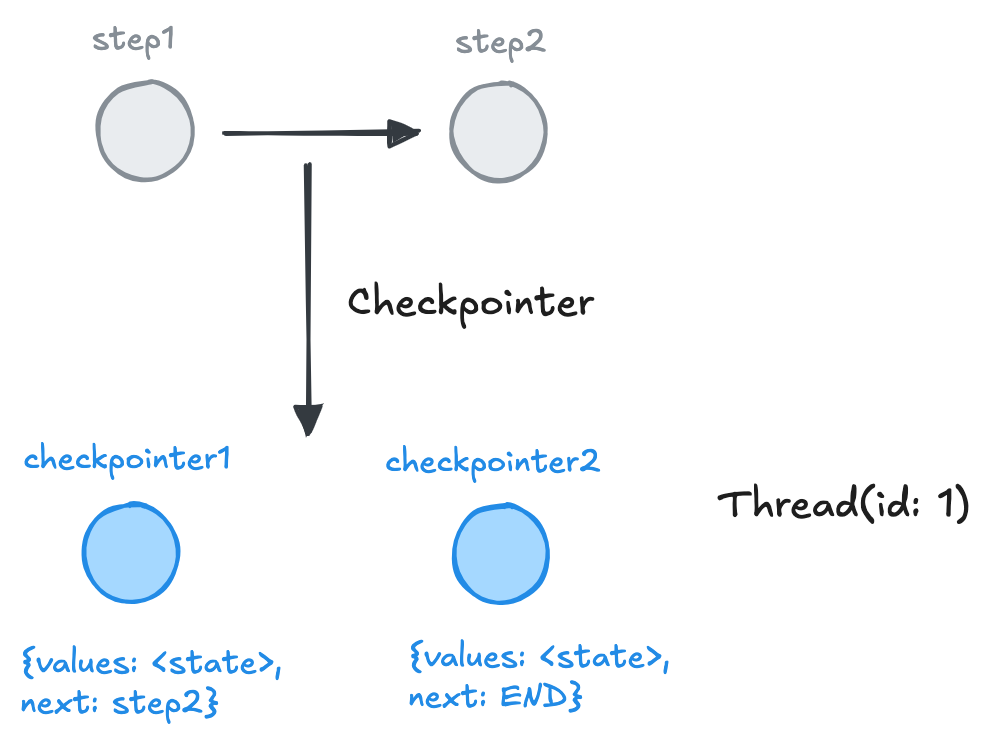

## 背景

AI 应用的状态持久化（Persistence）可以让用户在多轮交互中共享上下文能力，通过让 Agent 记住之前的互动，使用者可在多轮交互中建立连贯的对话，提供更具交互性和个性化的使用体验，从而更深入地探索主题或解决问题。

持久化 Agent 可以实现功能：

- 保存用户的多轮交互信息
- 允许用户在不同阶段介入
- 方便从长时间运行且易出错的任务中恢复到指定节点
- 允许用户在不同的 checkpointer 间实现时间旅行（time travel）
- ...

## 实现方案

基于 `langgraph` 的应用接入持久化能力，需要了解两个概念：

1. checkpointer: 当前对话保存的形式，比如 memory（内存）或 sqliteSaver（关系数据库）
2. thread: 当前对话的唯一 ID，历史会话检索需要基于上下文同一 thread



以 MessageGraph 为例，我们尝试实现 Persistence:

### 定义图结构

```typescript
import { MemorySaver } from "@langchain/langgraph";

const graphState: StateGraphArgs<IState>["channels"] = {
  messages: {
    value: (x: BaseMessage[], y: BaseMessage[]) => x.concat(y),
    default: () => [],
  },
};

export async function callModel(state: IState): Promise<IState> {
  const { messages } = state;
  const response = await llm.invoke(messages);
  return {
    messages: [response],
  };
}

const workflow = new StateGraph<IState>({
  channels: graphState,
})
  .addNode("agent", callModel)
  .addEdge(START, "agent")
  .addEdge("agent", END);

// 增加内存类型的 checkpointer
// 后续运行实例生成的消息列表 messages 都会存储在内存中
const graph = workflow.compile({ checkpointer: memory });
```

### 运行实例

首先我们给出一个不带 thread_id 的例子，运行两个独立实例:

```typescript
for await (const { messages } of await graph.stream(
    { messages: [['user', "Hi I'm Yu, niced to meet you."]] },
    {
      streamMode: 'values',
    }
  )) {
    let msg = messages[messages?.length - 1];
    if (msg?.content) {
      console.log(msg.content);
    } else {
      console.log(msg);
    }
  }

  for await (const { messages } of await graph.stream(
    { messages: [['user', 'Remember my name?']] },
    {
      streamMode: 'values',
    }
  )) {
    let msg = messages[messages?.length - 1];
    if (msg?.content) {
      console.log(msg.content);
    } else {
      console.log(msg);
    }
  }
}
```

结果输出：

```shell
[ 'user', "Hi I'm Yu, niced to meet you." ]
Hello Yu, it's nice to meet you too. How can I assist you today?
[ 'user', 'Remember my name?' ]
I'm sorry, I don't have the ability to remember personal information about individuals.
```

给每个运行实例绑定同一个 thread_id，再次运行：

```typescript
// 基于 thread_id，将上下文对话记录作为同一个上下文保存
let config = { configurable: { thread_id: "conversation-num-1" } };

async function main() {
  for await (const { messages } of await graph.stream(
    { messages: [["user", "Hi I'm Yu, niced to meet you."]] },
    // 上一个 thread_id 对应的消息列表会作为下一个实例消息列表
    {
      ...config,
      streamMode: "values",
    }
  )) {
    let msg = messages[messages?.length - 1];
    if (msg?.content) {
      console.log(msg.content);
    } else {
      console.log(msg);
    }
  }

  for await (const { messages } of await graph.stream(
    { messages: [["user", "Remember my name?"]] },
    // 上一个 thread_id 对应的消息列表会作为下一个实例消息列表的初始消息注入
    {
      ...config,
      streamMode: "values",
    }
  )) {
    let msg = messages[messages?.length - 1];
    if (msg?.content) {
      console.log(msg.content);
    } else {
      console.log(msg);
    }
  }
}

main();
```

再次运行，此时输出结果如下：

```shell
[ 'user', "Hi I'm Yu, niced to meet you." ]
Hello Yu, it's nice to meet you too. How can I assist you today?
[ 'user', 'Remember my name?' ]
Yes, I remember your name. It's Yu. How can I help you?
```

### 状态管理

基于 checkpointer 实现对话消息持久化后，我们可以在 agent 运行期间的的任意位置、任意时间实现图状态（state）的读取(read)、变更(update)、回滚(rewind)、打断(interupt)等操作。

实现状态管理的两个核心方法:

- getState: 获取当前 graph state values
- updateState: 更新 graph state

```typescript
// let config = { configurable: { thread_id: "conversation-num-1" } };

// 获取 thread_id 对应的历史聊天记录（checkpoint）
let checkpoint = await graph.getState(config);
// 打印内存中已保存的对话记录
console.log(checkpoint.values);

----

{
  messages: [
    [ 'user', "Hi I'm Yu, niced to meet you." ],
    AIMessage {
      "content": "Hello Yu, it's nice to meet you too! How can I assist you today?",
      "additional_kwargs": {
        // ...
      }
    }
  ]
}
```

## 总结

1. langraph 实现的 AI 应用可基于 `checkpointer` 实现用户多轮交互应用的持久化
2. 运行时 AI 应用可共享同一 thread_id 的历史交互记录
