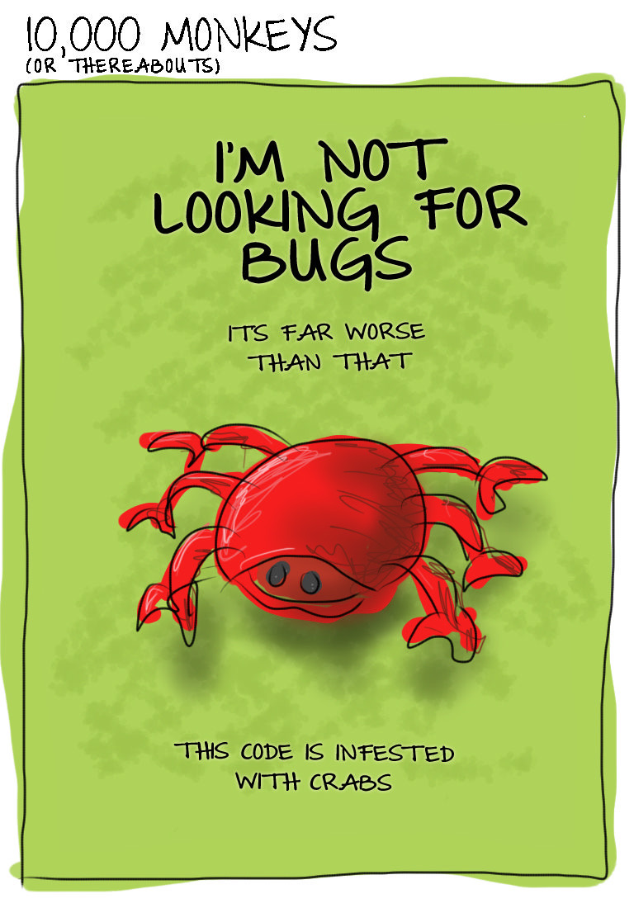

## 1. 心系代码

> 慈故能勇 —— 老子

要想写出好代码，必须要对好代码有执念。想要成为优秀的程序员，必须为之投入精力和时间。
不要忽略编程之乐，体会那些巧妙解决棘手问题的代码之美。


## 2. 保持外观整洁

如果没有编码规范，那就选一个。最好和编程语言主流风格保持一致。

不要在选择代码排版风格上犹豫不决，挑选一种，坚持使用。不要为了编码规范争论不休。即使不是你青睐的，也要这么做。

你应该对编码风格的来龙去脉和优劣得失很清楚，并且不断学习，从别人的经验当中吸取养分。

好的编码规范服务于代码意图，绝不是什么艺术探索。

> 如果一个人想写的清晰，那么首先他应该思路清晰。——歌德

命名有原则：

1. 简洁：充分利用上下文。

```typescript
class Widget {
  // ❌ NO GOOD
  public numberOfWidget;

  // ✅ YES
  public size;
}
```

2. 清晰：不能为了少敲几个键盘，就给变量起一个含义不清晰的名字。毕竟以后变量更多用来「读」而非「写」
3. 地道：采用编程语言推荐的大小写语法
4. 准确：确保命名准确

## 3. 写更少的代码

这些多余的代码就像野草一样，肆意生长，四处蔓延。填满了我们的存储器，扰乱了版本管理系统的历史记录，异常顽固地挡在我们的开发之路上。它们在源代码中到处游荡，使周围优秀的代码不堪重负。它们就是编程中的反物质。

更少的代码意味着更好的软件。

DRY：Don't Repeat Yourself。

确保每一句注释都有其价值，代码本身通常能说明 what 和 how。注释通常是为了解释 why。不解释其然，解释器所以然。

空白就像诗句中的留白，恰当使用，是有益于代码结构的。

童子军法则：总是保证营地在离开的时候，比到来时更加整洁 ——代码整洁之道（马丁）

把清洁代码的工作和功能性提交区分开来，确保在源代码提交中有清晰的记录。

如无必要，勿增实体。写更少的代码，做更有意义的事情。

> 小故事：
> 软件优化的传说：

1. 从一个函数中删除了 14 行无用的代码
2. 这个函数从来没有被调用过，所以把它删除了
3. 事实证明，程序根本无人使用，所以把这个项目彻底关闭了，节省了大量的人力投入


## 4 删除也是一种优化

> 我们把美归结为简单的事物，其没有多余的事物，完全符合目的 —— 爱默生

less is more，少即是多。

YAGNI 原则：you aren‘t gonna need it（你不会需要它）。不要写多余的代码，哪怕你认为这些代码将来会用到，如果现在没用到，就等到真正需要的时候再写。

> 小故事
>
> - 你已经在测试部门工作 1 个星期了
> - 你发现了很多 bug，显得大家看起来都很愚蠢
> - 所以，你被开除了


## 5. 代码的背影

如果没有出现缺陷，就不要修复它。

对旧代码感到不舒服是一件好事，它表明你已经学习到了新知识并有所提高。

> 小故事
>
> ”只有傻瓜才会从自己的错误中吸取教训，聪明人从别人的错误中吸取教训“


## 6. 导航路线

学习代码的最佳途径是由已经熟悉代码的人引领着学习。要积极寻求帮助。

正常构建只需要一个步骤，而且构建过程不需要人工干预。

> 是否用简单、单一的步骤就能构建整个系统，还是需要多个单独的构建步骤？构建过程是否需要人工干预？如果只修改代码的一小部分，那么是否可以只构建修改的部分？还是必须重新构建整个项目才能处理这个小改动？
>
> 最终的发布版本是如何构建的，它是否与开发版本有相同的构建过程？还是必须遵循一组非常不同的步骤？
>
> 当构建运行时，是否输出合适的日志信息？

带有好测试的代码通常也经过了很好的分解、思考和设计，这些测试是进入代码一个很好的途径，能够帮助理解代码的接口和使用模式。

通常，系统的实际架构和理想的设计并不一致。你应该始终相信代码，而非文档。

如果你要学骑自行车，那么你可以学习关于骑自行车的所有理论和书籍。你还可以研究自行车的零部件，拆开再重装，思考自行车背后的物理学和工程学原理。但是这些可能都是”屠龙之术“。除非你跨上自行车，把脚放到踏板上，真正开始骑它，否则永远都不会进步。你是不可能从书山学会保持平衡的，只能从跌倒中学习。

> 学些代码的最佳方法时修改它，然后从错误中学习。

从哪里开始呢？

在研究代码的过程中，寻找这样的机会，可以立即从中获益，且造成破坏的可能性最小。

寻找任何能带你进入系统的目标。

代码中是否有简单明了的 README 文档，如果没有，就创建一个，并包含你目前为止学到的东西。

> 小故事：
>
> 1. 他人即地狱 —— 让.保罗.萨特(存在主义哲学家)
> 2. 他人之代码即地狱 —— 让.保罗.码农


好的代码，就像地图，为你在系统中指引方向。

## 走出泥潭

大概我们都遭遇过流沙代码，不知不觉涉入其中。很快就有了沉沦的感觉。代码是浓稠细密的，极难修改，而且对于任何的修改都有很强的阻力。你付出的努力越多，就陷得越深，这简直是数字时代的陷阱。

有些代码非常卓越，美的像艺术品，优雅的像诗歌。清晰的结构，适当的节奏，优美的韵律，以及连贯性和美感使得阅读和修改都令人身心愉悦。

> 混乱的代码无所不在，要未雨绸缪。准备一些应对的法宝，并且能运用自如。

你不能要求所有的代码都完美，哪怕是对自己，也不能强求。

> 遇到糟糕的代码，要克制自己的厌恶情绪，想办法进行一些切合实际的改善。

如何衡量代码质量：

1. 外部接口是否清晰合理？
2. 数据类型选择是否合理，命名是否规范？
3. 代码布局是否整齐划一？
4. 对象之间的交互方式是否简单清晰，控制流程是否合理？
5. 完成特定功能的代码是否容易定位？

在评估代码质量前，可以做一些软件考古工作：

1. 代码存在多久了？
2. 相对于整个项目，有多少人参与过项目？
3. 最近一次修改是什么时候?
4. 最近修改代码的工程师还在项目里工作么？
5. 代码的 bug 多么？
6. bug 的修复速度怎么样？

> 慎选战场。权衡是否应该投入时间和精力来清理糟糕的代码。置之不理可能更加务实。”如果这段代码还能跑，那么就不要去动它“

> 每一次修改的背后，都事出有因，不要去追究责任。


## 8. 不可忽视错误

> 只要有了自信和无知，就必然能成功 —— 马克吐温

无知者无畏，没有顾虑就容易产生自信。用现在的网络用词讲，那就是”干就完了“。

> 不要忽略代码中的任何错误，不要推迟到以后出错再处理，”以后“处理通常意味着不会处理。

错误的托词：

1. 错误处理使得代码流变得更加混乱，难以阅读，同时遮盖了「正常」的执行流
2. 检查错误会造成额外的工作，我的最后期限迫在眉睫
3. 我知道这个函数永远不会返回错误
4. 这段程序只是用来演示而已，没人会来调用它
5. 我的编程语言鼓励不对错误进行处理（erlang: 让它失败吧，错误的代码应该尽快让它失败，并使其进程终结。）

> 小故事：
> 如何避免代码中的错误：
>
> 1. 代码越多，错误可能潜藏的地方也越多
> 2. 解决方案：那就把代码都删掉，问题解决了


## 9. 意料之中的意外

半杯水对有些人来说是半满的，对有些人来说是半空的。但是有些程序员甚至连杯子都视而不见，在编写代码时，他们根本不考虑异常情况。他们既不是乐观主义者，也不是悲观主义者，甚至不是现实主义者，而是顽固的忽视主义者。

在编写代码时，不要只考虑正常执行的路径。要考虑所有可能发生的不寻常路径，不管是多么不寻常。

对于可修复的代码，为其编写恰当的修复代码。对于无法修复的错误，要尽量编写合理的错误处理代码。听天命，尽人事。但不要忽略它。

问题的关键不是杯子来有多少水，而是如何制造一个密封的玻璃瓶，这样无论有多少水，都不会溢出来。

> 珍惜每一次错误


## 10. bug 追踪

> 如果调试程序是移除 bug 的过程，那么编写程序就是引入 bug 的过程 ——_艾兹格_·W.迪杰斯特拉

预防胜于治疗
应该始终采用可靠的工程实践，将意外发生的可能性降到最低。成熟缜密的设计、代码评审、结对编程和深思熟虑的调试策略是必不可少的。断言，防御性编程和代码覆盖工具都有助于防止系统出现错误。

> 通过合理使用工程实践，减少 bug 进入代码，不要期望快速生成的代码是高质量的。

> 任何人都可以编写计算机能够理解的代码，而优秀的程序员编写的是人类能够理解的代码——马丁.福勒

一个 bug 的修复难度通常由两个因素决定：

1. 可复现的程度
2. 软件缺陷进入时间和你意识到它存在的时间之间的间隔

系统地研究和分析 bug，尽可能收集信息：

1. 确定最简单的复现路径。筛除所有与发现问题无关的细节，它们只会分散你的注意力
2. 确保只关注一个问题。当你没有意识到自己把两个独立但相关的错误合并在一起时，很容易陷入混乱
3. 确定问题的可重复性。复现步骤多久会重复一次问题？是否依赖于一系列简单的行动？是否取决于软件配置或者机器环境？

> 断言和日志都是有效消除 bug 的工具，要高效使用。

但要小心，不要让代码充满无关紧要的日志信息，因为它们会掩盖真正发生的事情，造成不必要的调试噪声。

#### 活用二分法

采用二分法可以聚焦 bug 分析过程。

相对于顺序跟踪代码执行路径。有另外一个选择，确定执行链的开始和结尾，然后把问题拆分成两部分，计算出在中间点问题是否已出现。根据这些信息，你已经把问题空间缩小了一半，重复几次，很快就能定位到问题。

二分法通过缩小问题的范围，以`O(logn)`而非`O(n)`的时间复杂度得到一个解决办法。

#### 软件考古

在版本控制系统中挖掘历史记录，不仅是解决问题的好途径，也是追踪 bug 的简单办法。

> 执行一系列小而频繁，而不是一次性提交大量内容

#### 测试，测试，再测试

就像矿工们的金丝雀一样，在问题变得更复杂和难以收拾前，单元测试会早早失败，暴露问题。

有了一组测试之后，可以考虑使用代码覆盖工具来检查测试实际覆盖了多少代码。一个简单的经验法则就是：如果一段代码没有被单元测试覆盖，那么你就不能相信它可以正常工作。即使现在看起来没问题，之后也有可能出错。

当你确定了 bug 来源时，编写一个简单的测试来复现问题，并在提交修复前将其添加到测试用例中。这么做需要有强大的自制力，因为一旦找到 bug 的罪魁祸首，你自然希望尽快修复并发布。但你应该首先编写一组测试用例来展示问题，并用它来证明问题已经修复。

#### 用排除法查找问题

当问题可以复现时，考虑排除所有与问题看起来无关的代码。以便专注于错误代码上。

#### 保持清洁的环境

不要让 bug 在软件中徘徊停留。

把小问题标记为已知问题并将之置之不理是一种危险的行为。这会导致”破窗综合征“，让人们觉得种种不严谨和邋遢的行为是正常并且可以接受的。不良行为日积月累会掩盖很多的 bug。

> 尽快修复 bug，不要让 bug 堆积起来，将你的代码变成垃圾场

#### 迂回策略

有时候，你会在一个棘手的问题上焦头烂额，毫无头绪。有时候采用迂回策略以避免陷入盲目状态。

- 稍事休息。停下来喘口气，喝杯咖啡，活动一下头脑。休息能够帮助你找到新的视角。与其一头钻入代码，不如停下来斟酌一下问题。

  出去散散步，远离键盘。

- 讲给别人听。通常，当你向别人描述问题时，你也在梳理自己的思路并有可能解决问题。如果找不到人来聆听你的问题，可以采用小黄鸭调试法，通过和一个小物件交谈，等同于是向自己解释这个问题的来龙去脉。

#### 不要急于离开

一旦修复了一个问题，不要盲目往前冲。停下来，思考下这段代码是否还有其他相关问题。已修复的问题是否可能也会出现在其他地方。你通过修复 bug 的收获是否可以改进系统其他未知的代码？

辨别并记录那些包含较多错误的代码，当一段代码总是出错时，在上面花些时间是有必要的，可以考虑重写，进行更深入的代码评审，或添加更多的单元测试。

### 不可复现的 bug

有时你会发现一个 bug 没有清晰的复现步骤。它违背了逻辑和理性，很难确定用户的操作和问题之间的相关性，这些令人讨厌的 bug 就好像是宇宙射线带来的一样。跟踪这些 bug 需要很长时间，因为我们不会在开发环境和调试设备上看到它们的身影。

解决方法：

1. 持续记录产生问题的相关因素。随着时间的推移，你会找到一些规律
2. 考虑在代码版本中添加更多的断言和日志信息。
3. 如果问题紧迫，考虑设置一套独立环境来模拟 bug

可能会出现这类问题的原因：

1. 线程冲突
2. 网络延迟
3. 存储差异
4. 内存溢出
5. 全局变量


> 小故事
>
> 1. 我不是在找 bug
> 2. 问题比这个更严重
> 3. 代码里 bug 比螃蟹都还要明显



## 11. 测试时间

> 质量是免费的，但只有那些愿意付出沉重代价的人才能拥有 —— 汤姆.迪马克《人件》

> 改进软件开发，需要快速反馈。问题已出现就立即研究并解决它们。好的测试策略能够缩短反馈循环。

测试的种类：

1. 单元测试（unit test）
   单元测试是独立测试最小功能”单元“，以确保它们每个功能都正常。如果某个测试不是独立地测试单个代码单元（类 or 函数），那么它们就不是单元测试。
   单元测试不会涉及任何的外部访问：没有数据库，网络或者系统操作。
2. 集成测试（integration test）
   测试检查独立的单元如何集成在一起，并互相聚合，互相操作，以实现更大的功能。集成的组件整合在一起并正确地相互操作。
3. 系统测试（system test）
   系统测试又称为端到端测试，覆盖系统说明书中的所有功能。

单元测试覆盖所有的代码，集成测试和系统测试覆盖所有需求和功能。

> 在编写代码的同时编写测试。不要推迟，否则测试效率会非常低。

单元测试有助于改善设计，不仅能确保功能正常，防止造成破坏，还能探索 API 如何被使用，是否简单且整洁。这是非常宝贵的反馈。测试即文档，用来说明我们的类是如何被使用的。

单元测试简单易行，有助于改善代码结构。

测试应该作为**持续集成**（continuous integration）工具链的一部分，在构建服务器上执行。

> 再好的开发测试也无法取代周密的 QA 测试。为他们喝彩吧

优质的测试有以下特点：

1. 命名简短，清晰。
2. 可维护度高，易于编写，阅读和修改
3. 运行速度快
4. 始终和生产代码一致
5. 可以直接运行，不需要任何的预先配置操作
6. 不依赖任何其他测试用例以及测试执行顺序，不依赖外部状态，也不依赖代码中的共享变量
7. 测试真实的生产代码

坏的测试代码：

1. 有时成功，有时失败
2. 测试代码难以阅读或修改
3. 测试代码太大
4. 在一个测试用例中测试多个行为
5. 测试仅仅是按照顺序执行，而不是针对特定的行为和功能
6. 对不是你编写的第三方代码进行测试
7. 测试用例没有覆盖类的主要行为或功能
8. 测试覆盖很多无意义的细节（比如各个属性的 getter 和 setter）

### 具体的测试

`arrage-act-asert` 模式：

1. arrange：准备测试的输入
2. act：执行操作
3. assert：断言，验证操作结果

测试应该读起来就像代码的说明文档。

### 没有代码是孤岛

代码单元通过两个契约与外部世界交互：对外提供的接口和使用的外部接口。除此以外，它不应该依赖其他东西，特别是不应该依赖共享的全局状态或单例对象。

> 全局变量和单例对象不利于建立可靠的测试。测试具有隐藏依赖的代码单元难度较大。

代码单元提供的接口通常是公有方法、函数、事件和 API 属性。

类的外部依赖对象应该作为构建函数传入。这样可以允许类的所有者配置依赖，从而避开对其他代码的硬连接依赖。

> 构建易于测试的代码，有利于产生好的设计。

> 如果不考虑质量，那我们可以满足所有需求 -- 杰拉德.温伯格

测试有助于编写好的代码和维护代码质量，他们不仅可以驱动代码设计，还可以作为软件的文档。艾兹阁.迪杰斯特拉说过：测试是表明存在 bug 非常有效的方法，但它无法证明没有 bug。

没有测试是完美的，但拥有测试可以增强我们编写和维护代码的信息。在开发测试上投入的精力是一种权衡取舍，你愿意投入多少精力来获得信心？

测试的关键点很简单：编写了代码就要编写测试。为生产代码编写测试，并使用它们来驱动设计。在编写代码的同时编写测试，并自动运行这些测试。

缩短反馈循环。

> 小故事：
>
> 开发者：团队中没有“我”，只有我们
>
> 测试者：提 bug 的时候，没有“你”不行


## 12. 应对复杂性

> 简单是一种美德，需要努力工作才能实现。需要经过学习才能学会欣赏，但人们更愿意为复杂埋单。——艾兹格.迪杰斯特拉
>
> Simplicity is a great virtue but it requires hard work to achieve it and education to appreciate it. And to make matters worse: complexity sells better."

代码是复杂的，我们每天都在和复杂性做战斗。

写复杂的东西太容易了，稍微不注意，事情就会变得复杂。缺乏计划时，事情会变复杂。当你开始处理一个“简单”的问题时，很快它会演变成复杂的问题。你很快会发现有很多极端的情况需要处理。你简单的算法会变成一座迷宫，稍一分心就容易落入陷阱。

软件的复杂性来自于三个方面：

1. 圆团（blobs）
2. 线（lines）
3. 人（people）

### 圆团（blobs）

圆团——我们编写的组件，大小和数量决定了复杂度。

有些软件的复杂性是规模的必然结果，一个项目变得越大，需要的圆团就越多，它就越难理解，也就越难处理。这是必要的复杂性。

但是也有很多不必要的复杂性会给我们当头棒喝。有时这些“巨兽”来自于“模板”自动生成的，缺乏思考的程序员带来了这些令人可憎的事物。

我们需要管理必要的复杂性，教育不思考的程序员。

规模本身不是我们的敌人。我们需要足够的代码量来满足需求。问题是如何设计代码的结构，使代码合理分布。过于简化，而非简单，更非好事。
为了应对规模，问题是如何设计代码的结构，使得代码分布合理。

把复杂性隐藏在一个简单的设计背后。


系统由三个完整的模块组成，每个模块内部可能包含了包、组件，类或其他有意义的抽象。每个组件还可以进一步拆分为小的、易理解且简单的小组件。把问题划分抽象成这样的层次结构，将非常容易被大脑所接受，也使代码更易理解。
我们更喜欢强内聚的类，这些类聚焦于完成少量任务——最好聚焦于只做一件事情。

实现强内聚的诀窍是确保每个圆团具有正确的角色和职责，这会使简单设计你形神兼备，而不是徒有其表。

### 线条（lines）

> 没有代码是一座孤岛——约翰.邓恩

复杂性不是来自于这些圆团，而是源自它们的连接方式。

一般来说，圆团连接越少，软件设计就越简单。连接越多（用专业的术语来描述，称之为强耦合），设计就会越复杂，就必须理解并理顺更多的互操作。

在最基本层面上，一个系统是由多个对象组成，对象间是独立的，没有连接，这样的系统是最简单的。但它根本不是一个系统，而是一些相互独立，没有连接的系统。

真正开始创建软件是从建立系统连接开始，随着更多的圆团和连线，系统也开始变得越来越复杂。





循环依赖往往是连接关系中最复杂的部分。当对象相互依赖时，结构式僵硬的，不容易改变，更改一个对象，常常会引起另一个对象的更改。

这种类型的关系可以通过断开其中一个连接来简化，通过引入新的抽象接口能减少对象之间的耦合。


### 人

软件的复杂性取决于圆团和线条组成的结构。

但要注意一点，圆团和线条不会凭空出现，真正需要负责的是背后编写代码的人。是程序员引入了难以置信的复杂度，但也是程序员将棘手的问题转换为优雅而简单的解决方案。

软件的复杂性通常是历史的产物，程序员持续不断扩展系统，而时间不允许重构。“一次性的原型”变成了一个生产系统，而当原型系统投入实际使用后，我们再也没有机会把它打散并重新重构。

软件的复杂性源于人类在现实环境中的工作。降低复杂性的唯一方法就是掌控它，并防止工作压力使得代码结构变得混乱不堪。

> 小故事：
> 

### 设计之城

> 功能总是决定形式
>
> Form ever follows function —— 路易丝.沙利文

基本的项目决策是在早期做出的，以确保代码能轻松地增长，保持内聚。这些决策包括文件结构、如何命名、符合惯用法的编码风格、单元测试框架的选择以及支持基础设施等。

### 合理放置功能

由于一开始对系统架构有了清晰的概述，因此新功能被一致性添加到合理的功能区域中。

系统架构需要开发人员投入更多，这种额外努力工作的回报就是：当需要维护或扩展系统时，工作会变得容易得多，几乎不会遇到太多的坎坷。

系统架构能够帮你找到正确的位置：哪里需要添加功能，或是修改已有功能。它提供了一个模板，用来将低代码插入系统，也提供了一张地图，用来在系统中导航。

### 一致性

整个系统是一致的。每一层的每一个决定都是以整体设计为背景做出来的。开发人员从一开始就有意这么做，这样产生的代码都是完全匹配设计的，并且匹配已有代码。

> 清晰的系统架构设计造就一致的系统。所有的决定都不应该离开系统架构的上下文。

顶层设计的优雅会自然而然渗透到下层，即使在最底层。代码同样风格统一、排版整齐。清晰的设计可以保证没有重复，采用常见的设计模式，接口设计合理、符合习惯用法，每行代码都基于系统设计的上下文而编写。

> 清晰的架构有助于减少功能的重复

### 架构的演进

系统设计被认为是可以改变和可重构的。开发团队的核心原则之一就是保持灵活敏捷（没有任何东西是刻在石头上一成不变的），因此系统架构按需而变，这鼓励我们保持设计简单可变。因此，代码可以快速增长并保持良好的内部结构。
在系统中增加新的功能从来不是问题。

> 软件架构不是一成不变的，如果需要，就可以改变。
>
> 想要改变，架构必须保持简单。

### 延缓设计决策

YAGNI 法则：如果你不需要它，就保持不变。

> 当需求还不清晰时，不要做设计决策，不要猜测。

### 保持质量

相信系统设计，并且认为它需要被保护。设计的所有权属于团队每一个人，并愿意为之承担责任。

### 管理技术债

为了保证项目按时交付，一些走捷径的做法被特别批准了，为了避免在版本面临发布时再进行高风险性的更改，有细微瑕疵的代码或设计缺陷被允许合并代码库。
这些瑕疵会被明确地标记为**技术债务**，这些缺陷是如此地明显，以至于开发人员都想除之而后快，这就是开发人员对设计质量的责任感。

> 技术债（Technical Debt）类似于金融领域的贷款概念，在开发软件过程中为了快速完成某一项进度而采取的一些不规范或者不完美的实现。
>
> 贷款总是要还的，还款的时间越长，付出的代价就越大。
>
> 从长远来看，较低的代码质量意味着较长的开发时间，但是负责任的短期贷款可以加快开发速度。有时编写不够完美的代码可以被认为是“务实的”，但是务实的选择和草率的选择是有区别的。
>
> 有意识地管理技术债将对你大有帮助，不要让债务堆积起来，时刻让它处于显眼的位置，像真正的贷款一样，尽早偿还，避免额外付出成本。

### 测试方案设计

> 为系统软件一组良好的自动化设计。能够以最小的风险进行基本架构调整。同时能给你带来架构调整的运作空间。

单元测试显著地影响了代码设计，保证了良好的代码架构。每个组件单元都被设计成定义良好且可独立存在的实体——必须在单元测试中单独构建该组件，而无须构建与其相关的系统的其他部分。编写单元测试可以确保每个模块都高内聚，并与其他系统松耦合。

### 设计时间分配

金发姑娘法则：凡事须有度，不要超出极限，刚好就行。

系统设计时间刚刚好就行，既不太长也不太短。如果时间太长，程序员通常会想创建心目中的杰作（看起来总是差一点，但从来没有真正实现过）。有一点压力是好事，紧迫感有助于把事情做好。如果时间太短，就不能做出真正有价值的设计。

> 良好的项目计划能带来优秀的设计你。分配足够的时间才能创造架构上的典范——这可不是即刻就能完成的事。

### 与设计同行

虽然项目代码规模很大，但它具有良好的一致性，易理解。开发者可以快速掌握。没有不必要的交互连接，也没有奇怪的遗留代码。

因为编写代码过程问题较少，项目工作进展保持顺利。团队成员保持稳定。一定程度上是由于开发人员拥有设计的所有权，并不断改善它。

团队中的每个人都不拥有专属的设计领域，任何开发人员都被期望参与到系统设计的优化中。这是反向的康威定律，优秀的软件使得团队凝聚在一起。

> 团队的组织形式对生成的代码有不可避免的影响，随着时间的推移，架构反过来会影响团队协作。

### 那又怎样

好的软件架构来源于很多因素：

1. 编写代码之前，设计先行
2. 系统设计师的素质和经验
3. 在开发过程中，要保持设计清晰可见
4. 授权团队成员参与到整体设计优化中
5. 勇于做出改变，没有什么东西是一成不变的
6. 团队拥有合适的成员关系，确保开发团队规模合理，确保团队内部有健康的工作关系
7. 在适当的时间做出决策，当需求不明确时，就退出决策时机
8. 良好的项目管理和合理的项目期限

> 小故事：第二系统效应
>
> 1.  我一直希望我的计算机像我的电话一样好用
> 2.  梦想成真了，因为我已经不会用我的电话机了 
>     

> 时间并不能治愈一切
> 
