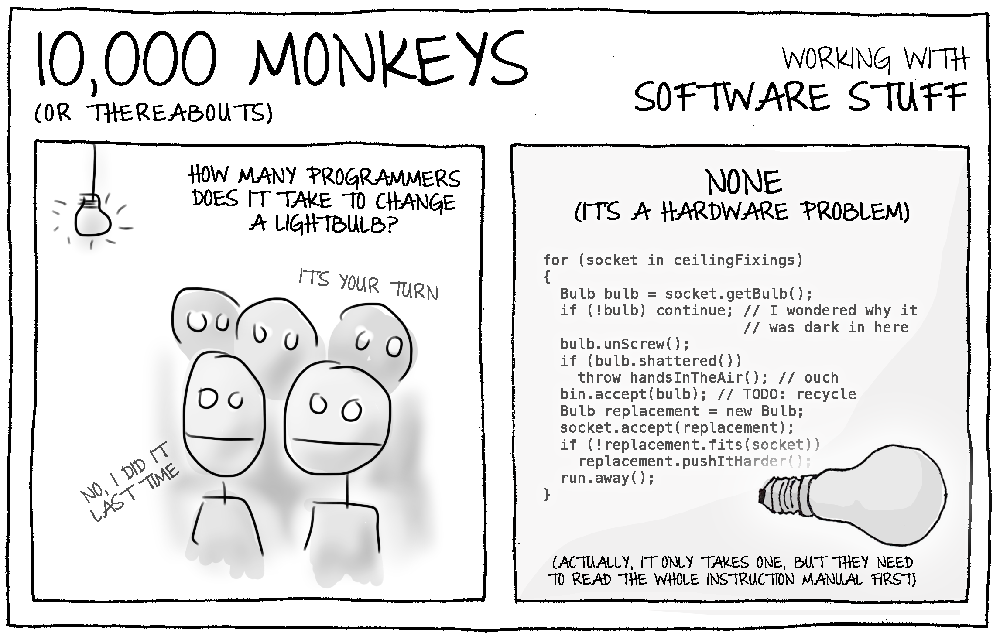
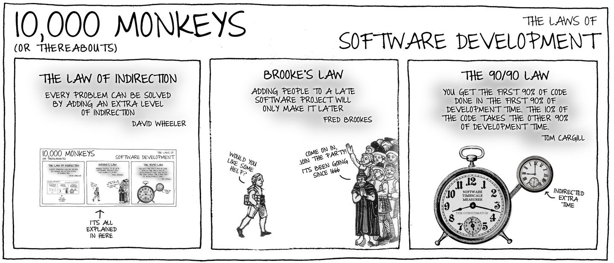
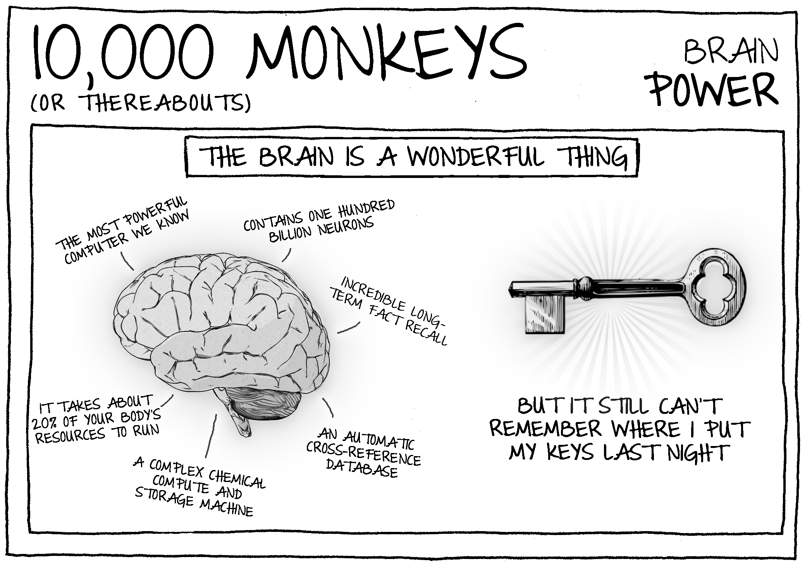
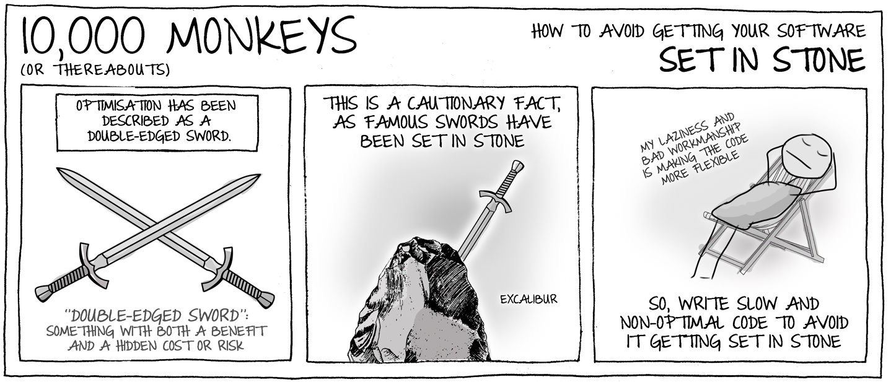
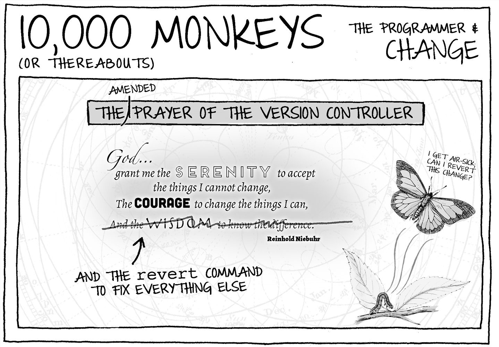
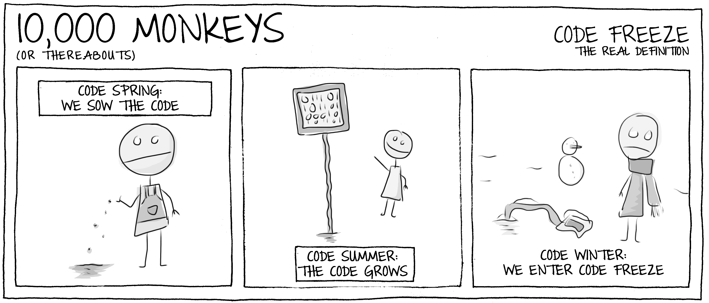
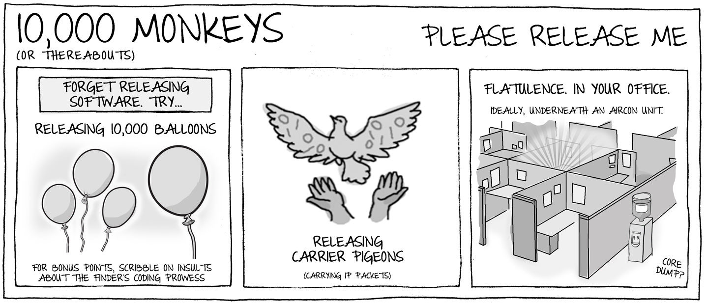
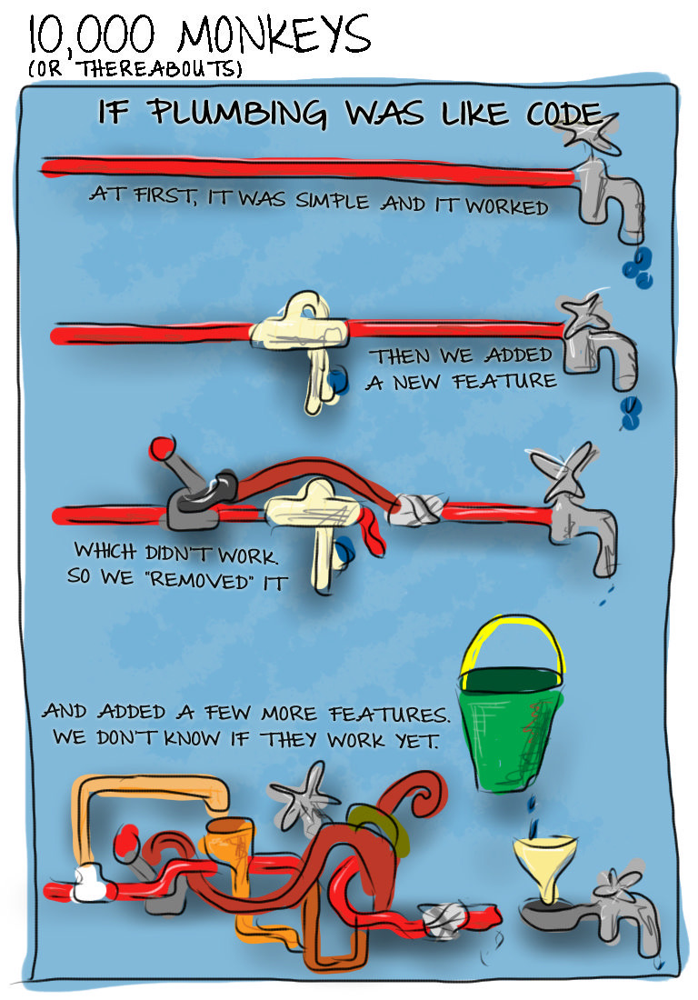

## 14. 软件开发是...

> 这就是我们的生活，远离了公众的纠缠，在树木中找到语言，在奔流的小溪中找到了书本，在石头中找到了布道，在一切事物中找到了美好
> —— 莎士比亚《皆大欢喜》
>
> And this, our life, exempt from public haunt, finds tongues in trees, books in the running brooks, sermons in stones, and good in everything.
> —— as you like it

作为有责任心的开发人员，我们都渴望用**正确的方式** 编写**正确的代码**，真正优秀的程序员具有这样的特征，真正关心他们编写的软件的编写方式。我们需要精心烘焙的手工代码，而不是那种意大利面罐头式的废话。

第一个问题：作为程序员，你真正想提高么？你真的想用正确的方式编写正确的代码吗？

软件开发是科学、艺术、游戏、运动、各种琐事的集合体。

### 软件开发是......艺术

代码不仅仅是二进制和字节，也不仅仅是方括号和大括号。它具有结构性且优雅，稳重而又不失平衡，充满品味和美感。

> 程序员需要品味和美感来编写卓越的代码

软件开发过程中的许多部分类似于艺术品创作：

1. 创造性（creative）
   软件开发需要有想象力，软件的构造必须精巧，设计必须精确。开发者必须对要创建的代码有一个远景，并对如何实现有一个计划。很多时候这需要很强的独创性。

2. 美感（aesthetic）
   好的代码以优雅、美丽和平衡为调整。存在于一定的文化风格框架内。在考虑代码功能的同时，也要考虑代码形式

3. 工匠（mechanical）
   作为艺术家，要熟练掌握工具、过程和技术。

4. 团队合作（team-based）
   很少有艺术创做需要艺术家独自坐在工作室里埋头苦干就能完成。雕塑大师要和学徒一起完成创作，管弦乐队各个成员要听从指挥，共同完成演奏。作曲家谱完曲子要由演奏者来表演，而建筑师设计完要由建筑团队来实现。

当被问起是如何创造雕塑作品《大卫》时，达芬奇说：我往石头看，就看到他在那里，然后就把剩下的东西凿掉了。

你是怎么做的，是否降低或消除了软件开发的复杂度，通过将复杂的部分全部剥离掉，得到了想要的艺术品呢？

### 软件开发是......科学

> 任何聪明的傻瓜都可以让事情变得更大、更复杂、更激烈。往相反的方向则需要天分，以及很大的勇气。——爱因斯坦
>
> Any intelligent fool can make things bigger, more complex, and more violent. It takes a touch of genius—and a lot of courage—to move in the opposite direction.

> 想象力比知识更重要，知识是有限的，而想象力可以囊括整个世界 ——爱因斯坦
>
> Imagination is more important than knowledge. Knowledge is limited. Imagination encircles the world.

软件是一门科学：

- 严谨（rigorous）

  好的软件必须准确，经过检验、度量、测试和验证。

- 系统（systematic）

  软件开发需要计划、设计、预算和系统化的构建。

- 富有洞察力（insightful）

  软件开发需要有深度的思考和敏锐的分析，像科学一样，要大胆假设，小心求证。

> 好的软件开发不是牛仔式的自由编码，而是暂时放心你能想到的第一个方法。开始一段深思熟虑的精准过程。

### 软件开发是......运动

大多数运动项目需要技巧和努力：坚韧、训练、纪律、团队协作、指导和自我意识。

- 团队协作

  软件开发需要多人协作，需要不同技能的人在一起和谐工作

- 纪律

  每个团队成员都需要对团队负责，并愿意尽最大的努力。这需要奉献精神、积极进取和大量训练。

- 规则

  软件团队需要遵循一套规则和团队文化。

你见过一群 7 岁的孩子踢足球么？除了一个孩子被当做守门员，其他的孩子在球场上疯狂地追着球跑，没有传球，没有沟通，没有人意识到还有其他团队成员。一群孩子的注意力都被集中在一个移动的小球上。

一个真正的球队以以一种更具凝聚力的方式运作，每个人都知道自己的责任，团队团结一致。他们为共同的愿景而努力，并形成一个高效、协调的整体。

### 软件开发是......游戏

- 学习

  孩子之所以意识到自己在学习，是因为他们本就一无所知。学习需要一个简单的特质：谦逊。自以为是的程序员是最难共事的群体。

孩子们不断吸收着新知识，想要进步，学习是唯一的途径。我们必须实事求是地面对自己所知道的和不知道的。

享受学习，品味发现的新事物，练习和提高你的技艺。

- 简单

  你是否尽可能编写简单的代码，你是否能做到追求简单的最大化，以编写更易理解的代码？

孩子们总是刨根究底试图弄清楚真相，他们愿意用有限的视角来理解新事物，他们总爱问为什么。

我们应该不断地问为什么，对于自己在做的事情，多问几个为什么，不断地尝试更好地理解问题，找到最佳解决方案。

- 快乐

  编写代码应该是一段快乐的旅程。

### 软件开发是...鸡毛蒜皮的琐事

软件开发并不总是令人愉快，也不总是一帆风顺。为了完成项目，总有一些单调乏味的工作需要有人来处理。

我们必须时不时成为软件守护者：

- 清理

  及时发现问题并加以解决，修复必须及时，且不能造成破坏。守护者不会把这样的工作留给别人，他们会承担起守护责任

- 幕后工作

  守护者不会再聚光灯下工作。他们非凡的努力可能很少得到认可。守护者扮演的是支持角色，而非主角

- 维护

  守护者会删除僵尸代码，修复受损代码，重构或者适当重建不当代码，并对代码进行整理和清理，以确保不会年久失修，破败不堪。

### 隐喻太多

软件开发拥有自己的特性，没有其他事物和它完全一致。这仍然是一个不断被探索和完善的领域，没有一个类比是完美的。

卓越的软件都来自于用正确的方式来编写正确的代码，而不是源自创建意大利面条式的代码。

> 小故事：
>
> 1. 换灯泡需要几个程序员？
> 2. 一个也不需要（这是一个硬件问题）
> 3. 实际上，只需要一个，但他需要完整地阅读一遍说明书
>    

## 15. 遵守规则

> 如果我遵循了所有规则，我将一事无成 —— 玛丽莲.梦露
>
> If I’d observed all the rules, I’d never have got anywhere

我们生活中充满了很多规则，有些规则是强加于我们的，有些则是我们自己设定的，规则润滑了生活的齿轮。

规则支撑了我们的游戏，描述了游戏是如何运作的。规则使得运动公平愉快，并给我们提供了大量的机会对其进行演绎。

规则约束了我们的社会生活，生活中每时每刻都有规则，我们已经习惯如此，以至于对它们视而不见。

在编码世界中，我们遵循的规则范围更广：开发规程规范，工具集和工作流程，编程语言的语法，设计模式等等。这些规则告诉我们什么是专业的程序员，我们怎么和其他人玩软件开发的游戏。

规则使我们相互合作，也能规划和协调我们的行动。

### 1. 我们需要更多规则

我们需要自己定义规则，自己可以主宰的规则，以及定义团队中的文化和工作方法。规则不必是大而不当的严格命令，可以很简单。这些规则描述的不仅是方法和过程，还有团队文化，即如何成为团队中优秀的一员。

> 开发团队有一组规则，这些规则定义了我们该做什么以及怎么做。同时也描述了团队的编码文化。

我所在的团队，开发之道被总计为三条互补的简单原则。所有其他的实践都遵循这些规则。这些规则已经成为了团队中神圣不可侵犯的传统。我们把它们用美观的大字打印出来，张贴在公共区域。这些规则指导着所有的开发活动。每当面临选择，要做一个棘手的决定，或者进行异常激烈的讨论时，它们都能帮我们找到正确的答案。

准备好接受智慧的洗礼了吗？做好注备，以下是我们编写好代码的三条惊天东队的规则：

1. 保持简单（Keep it simple）
2. 开动脑筋（Use your brain）
3. 没有什么是一成不变的（Nothing is set in stone）

就这些，很棒吧？

我们之所以制定这些规则，是因为相信它们会带来更好的软件，并帮助我们成为更好的开发者。

它们完美描述了我们团队的态度，社区意识和文化。我们的规则言简意赅，我们不喜欢冗长的官僚指令和不必要的复杂性。开发人员自己负责解读和遵循规则，我们信任团队，这些规则赋予了团队力量。团队总是在开发中开创性地运用规则，我们不断总结经验并寻求进步。

> 不要依赖模糊，不成文的团队规则。使规则清晰明确，并以此为基础打造团队文化。

请牢记第三条规则，”没有什么是一成不变的“，包括你的规则，毕竟，规则就是用来打破的。更确切地说，规则是用来重新制定的。随着团队的学习和成长，你的规则会随时间发生合理的变化，现在合理的事情在未来就可能不那么合理了。

> 立刻行动：制定开发团队自己的规则。把它们打印出来，贴在办公室的墙上。

> 小故事：
> 

1. 中间层定律：每个问题都可以通过添加合理的中间层来解决

   The law of indirection: Every problem can be solved by adding an appropriate middle layer——David Wheeler

2. 布鲁克斯定理：在一个延迟的项目中添加人手只会导致项目延期更严重。

   Brook's law：adding people to a late software project will only make It later。

3. 九九定律：当项目进行到某个阶段时，看似已经完成了 90%的工作，但实际上还有另外 90% 的工作需要完成。

   90/90 law：you get the first 90% work done，the rest of the work still takes another 90% development time。

## 16. 保持简单(Keep It Simple)

> 简单是复杂的终极境界 —— 达.芬奇
>
> Simplicity is the ultimate sophistication.

你一定听过这个建议，`keep it simple, stupid`，意思就是”保持简单，傻瓜“。一个人是有多么愚蠢才会忽略它呢？简单无疑是极好的目标，当然应该在软件开发中实现，没有哪个程序员愿意处理过于复杂的代码。简单的代码透明、结构清晰、bug 少、易学易用。

在程序员世界中，有两种简单：错误的（wrong）和正确的（right）。

不动脑子的方法不能产生简单（simple）的代码，而是`过于简化`（simplistic）的代码。`过于简化` 的代码错误重重。由于考虑不周，代码和需求不匹配，通常只考虑表面可见的部分，忽略业务处理，不能处理非常规的输入。

简单绝不是编写错误代码的借口。

> 简单的代码需要设计，它与过于简化的代码不是一回事

我们应当追求简单的代码，而不是不经过大脑，”过于简化“的代码。

### 16. 1 简单设计（Simple Designs）

简单设计有一个明确的标记：可以被快速、清晰地表达出来，且易于理解。你可以用一个简单的语句或清晰的示意图来概括它。简单设计很容易概念化。

#### 简单易用（Simple to Use）

简单的设计使用起来很简单，认知成本低。

因为没有太多东西要提前学习，所以很容易上手。使用最基本的工具就可以开始工作。其高级功能会在你需要时像精心编写的故事一样徐徐展开。

#### 防止误用（Prevents Misuse）

简单的设计很难被误用和滥用。保持接口简单，能够减轻使用接口人员的负担，从而使用户受益。

将复杂性放在正确的位置很重要：隐藏在一个简单的 API 后面。

> 简单的设计旨在防止误用。为了呈现更简单的 API，我们宁愿引入一个额外的内在复杂性。

#### 组件大小（Size Matters）

保持每个组件只做一件事情，即使会导致组件数量变得很多。

> 简单的设计要尽可能小，小到不能再小

#### 代码调用路径短（Shorter Code Paths）

简单的设计会减少中间层，并确保功能和数据不会离用户太远。

#### 稳定性（Stability）

简单设计一个明确的标记就是稳定性。代码可以增强和扩展，却不必大量改动。如果随着项目进行，需要反复修改同一段代码，则说明要么需求非常不稳定，要么设计不够简单。

简单的接口往往是稳定的，不会发生太大的变化，你可以用新服务来扩展，单不需要重写整个 API。

### 16.2 简单代码

简单的代码易于阅读和理解，所以很容易修改。

一致性对简单的代码至关重要。

> 一致性能使代码清晰

### 16. 3 保持简单，别做蠢事（Keep it simple , don't be stupid）

当你遇到 bug 时，通常有两个解决方案。

1. 采取最简单的解决方案，想保持简单，对吧？先解决表面问题，在问题上打个补丁即可。如果解决深层次的问题工作量很大，那就先放一放。但是，这可能面临前面提到的过度简化的问题。
   这种解决方案没有使得事情变简单，反而更复杂了，你给代码增加了一道新的疤痕，但没有解决深层次的问题。
2. 重写部分代码。这样既解决了问题，又保持了简单。也许必须调整 API，也许进行一些重构为 bug 修复提供合适的空间，甚至可能需要大规模重写代码，因为你发现之前的假设不再成立。

后一种选择是我们的目标，它确实工作量很大，但是从长远看，保持简单是值得的。

> “创可贴”不能产生简单的代码。

### 16.5 避免过早优化

> Premature optimisation is the root of all evil (or at least most of it) in programming
> 不成熟的优化是编程中的万恶之源 —— 高德纳

首先编写清晰易懂的代码，只在需要的时候才把它变得复杂。

### 16.6 足够简单

我们都知道简单的代码比过分复杂的代码要好，也都见识过丑陋、复杂的代码，没有人一开始就计划写这样的代码。在通往复杂性的道路上，总是伴随着匆忙的变更和不断下滑的标准。也许一开始只是一个稍微懒惰的变更，只加一个创可贴式的修复，只跳过一次代码评审，只有一次“我没有时间重构”，但日积月累，代码变成了一团乱麻，很难再恢复正常。

很遗憾，保持简单是很艰难的。

简单性是源于无数开发准则的一面旗帜，比如从充分性的角度来看：YAGNI。从代码可扩展性的角度来看：DRY。从系统设计的角度来看，简单性体现在高内聚和低耦合。

## 17. 开动脑筋（use your brain）

> Keep is Simple, don't be stupid
>
> 保持简单，但别犯傻

聪明人也会犯傻，功夫宗师也会拌跟头，优秀的架构师有时也会犯一些常识性的错误，错过眼前那些显而易见的东西。

我们常常会有奇怪的欲望：编写令人兴奋的算法或精心设计巧妙地数据结构，这种欲望使我们沉迷，进而看不到事实：事实上这是一个简单数组就能够解决的问题。在匆忙发布版本的时候，大量不合格的代码会喷涌而出。压力使得我们不能仔细思考，这时候就会写出愚蠢的代码。

连作价都无法避免这一点，作为普通开发者，我们更是如此。确保你没有对常识视而不见，不要使设计过于复杂，不要做那些显而易见的蠢事。

> 停下来思考一下，不要写愚蠢的代码

我们都会时不时犯错，没有人总是编写完美无缺的代码。所以，当你意识到自己编写了一些愚蠢的代码，或者做了一个愚蠢的设计，这没什么大不了，每个人都会犯错。

坦率地承认错误，及时去修改，采用更好的设计。承认失败并改正错误需要勇气。相比通过在残缺的代码上不停打补丁挽回面子。这样做更需要勇气，尊重代码，把烂摊子收拾干净。

> 承认错误，并对失误的编码负责，从错误中学习。

### 避免盲目

不动脑筋编程很容易。凭着本能的习惯，当你的手指开始敲出几行代码时，你很容易就会任由代码从指尖汨汨而出，从而陷入一种墨守成规的状态。试图解决眼前的问题，而没有真正考虑全局，没有考虑上下文其他代码，或者没有考虑一些边界问题。

这不可避免地产生了很多愚蠢、冗长、过于复杂的代码。

当你面对一项编程任务时，停下来，让思维后退一步，考虑是否有其他解决方案。检查一下你是否正在埋头推进计划，而采用这个计划仅仅是因为它是第一个出现在你脑海里的，你并没有尝试去想其他的解决方案。

> 集中精神。在编写代码时不要漫不经心

### 你可以思考

“use your brain”，意味着你可以使用大脑，并且被鼓励如此。

某些程序员没有承担起他们应有的责任。他们凭本能编程，仅仅是在做填补别人设计中的空白工作，或者遵循已有的结构和惯用法，仿佛机器人一样，没有思考的能力。

当你面对一段代码时，通过思考来决定它的结构。你拥有这些代码，要对它担负责任。积极主动地做出决策，进行必要的改善和修正。

如果发现代码充斥着创可贴式的修改，不要效仿，不要在应当进行深度调整时退缩，不要再添加一片创可贴。要明白，解决问题是你的责任，你可以严格地评估已有代码。

你需要勇气来拥有一个观点，并且能够表达它。让代码变得更好值得你坚持和拥护。

> 勇于开动脑筋思考，你有权利也有能力对代码进行评判。并就如何改进做出决策。

> 小故事：
>
> 1. 大脑真是一个奇妙的东西：
>
> - 已知最强大的计算机
> - 包含了 1000 亿个神经元
> - 令人难以置信的长期记忆
> - 复杂和化学计算和存储机器
> - 还需要身体 20%的能量来维持
>
> 2. 然而它还是不记得我昨晚把钥匙放哪去了
>    

## 18. 没有什么是一成不变的

Nothing Is Set in Stone

> 人们总说时间改变一切，但实际上你必须自己去改变它们 —— 安迪.沃霍尔
>
> They always say time changes things, but you actually have to change them yourself.

编程领域有一种奇怪的说法：一旦代码编程完成，它就是神圣不可改变的。

如果需要修改代码，确实会带来非常真实的焦虑。如果对于代码的逻辑不从里到外理解透彻，如果不是百分百确定要做什么，如果不是完全清楚每一个变化的结果，那么就有可能带来奇怪的破坏，或者改变软件在某些特殊条件下的行为，引入一些微妙的 bug，对吧？

软件应该是软的，而不是硬的。然而，恐惧使我们冻结代码以避免破坏。
Software is supposed to be soft, not hard。

> 不要试图将代码不可改变。如果产品中有不可更改的代码，那么产品就会腐化。

当最初的作者离开项目，没有人完全理解对业务关键的遗留代码时，我们就会看到死亡僵硬的状态。当遗留代码难以修改，甚至无法对遗留代码做出可靠的评估时，程序员就会避开代码的核心地带。从此它就会变成一个不受拘束的“代码荒原”，在那里“数字野兽”无拘无束地游荡。为了以一种及时和可预测的方式工作，新增加的功能被作为卫星模块添加到系统的边缘。

代码绝对不应该静止不动，无论最初是如何煞费苦心地确认需求，需求总是处于不断地变化状态中。产品版本 2.4 和 1.6 的差异如此之大，以至于代码内部的逻辑完全不同，我们总是在旧代码中发现需要修复的新 bug。

当代码变成了一种束缚，你不是在开发它，而是与之搏斗。你将永远围绕着坏死的逻辑跳舞，围绕着不可靠的设计进行更加晦涩难懂的规划。

> 作为软件的主人，一切尽在你掌握中。不要让代码或流程来决定项目如何发展。

### 大胆改变（Fearless Change）

大型软件项目包含许多必须掌握的细微之处和复杂性，谁都不想由于修改过于草率引入 bug，没有人希望在不明就里的情况下贸然做出变更。那是不负责任的编码方式。

如何平衡改变的勇气和犯错的恐惧呢？

- 学习如何进行好的变更。有些做法可以提高安全性，减少出错的可能。勇气来自自信，自信来自修改的安全程度。
- 每天对代码进行改善，使其更具可塑性
- 真心接受那些能够使代码走向繁荣的心态。

但最终要勇敢的去改变。你既可能会失败，也可能会出错，但总是可以将代码回退到之前正常工作的状态，然后重试。尝试并不可耻，你会从错误中汲取教训，只要确保任何更改在进入生产环境前有足够的评审和测试。

没有什么是一成不变的，设计不是，团队不是，流程不是，代码也不是。理解这一点，你就能理解自己在改善软件中扮演的角色了。

> 修改代码需要勇气和技巧，不要鲁莽。

### 改变态度

> 产生“好的代码”不是别人的问题，这是你的责任。你有能力做出改变，带来进步。

- 修复错误的、危险的、糟糕的、重复的代码。不要让问题越积越多，如果你发现代码已经让人望而却步，那么必须尽快修改它
- 鼓励重构。
- 没有人“拥有”代码的专属区域。任何人对代码的任何部分都可以做出修改。避免代码狭隘，它扼杀了变化的速度。
- 犯错误或者编写有问题的代码是很正常的，每个人都需要不断学习和成长。
- 每个人的意见都很重要，需要平等对待。
- 优秀的程序员期待变化，因为这就是软件开发的意义所在。代码变化很快，要习惯接受。
- 推行问责制。评审，结对编程和测试是确保代码保持灵活性的关键部分。如果有事情出错了，那么我们能在其成为问题之前发现它。

### 做出改变

有一个流传已久的故事：一个游客在乡村迷了路。他拦住一个当地人，问他怎么去一个遥远的小镇。村民考虑了一会儿，慢吞吞地回答：如果我要去那里，我就不会从这里出发。

这听起来很傻，但通常旅行开始的最佳地点不是你当前所在的位置——一个代码泥潭。如果试着往前走，你可能会沉下去。相反，回到一个合理的地点，将代码引导到一条公路上，而公路可以通往高速公路，然后以更快的速度向目标推进。

学习如何找到深入代码的路径是很重要的，特别是如何绘制出路线，如何跟随路线并深入，了解路线上什么地方隐藏着陷阱。

#### 规划改变

我们鼓励生成可变更的代码。简单（simplicity），清晰（clarity），一致（consistency），具有这些特性的代码意图清晰明了，容易修改。应避免生成带有副作用的代码，因为它在面对更改时很脆弱。如果你遇到一个做两件事的函数，把它分成两部分。把隐式编程显式。避免刚性耦合和不必要的复杂性。

当一个丑陋的、僵硬的代码项目抗拒改变时，应采用以下策略：缓慢改进代码，进行安全、零散的改进。有时候调整局部代码，有时候修改整体结构。经过一段时间，它就会进入一个可塑的状态。

> 进行一系列频繁的、微小的、可验证的调整，而不是一次大规模的代码重构。

不要试图调整所有的代码，这是一项艰巨而棘手的任务。相反，要确认需要与之交互的一部分代码，并集中精力修改。

#### 改变的工具

好的工具可以帮助你进行安全的变更。

一套好的自动化测试工具可以让你工作得又快又好。关于修改是否造成了破坏。自动化测试能够使你获得快速、可靠的反馈。

> 自动化测试是一个极为有益的安全工具，可以帮助你建立对代码修改的信心。

开发的主干（backbone）应该是持续集成，一台不断签出新版本并进行构建的服务器。如果有什么不好的东西溜进代码库并造成破坏，导致构建失败，你将很快发现它。

#### 慎重选择战场

没有什么是一成不变的，但也不是所有的东西都应该川流不息。

在有机会做出改进之前，需要一直背负这些技术债。它们应该被放回到项目计划中重新考虑。重要的债务应该成为开发路线上的工作项，而不是被遗忘，任其恶化。

### 万变不离其宗

> Plus ça change: 法语。意思是 "变化越大，事情越是不变" 或者 "越是变化，越是一样"。

我们必须接受代码变更的事实，任何静止不动的代码都是一种负担。没有代码是不可修改的，对一段代码恐惧到能躲则躲恐怕就会适得其反。

> 小故事：
>
> 1. 代码优化被看做是一把双刃剑（既有利又有潜在风险）
> 2. 这是一个值得警惕的事实，因为著名的宝剑早就嵌在石头中了
> 3. 因此，编写低效且不太合格的代码可以避免它变得一成不变
>    （`我的懒惰和无能使代码更加灵活`）
>    

## 19. 代码复用

> 如果不能简化、复用、维修、重建、翻新、修整、转手、回收或者制成肥料，则应加以限制，重新设计或停止生产
>
> If it can’t be reduced, reused, repaired, rebuilt, refurbished, refinished, resold, recycled or composted, then it should be restricted, redesigned or removed from production — Pete Seeger

#### 复用案例 1：Copy-Pasta

代码像做手术一样被从一个程序复制出来放入另外一个程序。

尽量避免 copy-pasta 式的代码。可以将公共的逻辑放到公有函数和公共库中，而不是忍受重复的代码和重复的 bug。

#### 案例 2：为复用进行提前设计

YAGNI 法则：如果你还不需要它，就不要写它。

集中精力采用最简单的方式满足当前的需求。只编写用得到的 API，并使其尽可能小。尽可能适当。

当其他程序需要此模块时，可以添加或扩展现有代码，通过只生成尽可能少的代码，你将减少 bug 和不必要的 API。而这些 API 可能在几年以后才会派上用场。

通常，你计划的复用永远不会发生，或者生成用户的需求和你的预期完全背道而驰。

#### 案例 3：提升和重构（Promote and Refactor）

编写小的模块化代码，保持代码干净整洁。

一旦意识到需要在多个地方使用代码，就进行重构：创建共享的类库和代码文件。把代码移进去，尽可能少地扩展 API 以兼容已有应用。

在这个阶段，我们很容易误以为接口必须重新定义、重新编写，并进行扩充。但这可能不是一个好主意。要保持改变最小且简单，原因如下：

1. 现有的代码可以工作，每一次无端的改动都可能使它远离这种状态
2. 可能很快会出现使用接口的第三个应用，但需求略有不同。如果不得不再次调整 API，那将是一种耻辱。

> 代码之所以是”共享”的，是因为它是多个使用者共同使用的，而不是因为开发想创建一个漂亮的仓库。

#### 案例四：重新发明 or 使用现有轮子（Buy In, or Reinvent the Wheel）

当你需要添加新特性时，可能已经有第三方库可用了。

权衡购买与构建成本、代码质量，以及集成和维护的难易程度。开发人员倾向于自己开发，不仅是为了磨炼自己，也是出于对未知事物的不信任。这需要仔细权衡。

> 不要忽视别人的代码。与其编写自己的版本，不如使用现有的解决方案。

> 小故事：
>
> 1. 如何编写不可复用的代码：
>
> - 总是选择没有意义的命名
> - 编写晦涩难懂的代码，让别人看不懂
> - 别写它，从未被使用，谈何复用？
>   

## 20. 高效版本控制

> 一切都在变化，没有什么会消亡——奥维德（古罗马诗人）
>
> Everything changes, nothing perishes.— Ovid
>
> 变化是持续不断的，但事物本质上不会消失

对开发人员而言，版本控制系统的重要性不言而喻，它就像吃饭和呼吸一样稀松平常，也像编辑器和编译器一样常用。它是日常开发必不可少的一部分。

版本控制针对一组文件的多次修订进行管理的过程。这些过程通常是软件系统的源文件（因此成为源文件控制系统），不过也可以是文档树，或者是文件系统中的任何其他文件。

这是一个简单的设施。如果使用得当，好的版本管理系统会给我们带来诸多好处：

- 它提供了一个协作中心，协调开发人员如何写作。
- 它指明了最新的工作成果并发布出去，代码总是先提交、后集成。其他工具连接到系统更新数据，比如持续集成、发布和代码审计等。
- 它维护一个项目的工作历史，归档每个特定版本。它是代码的时间机器。这使代码考古更加容易，跟踪文件中的更改，从而找出包含特定特性的更改，它指出了谁更改了文件以及为什么更改。
- 它为你的工作提供了中央备份。
- 它为开发人员提供了安全网，并为探索实验留下了空间。尝试改变，如果没有效果就回滚
- 它促使团队形成工作节奏：做一些工作，测试它，然后提交它。再开始下一项工作
- 它使得同一份代码上的并行开发成为可能，而且大家都互不干扰
- 它支持可逆性，如果发现项目历史中的任何更改时错误的，则可以回滚撤销它。

### 用进废退（Use It or Lose It）

版本控制是开发过程的基础，没有它，你就缺乏结构支撑。

因此，版本控制的第一条黄金法则就是：一定要有（do it）。从任何项目的一开始，就使用版本控制。没有如果，也没有但是。

大多数现代的版本控制系统基本上开箱即用。因此没有理由推迟使用版本控制。即使是最简单的实验原型（但经常会发展成生产系统）也可以建立自己的代码长裤，从而有可以追踪的历史。

> 使用版本控制系统。它既不是可选的，也不是最好拥有的工具，而是开发工具的支柱。没有它，你的工作成果就时刻处于危险之中。

软件并非生来安全。磁盘上的代码就像数字烟雾一样，轻轻一挥手带起的风就可以把它吹散。这些年来，我已经记不清有多少次误删代码，或者做了错误的修改，却没有可以回滚的检查点。版本控制可以缓解这种情况，一个体面、轻量级的版本控制系统鼓励小规模、频繁的提交，为你自己偶尔的愚蠢行为提供了有效的隔离网。

### 存储正确之物

项目源代码中哪些文件应该存储在版本控制系统中？有两个答案，它们并不完全矛盾。

#### 答案一：存储所有

你必须存储重新创建软件所需的每个文件。不管是“二进制”文件还是“源代码文件”，加入版本控制系统就好。一个好的版本控制系统可以合理地处理大型二进制文件。

这意味着你的仓库必须包含以下内容：

1. 所有源代码文件
2. 所有文档
3. 所有构建相关的文件（makefile、脚本）
4. 所有配置文件
5. 所有静态资源（图片、视频、资源文件等）
6. 第三方文件

#### 答案二：存储尽可能少的文件

你显然要存储很多东西，但不要包括不必要的文件，否则将导致混淆、过渡膨胀，并成为前进的障碍。尽可能保持文件结构简单。具体来说，应该做到以下几点：

- 不要存储 IDE 配置文件或者缓存文件
- 如果生成对象文件、库文件、二进制文件是构建过程的结果，则不必存储他们
- 不要存储不属于项目的东西，比如用于构建服务器的操作系统镜像
- 不要存储测试报告或 bug 报告。它们应该属于 bug 管理系统
- 不要存储个人设置，比如浏览器的配色方案等
- 不要把你认为以后可能需要的东西放在仓库里。请记住，如果与当前的代码无关，则可以删掉版本控制下的内容。不要抓着那些可以扔掉的“数码行李”不放。

> 在版本控制系统存储软件项目包含的每个文件。但是要存储尽量少的文件，不要包含任何不必要的文件。
>
> Store every file that comprises your software project under version control. But store as little as possible; do not include any unnecessary files.

### 软件发布版本（release version）

二进制文件并不真正属于项目源文件，考虑把这些文件归档到简单的静态目录结构中。当记录较少变动的文件结构时，版本控制并不会给你带来太多好处。使用文件服务器进行归档会更容易。

#### 代码库的布局

仔细考虑代码库的布局。确保目录结构清晰且与代码结构一致。在顶层包含一个 README 文档。

坚决地避免重复，仓库的文件重复和代码重复一样，会导致 bug。

小心管理三方代码，将其与源代码区分开，将它们放到标记清除的目录下。

确保仓库正确配置，忽略不需要的文件。根据模式匹配规则指示忽略某些文件。这有助于防止意外迁入（check in）某得个人设置文件、自动生成文件等。

### 用好版本控制系统

> 改变和改善是两回事——谚语
>
> To change and change for the better are two different things.

如果“使用版本控制系统（“use version control）”是黄金法则，那么“用好版本控制系统（“use version control well）”，真正理解版本控制系统的工作方式以及使用它的最佳实践是很重要的。

#### 原子提交（atomic commit）

提交到代码仓库的每个更改都说明了你对代码所做的工作。考虑一下如何讲述这个故事，才能使记录下来的历史清清楚楚。

进行小的原子提交。这样的修改更容易理解，也更容易检查是否正确。这是一个小而频繁（little and often）的提交策略。

原子提交具有内聚性和一致性（cohesive and coherent），它将相关更改表示为一个独立的步骤。不要创建包含多个更改的提交，不要同时进行代码布局调整的功能修改，原子提交应该是完整的，不要提交做了一半的工作，每次提交必须作为一个完整的步骤。

#### 正确的提交信息（commit message）

每次提交时，提供好的提交信息（check-in message）。应该对做了改变进行简短总结。如果你觉得有必要，可以给出改变的原因。

使提交消息清晰、简洁、明确，就好像代码一样，记住 DRY 原则。没有必要列出修改了哪些文件，版本控制系统已经记录了这些信息。

我们的目标是在第一句话中提供关于提交的总结性信息。当你浏览仓库的提交历史记录时，提交信息可以在提交记录列表中很好的呈现出来。

#### 精心创建代码提交

- 总是基于最新版本的仓库代码提交
- 当你冲出门去赶公交车时，匆忙提交“应该有效（should work）”的代码是很有诱惑力的，但“应该有效”这种事情很少如愿发生。

### 分支（branch）：只见树木不见森林（Seeing the Wood for the Trees）

分支是版本控制系统基础设施。它们能够使不同特性的开发工作同时进行，而这些工作不会互相干扰。一旦完成，就可以将每个分支合并回主线。

分支可用于个人工作（作为个人开发或风险实验的演练场），帮助团队协作（定义集成或测试区域）和发布管理。

## 让球越过门柱（Getting One Past the Goalpost）

> 如果只有一方错了，战斗就不会持续——福兰索瓦（法国作家）
>
> Fights would not last if only one side was wrong.

编程是一项人际关系非常紧密的活动，因此不可避免地会与关系问题和开发过程中的摩擦产生联系。

我们与很多人密切合作，有时这种合作是在压力重重的情形之下进行的。
作为开发团队，我们与 QA（质量保证） 团队的关系是磕磕绊绊的。这很大程度是因为我们与他们的互动非常频繁，而且这种互动关系通常是在开发过程中压力最大的时候。为了赶在最后期限之前交付软件，我们试图将足球提过测试人员把守的大门。

### QA 人员擅长什么

QA 部门时候为了确保交付的软件产品有足够好的品质而存在。它们是项目构建过程中必不可少的重要组成部分。
这意味着 QA 人员会对所有程序员创造的东西反复进行测试。这样可以确保实现以下几点：

- 软件符合规范和需求。要求的每个特性都已经实现
- 软件在所有平台上都能正常工作
- 在最新的构建中没有引入错误，新特性不会破坏任何其他行为

QA 人员属于“QA 部门（quality assurance）”，而不仅仅是“测试部门”，他们的作用不只是像机器人那样按按钮，而是将质量深深地融入产品之中。

- 他们会参与创建软件的规格说明书，理解并参与塑造将要构建的东西
- 他们会参与软件设计和构建过程，并确保构建的内容是可测试的
- 很自然的，他们会在测试过程中投入大量精力
- 确保实际发布的版本是和测试版本保持一致的

### 软件开发：充满有机肥料的管道

线性管道是行业长期着迷于有缺陷的瀑布开发方法（waterfall development）的逻辑推论。

把软件开发作为一个线性过程是错误的。

管道的比喻是有缺陷的，它常常影响我们的流程和交互模式，开发团队应该与 QA 团队不断沟通，而不是将开发工作的最后阶段才把软件扔给他们。

> 软件是非常复杂的东西，而这些正是 QA 人员擅长的。

严格的测试和质量保证过程仍然是软件开发过程的重要组成部分，即使是有全面的单元测试。进行单元测试是一种负责任的行为，能在将代码交付给测试人员之前，证明其足够好。

### 欲速则不达（More Haste, Less Speed）

如果你感觉自己像一个在拼命赶作业的小学生，想按时交上去什么东西，明知老师会因此而生气，很可能让你重新做一遍。那么你正在犯错！停下来，思考一下。

> 不要急于创建版本，你会犯错。

QA 负责发现开发中的 bug，即使这不是由于你的原因直接造成的。也许它源于一个你无法控制的设计决策。或者，它可能隐藏在不是你编写的代码中，但是对整个产品负责是一种健康和专业的态度。你不应该仅仅对自己编写的那一小份代码负责。

### 差异使我们更强大（Our Differences Make Us Stronger）

> 当你和某人发生冲突时，有一个因素可以决定你们的关系是被破坏还是加深。这个因素就是态度——威廉.詹姆斯（哲学家和心理学家）
>
> Whenever you’re in conflict with someone, there is one factor that can make the difference between damaging your relationship and deepening it. That factor is attitude.

高效的工作关系源于开发者正确的态度。当与 QA 工程师一起工作时，开发工程师必须理解并利用彼此之间的差异。

- QA 和开发人员大不相同。开发人员常常缺乏有效的测试心态。做好测试需要以一种特殊的方式来看待软件，需要一些特殊的技能和癖好。我们必须尊重这些技能，如果想创建高质量的软件，这些技能必不可少。
- QA 人员更倾向于想用户而非计算机那样思考。他们可以感知产品质量，给出有价值的反馈，而不仅仅是专注于正确性上，请倾听并重视他们的意见。
- 当程序员开发某个特性时，他们会本能地专注于愉快路径（happy path）：当一切顺利时（所有输入都是有效的，系统 CPU 处于最大可用状态，没有任何内存或磁盘问题，并且每个系统调用都正常），代码是怎样工作的。
  我们总是带着偏见来构思代码，QA 人员不会被这样的偏见所束缚。

### 拼图的碎片（Pieces of the Puzzle）

测试并不是传统瀑布模型中的“最后一个活动”，一旦完成了瀑布开发过程的 90%，进入测试阶段，你可能会发现完成项目还需要另外 90% 的工作。你无法预估测试将要花费多少时间，尤其是当测试很晚才介入时。

正如代码会从测试先行的方法中受益时，整个开发过程也是如此。与 QA 部门合作，尽早获得他们的反馈，他们可以帮你验证规格说明书，他们的专业知识可以应用到产品设计中。在编写代码之前，大家就对保证软件可测试性最大化达成共识。

> QA 团队不是质量的唯一负责人，也不是质量的看门人，质量是每个人的责任。

为了保证软件质量，并确保很好地与 QA 团队一起工作，所有开发人员都应该理解测试过程并欣赏其复杂的细节。

## 22 冻结代码（Frozen Code）

代码冻结是一个广为流传的术语，但通常人们并不打算算出其背后的真正含义。

代码冻结期表示从“完成”时间点（“done” point）到发布日期（release point）之间的一段时间——在此期间不要对代码进行变更。

但是，启动代码冻结的“完成”时间点是什么？应该是我们认为代码已经完成，并且实现了所有特性，同时没有明显的 bug 时。事实上，这个时间定义非常模糊。

在此期间，我们“冻结代码”，不会对代码做任何修改。然而，这个概念是一个一派胡言（pure bunk）。代码不会静止不动，无论何时，在这个阶段都会对软件进行最终的、详尽的回归测试，以保证软件质量足以发布。

> “代码冻结”是指在发布之前的一段时间，我们期望代码没有任何更改。

冻结是一个比喻性的术语，对于开发工作，代码被认为冻结的。但对于最终的测试，代码仍然是开放的。

> 冰川也会移动，只是非常缓慢而已

### 世界新秩序（A New World Order）

代码冻结期实际上意味着对开发工作采用新的排序规则，而不是对代码进行完全锁定。不能盲目修改，即使是有价值的变更，也必须经过仔细权衡。

我们努力维护发布过程的完整性，在每个变更被采纳之前，都要经过非常仔细的审查。尽量只包含发布过程中必需的更改。在“冻结代码”期间发现的问题或 bug 不会被立即修复，只有影响发布的“showstopper” 级别的问题才会被处理。根据优先级进行排序，一些低优先级的问题可能会进入排队队列，在之后的版本发布中解决。我们会平衡风险：比起投入时间和精力去调查和修复这错误，产品发布更重要。

具体来说，没有新特性的开发。优先考虑必须解决的问题，未经批准，不修复日常问题。这样做是因为，即使是最简单的特性修改或 bug 修复，也可能带来意想不到的副作用。

所以，与其说是“冻结代码”，这更像是一种故意减速。它有意识地降低了代码更改的速度。

> 放慢开发速度，小心引导代码发布，小心地管理最终的修复和更改。

#### 冻结的类型

- 新功能冻结
  这有助于避免“功能蔓延（feature creep）“，当我们接近功能发布时，总是很容易在没有充分考虑变更可能带来的风险或潜在 bug 的情况下，偷偷地添加额外的新功能。
- 代码冻结
  不再开发任何新功能，也不再修复优先级不高的 bug，除非”showstopper“ 级别的修复
- 深度代码冻结
  任何更改都是不被允许的，在这一时间点之后的任何变更等同于使用”除颤器“复活开发团队。

### 使用分支解决问题

在代码冻结期间，会创建一个发布分支，这允许冻结发行版的代码，而不会议妨碍继续在主线上继续其他功能。

这是一种最佳实践。当使用发布分支时，确保不会在此分支执行代码操作。发布分支应保持稳定，不进行有任何风险的变更。

所有的变更都发生在一个更加宽松灵活的分支上，比如开发分支。每个修复都会在那里进行测试和验证，之后才合并到发布分支上。这样，只有通过评审的代码才能到达发布分支。

代码应该始终流向更稳定的分支。我们会基于已经验证过的质量，把一个变更”提升“到更加稳定的分支。

与普通的开发任务相比，合并到发布分支的每个变更都需要经过更严格的流程：

1. 经过严格的评审
2. 经过针对性的测试
3. 经过风险评估，我们理解它们所带来的任何潜在的差异，并在必要的时候缩小这些差异
4. 经过优先级的评估，被仔细审查，以确认适合发布

开发人员喜欢开发，很快就会手痒，又开始编写代码了。一定要采用分支。

### 不是真正冻结

“冻结”这个词会诱使你在事情不应该僵化的时候把它僵化。当需要做出改变的时候，必须改变。

### 代码冻结的时间

你必须为代码冻结确认一个正确的时间长度。就像「纳尼亚」的冬天一样，你也不想在圣诞节 🎄 永远不会到来的地方经历漫长的冰冻期。但如果时间太短，那么冻结毫无意义。

冻结多久取决于项目的复杂度，对测试的要求，已经加入当前版本变更的范围以及可投入的测试资源。

理想的冻结期是两周。

注意帕累托法则：我们经常在项目中看到，最后“20%” 的工作扩展到了 80% 的总时间。为了避免这种情况，你需要在正确的时间点进入冻结状态，当你还剩下几件事情需要完成时，不要宣布冻结。只有一切确实都完成了，才能宣布冻结。

### 感受代码冻结

代码冻结是通往发布的艰难之路，你应该合理地设立期望。

在代码冻结期间，你可能会发现有些 bug 无法修复。因为它们不够重要。大家不愿意承担修复它们带来的风险。现在不再是可以自由提交代码的时候了，修改需要审批。因此，你要做好失望的心理准备，你可能会推出一款不太完美的产品，这一点儿都不奇怪。

在代码冻结期间，可能会积累技术债，这是少数几个允许这样做的时间段之一，当没有空间进行大范围修改时，必须采用临时的方法来修复问题，已获得可以发布产品的窗口期。但请记得将这种工作视作债务，而不是正常的工作，并计划如何在发布之后的开发周期内修复它。

如果冻结时间过长，那么你可以把它视作一个危险的信号，说明你的代码基础不够牢固。

### 就快结束了

当代码冻结期结束时，也就是当我们到达发布时间点，代码库就真正被冻结了。当发布完成时，不会发生任何改变。关闭发布分支，归档代码，去庆祝吧。
任何进一步的更改都将在另一个序列中。

> 唯一真正的“代码冻结”是在一个版本的发布被接受之后，这是代码最终确认不变的时刻。

这一时刻是真正的代码冻结，但是没有人再关心和谈论这个话题了。

### 反代码冻结

如果工作得很好，则完全可以避免代码冻结期。

快速的无代码冻结期式发布需要新的思维方式和规则。我们从一开始就致力于编写可靠、可验证的代码来实现快速发布。

可通过以下方式减少甚至消除代码冻结：

- 采用持续交付，设置一条将每个构建引导到完全可部署状态的管道。可以确保随时可部署。
- 简历具有良好覆盖率的自动化测试工具。
- 缩短测试周期，缩小项目发布的范围
- 开发简单可靠的发布管道

很多团队每周可以发布一次软件，也有一些团队能够每天将代码发布到生产环境。

缩短开发周期需要从头到尾更有纪律性的思维模式，因此你不需要在开发的冻结阶段改变方向并投入更多的关注。

> 追求永远不需要冻结的代码，使得代码随时可发布到生产环境

### 结论

代码冻结是一个有误导性的术语。代码不会真正冻结或解冻。代码是一种可塑的无知，它在不断变化并适应周围的世界。更准确的说，“代码冻结”实际上开发速率变慢了，我么改变了工作的重点。

在接近代码发布时，在开发过程中需要更多的规则来确保软件质量达到可发布状态。

> 小故事：
>
> 1. 代码的春天：我们播种代码
> 2. 代码的夏天：代码在成长
> 3. 代码的冬天：进入代码冰冻期
>    

## 23. 软件发布

> 我听见天使在歌唱，
> 那是在春日来临时，
> 怜悯，怜惜，和平是世界的解脱
> —— 英国诗人威廉.布莱克《我听见天使在歌唱》
>
> I heard an Angel singing
> When the day was springing,
> Mercy，Pity，Peace is the world's release

创建一个高质量的软件发布版本需要严格的纪律性和计划。软件发布是软件开发的关键部分。与设计、编码、调试和测试同等重要。要想高效，发布过程必须做到以下几点：

1. 简单
2. 可重复
3. 可靠

当构建一个版本时，需要做到以下几点：

1. 确保可以从源代码控制系统获得完全相同的用于重新构建的版本代码
2. 准确地记录是如何构建的
3. 存储构建日志以供将来参考

### 齿轮是如何运转的

#### 1. 初始化发布

达成发布版本和发布范围共识

#### 2. 准备发布（Prepare the Release）

发布分支是稳定代码的快照。它让你能够在主线上继续开发一些“不稳定”的特性。一旦验证完成，你就可以将稳定、可工作的代码从主线分支合并到发布分支。这就维护了发布代码库的完整性，同时允许其他新工作在主线上继续进行。

发布过程很短，所以发布分支的生命周期也应该很短。

记得给源代码控制系统中的代码打 tag，记录发布的内容。tag 名称需要反应发布名称。

> 好的发布过程并不一定需要发布分支，如果保持主线一直处于可交付的状态，那么可以绕过发布分支。

### 3. 构建发布（Build the Release）

总是先打 tag，在签出该 tag。

> 永远不要重用任何旧的构建。

这一步绝对不能涉及手动编辑任何文件，否则你就没有与待构建代码完全一致的版本记录。

理想情况下，构建应该是自动化。只需按下一个按钮，或者调用一个脚本，最好将构建的脚本和代码一起提交到源代码控制系统中，这样可以清楚地记录代码是如何构建的。自动化降低了认为操作出现错误的可能性。

> 使构建简单到只需一个步骤，自动化处理所有工作，使用脚本来完成。

在 CI 服务器上部署构建，确保正常运行，用同样的方式发布正式版本。

#### 4. 打包（package）

理想情况下，这一步是前一步不可分割的一部分。
打包代码（创建镜像），此步骤也应该是全自动的。

#### 5. 部署（deploy）

存储生成的制品和构建日志以供将来参考。

测试发布版本，以确保一切都是正确的，且具有适合发布的质量。

应该有一个最初的冒烟测试（smoke test），以确保软件运行正常。然后执行任何适合本发布类型的测试：

- 内部测试版本：由内部测试人员通过测试脚本运行
- Beta 版本：由精心挑选的外部测试人员运行
- 发布候选版本：进行适当地回归测试
  一个软件版本在彻底测试完成之前不应该被发布出去。

### 早发布，勤发布（Release Early and Often）

> 不要讲软件发布的规划和构建推迟到最后一刻，尽早构建，通过快速而频繁的构建进行迭代。像调试软件一样调试构建。

理想的发布过程是自动化的，自动化的构建和发布管道应该在早期就建立起来。经常使用它，确保其是有效且健壮的。

> 小故事：
>  > 
