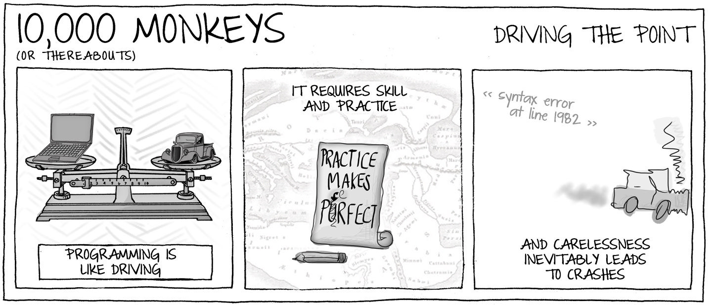
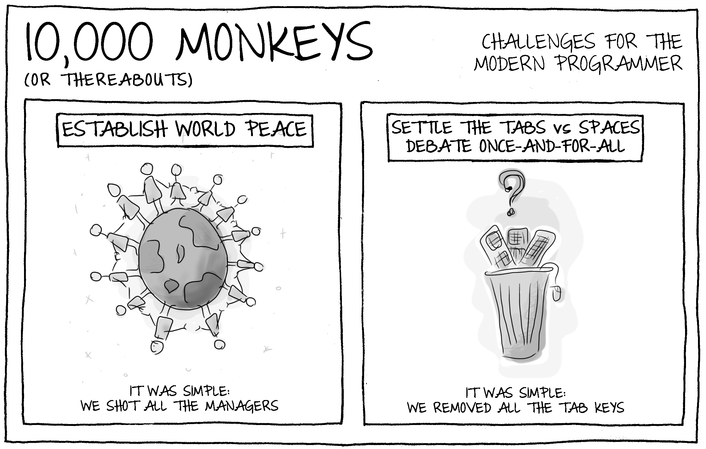
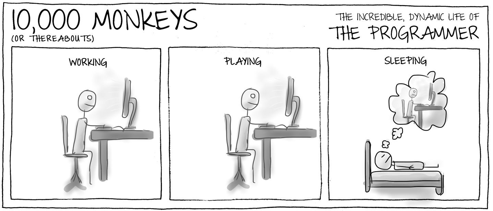
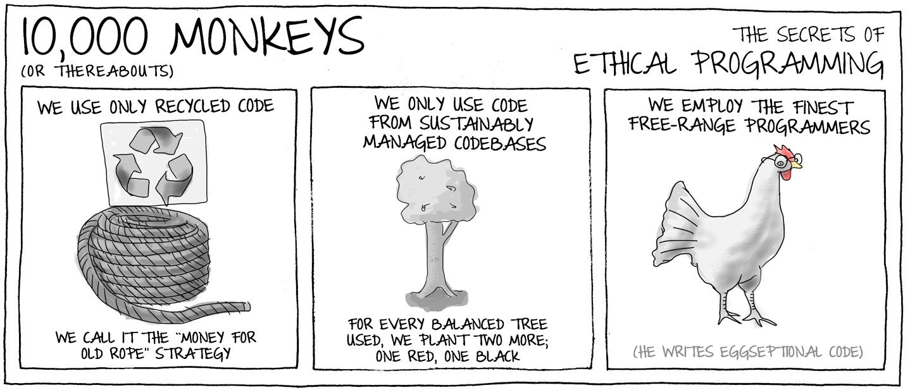

## 24. 做一个乐知者（Live to Love to Learn）

> 学习如逆水行舟，不进则退 —— 中国谚语
>
> Learning is like rowing upstream: not to advance is to drop back.

编程是一个令人兴奋又充满活力的领域，总是有新的东西要学。我们总是面对各种未知领域：新问题，新情况，新团队，新技术，或者它们的新组合。

我们不断地受到挑战，不断地去学习，去提高技能和能力。如果你觉得自己在事业上停滞不前，那么可以采取最实用的步骤之一就是去有意识地学习新的东西。

> 要诀：处于不断学习的状态，对学习新的东西充满期待

### 学习什么

你的目标是已知的未知（`known unknown`）——你想去学习的东西，或者探索未知的未知（`unknown unknowns`）：先花点时间调查一下什么东西比较有趣，学起来看看。

- 学习一种新语言
- 学习一项新技能
- 学习如何与他人合作
- 学习一个新的问题域
- 学习如何学习
- 学习完全不同的东西

### 交感反馈

`Cross-sensory feedback`：

- 边工作边听音乐
- 边涂鸦边思考（是的，我在会议上注意力非常集中，看看我画了多少涂鸦）
- 摆弄某样东西（比如一支笔）
- 边工作边说话（大声说出你在做或正在学的东西）
- 使思维具体化，而不是纯粹的智力活动
- 进行冥想练习（可能有助于你集中注意力，减少分心）

提高信息记忆能力的一个非常简单的方法就是使用记事本。随时随地记录发现的信息，而不是让它从你身边溜走。这有两个好处：首先，它让你集中注意力，保持专注。其次，即使做完笔记后马上扔掉，交感神经也会有助于简历长期记忆。

马斯洛关于能力的 4 个阶段定义：

- Unconscious Incompetence (无意识的无能力)：知识的盲区。你对自己的无知一无所知。
- Conscious Incompetence (有意识的无能力)
- Conscious Competence (有意识的有能力)
- Unconscious Competence (无意识的有能力)：你已经完全掌握了技能，已经内化成了你的自然行为中。大多数成年人都可以把走路和保持平衡看做是一种无意识的能力。

### 学习模型

德雷福斯特学习模型（The Dreyfus model of skill acquisition）五个理解层次：

- 新手（novice）
  新手希望快速获取结果，但缺少经验指导，如果有好的规则指引，新手可以往前走更远。新手对于主题还不了解。
- 初学者（advanced beginner）：
  已经获取部分经验，打破一些规则，尝试自己独立完成。当事情出错时，你会陷入困境。初学者缺少理解全局的层次，容易陷入不相关的细节。初学者能快速获取明确的知识。
- 胜任者（competent）：
  这个阶段，你开始建立问题领域的心智模型（mental model）。你已经有了相关的知识地图（mapped the knowledge base），开始关联各个部分，并了解不同方面的重要性。你开始系统规划解决问题的路线，而不是一头扎进去。你开始寻找新的规则来制定学习计划，并开始看到这些规则的局限性。
- 精通者（proficient）
  精通者有着更好的大局观，从以前的错误中学习，并反思自己的经验，以便在未来更好地工作。精通者容易识别和关注真正重要的问题，自信忽略不相关的细节。精通者已经获得了重要的隐性知识（tacit knowledge）——那些很难通过言语阐述获得，只有依靠经验和深刻的理解才能获得的知识。
- 专家（expert）
  学习树的顶点。专家可以自由运用各种仅能，并指导别人。专家拥有直觉（intuition），所以它们不需要规则，而是自然看到答案，哪怕不能马上清楚说明为什么这是最好的解决方案。

德雷福斯特学习模型说明了学习的每个阶段应该如何解决问题。你是在寻找简单的规则来应用，积极地收集原理来获得经验，还是靠直接给出答案？你对整体有多大的把握？

### 知识组合（The Knowledge Portfolio）

把当前的工作知识看成是一个投资组合。这个比喻很好地强调了应该如何管理收集的知识信息，谨慎地投资以保持投资组合的流动性，并引入新的投资以加强它。
平衡项目的 风险/收益回报（risk/reward balance）。有些知识属于常识类，是非常安全的投资，持有它们风险很低，容易通过学习掌握，并保证未来可用。有一些投资风险较高，可能不是主流的技术和实践，短期内不会有所回报。
你需要良好的风险分散策略和健康的知识投资范围。

### 以教促学（Teach to Learn）

> 教书育人，等于学两次
>
> To teach is to learn twice.——Joseph Joubert

学习最有效的方法之一就是”教“，向别人解释一个话题会巩固你头脑中的知识。当你必须解释清楚某件事时，你会不知觉得更加深入，这样才能真正理解这个话题。教育迫使你复习材料，强化记忆。

> 如果你不能解释清楚一件事情，说明你没有很好地理解它
>
> ——阿尔伯特.爱因斯坦

教学就是突破你的知识界限：你必须回答一些棘手的问题，拓展你的知识面。如果有人问了一个你不能回答的问题，那么正确的答案就是：我不知道。但是我可以去弄清楚答案。

### 知行合一（Act to Learn）

> 吾听吾忘，吾见吾忆，吾做吾悟 —— 谚语
>
> I hear and I forget. I see and I remember. I do and I understand.

一个重要的学习技艺是边做边学（learn by doing）。阅读图书，观看教程，参加编程会议都很好，但在你真正使用技能之前，它只是你头脑中抽象的概念集合。

要把抽象的东西具体化，投入进去，试一试。

学习一门新语言时，立即开始用它编写代码，把你读到的代码输入系统并运行它们。修改代码，通过实际的错误，看看什么可行，什么不可行。

使用（using）信息是了解信息的可靠途径。它会产生更多的问题来指导你的学习。

### 我们学到了什么

> 不闻不若闻之，闻之不若见之，见之不若知之，知之不若行之 —— 荀子

> 小故事：
> 新手 VS 专家
> 

## 25. 考试驱动开发

> 逻辑可以把你从 A 带到 B，而想象力可以带你去任何地方
> ——阿尔伯特.爱因斯坦
>
> Logic will get you from A to B. Imagination will take you everywhere.

在经历了长时间的痛苦以后，软件开发变成了我的第二天性。一旦熟悉了编程语言语法，理解程序设计的概念。并学会了区分好代码和坏代码，就会发现自己能很自然地做出合理的编码决策，而不需要格外的努力求索。日常的编码行为和”小中见大“已经成为本能。正确的语法从手指的肌肉间流淌而出。

有经验的程序员可以不经深思熟虑就非常高效地工作，这就是经验带给你的好处。这种状态就是”无意识的有能力“。这是不需要有意识地思考就能完成的行为，也是在不知道自己在做什么，任务有多么困难的情况下，就能有效完成的任务。

### 驾驶员的故事

要成为一名合格的驾驶员需要大量的学习。你需要努力学习汽车驾驶的基本原理，以及交通规则和礼仪，良好的驾驶员需要协调的行为和技能。这是一个复杂的过程。你必须通过大量的努力和实践来获得这种能力。

当新驾驶员通过驾驶考试之后，他们正处于**有意识的有能力**阶段，他们知道自己可以驾驶，而且必须集中精力，仔细协调各种情况，选择新的档位是一个有意识的过程，操作离合器也需要集中注意力。

随着经验的积累，很多这样的行为成为了本能反应。我们变得越来越有信心。对车辆的控制和操纵成了我们的第二天性，我们习惯了车辆对于控制的反应，我们自然而言地正确驾驶。我们成为了车辆的主人。

一旦司机到了这个阶段，他们的注意力就会被解放出来，专注于剩下的未知：道路本身，以及根据路况做出新的决定。

同样，一旦软件开发人员掌握了他们的工具和语言，其注意力就会被解放出来，可以看到更大的问题。他们能够规划路线，而不必关注如何实现这样的细节。

### 成功使人自满

> 成功使人自满，自满导致失败。只有偏执狂才能生存
>
> Success breeds complacency. Complacency breeds failure. Only the paranoid survive.—— Andy Grove

当你充分达到胜任的状态时，一定不要自满。在编写代码的时候一定要让大脑充分参与，以避免愚蠢、潜藏危险的错误。

### 考试驱动开发

大多数编程技能都是在工作中积累经验获得的。通过学徒——胜任者——工匠模式的学习路径可能更适合我们。

### 结论

改变你的习惯，让自己更为专注，更谦虚的程序员。确保你不会从无意识的有能力（unconscious competence）阶段划入本能式编码（cowboy coding）阶段。

> 自己思考，同时也别剥夺别人思考的全力——伏尔泰
>
> Think for yourself and let others enjoy the privilege of doing so too

> 小故事:
>
> 1. 编程就像驾驶
> 2. 需要技巧和练习
> 3. 粗心就会导致事故
>    

## 26. 享受挑战

Relish the Challenge

> 没有终局的成功，也没有致命的失败：重要的是继续前进的勇气——丘吉尔
>
> Success is not final, failure is not fatal: it is the courage to continue that counts.

我们是”知识工作者（knowledge worker）“，我们运用自己的技能和知识让生活变得更美好。这是我们的快乐之源和生活的意义。我们陶醉于各种机会：创造新事物，解决问题，研究新技术，以及通过拼图解开有趣的谜题。

我们享受挑战，并为此刚到兴奋。

投入且积极的程序员总是在寻找新的、令人兴奋的挑战。

### 挑战是什么

什么最能激发你的兴趣？

- 你希望因为完成遗留项目而获得报酬么？或者你更希望出色的工作而获得报酬？
- 你是为了荣誉而执行任务么？你是否在意同事们的认可？
- 你想从事开源项目吗？分享代码会给你带来成就感么？
- 你想成为第一个在新领域给出解决方案或解决棘手新问题的人么？
- 你解决问题是想获得展示智力挑战的乐趣么？
- 你是否喜欢从事某一特定类型的项目，还是某些技术满足你的癖好？
- 你想和某些类型的开发人员工作并向他们学习么？
- 你是否以企业家的眼光看待项目——寻找成为百万富翁的机会？

### 不要做

1. 总是做令人兴奋的事情，而把无聊的事情留给别人是自私的
2. 如果没有引入真正的业务价值，仅仅为了调整优化而修补一个正常的系统是危险的，你增加了不必要的改变和风险。这些时间本可以做更有价值的事情
3. 如果在自己的科学小实验上走神，那么你永远无法完成任何真正的工作
4. 记住：并非每一个编程任务都令人兴奋着迷。我们很多的日常工作都是单调的”搬砖式“工作。这才是现实世界中的编程本质。
5. 生命太短暂了。我不想把业务时间浪费在编程上
6. 重新已存在的东西是巨大的浪费，不能对现有的行业体系做出贡献。

### 接受挑战

- 做一些 code katas，这些练习很有价值
- 找一个你想解决的编码问题，并完成它
- 开始个人项目，去研究一些值得投入精力学习的新东西
- 保持广泛的个人兴趣，不断发现好的调查的学习的目标
- 如果目前的工作没有压力，也没有挑战性，那就考虑换个工作。不要安于现状，记住流水不腐的道理（the boat needs to be rocked.）
- 与积极进取的程序员一起工作，你会带着满脑子的想法回来，并从同行的热情中受到鼓舞。
- 确保你看到进展，每天建立办事项列表
- 保持新鲜感：适当休息。不要被代码搞的不知所措、窒息或厌烦
- 不要害怕重新发明轮子，做一些别人以前做过的事情，这是非常好的练习。

> 小故事：
> 现代程序员面临的挑战：
>
> 1. 维护世界和平：这很简单，把所有的经理都解雇掉
> 2. 一劳永逸的解决 Tab 键和空格之争：这很简单，把所有的 Tab 键都从键盘上拆掉
>    

## 27. 避免停滞

> 铁仅为废弃而生锈；水因为停滞而不再纯净......同样，无所事事也会消耗精力——达芬奇
>
> Iron rusts from disuse; water loses its purity from stagnation... even so does inaction sap the vigor of the mind

你最近一次掌握了新鲜有趣的技能并把它们写进简历是什么时候？你最近觉得自己能力得到提升是什么时候？上次在工作中遇到不适是什么时候？你最近一次发现令你高效的事情是什么时候？

如果这些问题的答案是模糊而遥远的过去，那么说明你目前沉浸在”舒适区（comfort zone）“：有些人认为像天堂一样的地方，那里生活安逸、工作悠闲、没有什么难以预测。

然而舒适区是一个陷阱，安逸的生活意味着你没有学习、没有进步、没有变得更好。舒适区是你变得停滞不前的地方，你很快会被更年轻的开发人员所取代。舒适区是通往过时的老路。

很少有人会有意识地决定要停滞不前。但是，人很容易进入舒适区，在没有意识的情况下，一路向下滑行。认真思考一下：这就是你正在做的事情么？

### 技能就是你的投资

保持技能持续停留在高水平是一项艰苦的工作。它使你不得不将自己置于不舒服的境地，并投入相当多精力。这项工作有可能是艰难且风险极高，有时甚至会让你陷入难堪的境地。这听起来可不轻松，对吧。

因此，这不是很多人顺其自然的选择，我们每天花那么长时间工作，难道不应该有一个惬意的生活吗？向熟悉和舒适的东西靠拢是很自然的。

不要这样！

你必须有意识地投资你的技能，必须反复不断地做出这样的决定。不要认为这是一项艰巨的任务，要乐于不断挑战。要感谢对自己的投资，这不仅会使你成为卓越的程序员，也会成为更好的自己。

> 小故事：
> 程序员不可思议的动态生活：
>
> 1. 工作
> 2. 游戏
> 3. 睡觉
>    

## 28. 程序员的道德规范

### 对代码的态度

不要故意编写难以阅读的代码，也不要故意用复杂的方式设计代码，进而导致没人能够理解代码。

我们开玩笑说这是一种”防御性开发“：编写只有自己能懂的代码，将确保自己的工作稳定。有点儿道德的程序员知道，其工作保障在于他们的才能，诚信和对公司的价值，而在于让公司依赖于他们。

> 要诀：不要通过编写不可读或者过于”聪明”的代码，来让自己变得“不可或缺”。

不要编写“创可贴”式的方式修复 bug，虽然这样会隐藏当前问题，但问题并没有消失，会以其他的方式呈现出来。有道德的程序员发现错误，会尝试理解它，并找到适合、可靠、经过测试的修复方式。这是一件“专业”的工作。

有道德的程序员尽可能编写最好的代码，在任何时候，尽最大所能去工作。使用最合适的工具和技术，带来最好的结果。例如，使用自动化测试保证质量，通过结对编程，代码评审来捕获错误和优化设计。

### 对人的态度

> 己所不欲勿施于人——孔子
>
> Treat others as you would want them to treat you.

对代码的良好态度也是对其他程序员的良好态度。

#### 1. 队友

有道德的程序员认真工作、尊重每一个团队成员，并与他们一起努力实现最好的结果。

永远相信：无论他人是否成熟老练或富有经验，都能做出贡献。每个人的意见都值得聆听，应该允许每个人提出自己的观点，都不应该因此受到谴责。

诚实待人：当你认为别人的观点不正确时，不要假意苟同，这是不诚实的，而且毫无益处。建设性的分歧和合理的讨论可以产生更好的代码设计决策。了解团队成员能够接纳的“辩论”水平。有些人热衷于激烈、充满激情的学术辩论，有些人则害怕对抗。有道德的程序员力求在不冒犯任何人的情况下取得最有成效的讨论结果。有时他们可能做不到这一点，但目标始终是尊重他人。

#### 2. 管理者

如果看到妨碍项目运行的潜在问题，请尽快报告。问题提出的越早，计划得越周全，处理得越快，项目就进行得越顺利。

当被赋予责任时，要尊重别人对你的信任，尽最大的努力去履行职责。

#### 3. 雇主

不要在公共场合失言，或说雇主的坏话。

#### 4. 你自己

作为一名有道德的程序员，你要不断学习好的编程实践。

一个疲惫的程序员是没有价值的，不要过分劳累，要知道自己的极限。

### 希波克拉底誓言

> 我发誓不会对代码或业务造成任何损害。追求个人进步，提高技能。我将尽我所能完成分配给我的任务，与团队和谐相处。我将以正直的态度与他人互动，努力使项目和团队的效率及价值最大化。

### 结论

> 道德伦理本来就是一种为了向他人推荐与自己合作，不得不付出牺牲的艺术。——伯特兰.罗素
>
> Ethics is in origin the art of recommending to others the sacrifices required for cooperation with oneself.

编程职业的道德伦理有两个层次：“不伤害”是基本层次。除此之外，还有一个更复杂的道德准则：只从事带来良好社会效益的项目，用你的才能让世界变得更美好，为了提高编程技艺而乐于分享知识。

> 小故事：
> 关于编程中道德伦理的秘密：
>
> 1. 我们只采用循环利用的代码
> 2. 我们只采用管理完善的代码库的代码——为了保持平衡，每砍掉一棵树，我们会种两颗，一颗红，一颗黑
> 3. 我们只雇佣最优秀的自由职业程序员（eggseptional，这里试用了 exceptional 的谐音，意为最杰出的）
>    

## 29. 热爱编程语言

### 1. 爱与尊重（Love and Respect）

大多数程序员因为激情而编程。他们选择一门语言是因为真正喜欢使用它。

有时你被迫使用你不会喜欢的一种语言，但随着时间的推移和经验的积累，你体验到了越来越多的乐趣。

### 2. 承诺（Commitment）

要想成为特定语言领域的程序员，必须坚定地以某种承诺为目标，投入时间使用它。你不能私自地期望它反过来迎合你的需求，尤其是当它被设计用来适应多种场景和需求的情况下。

承诺也意味着必要的牺牲。你必须放弃一些喜欢的方式，以适应另一方。语言有特定的惯用法和最适合的工作方式。但是如果好的代码就是这样定义的，那么就应该采用这种惯用法。

### 3. 沟通（Communication）

我们既与编程语言沟通——以一种清晰、简洁、明确、正确的方式告诉它做什么——也用编程语言作为媒介与其他人沟通。

好的程序员也是好的沟通者，他们听、说、读、写、编都很好。

### 4. 耐心（patience）

要完全掌握一门语言，可能需要很长时间。想要欣赏语言的美，需要很长的耐心。

> 要诀：不要期望一夜之间成为语言大师，但也不要在学习受挫的过程中感到沮丧。

### 结论

实际上，在各种语言之间流连徘徊是非常有益的。这将使你掌握不同的编程技能和技术，并帮助你避免在编码时陷入窠臼。

优秀的程序员考虑的不仅是几行代码或者一个孤立的设计。他们关心语言的使用、交互，以及充分发挥它的特性。

## 30. 程序员的姿态

> 良好的站姿和坐姿能反映出人的精神状态——植芝盛平（日本合气道创始人）
>
> A good stance and posture reflect a proper state of mind.

### 1. 基本姿态

- 不断变换姿势，保持肌肉放松，缓解身体的紧张
- 多休息，多在办公室内走走，你会发现和别人交谈总是有益的
- 阅读屏幕上的内容时，保持昂首挺胸
- 偶尔看看别的动词，把注意力放在远处的一个物体上
