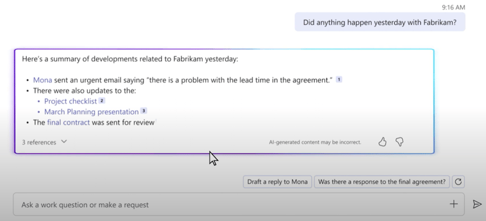
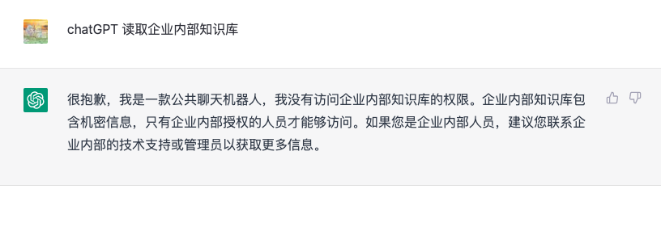
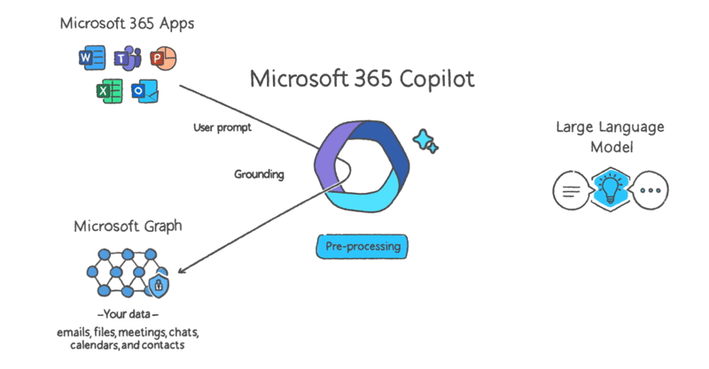
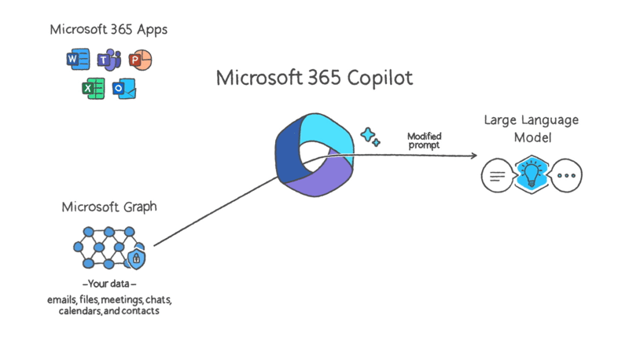
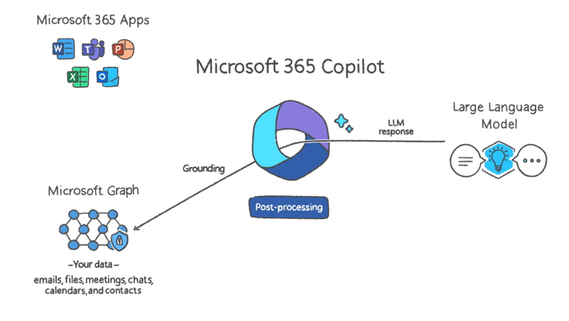
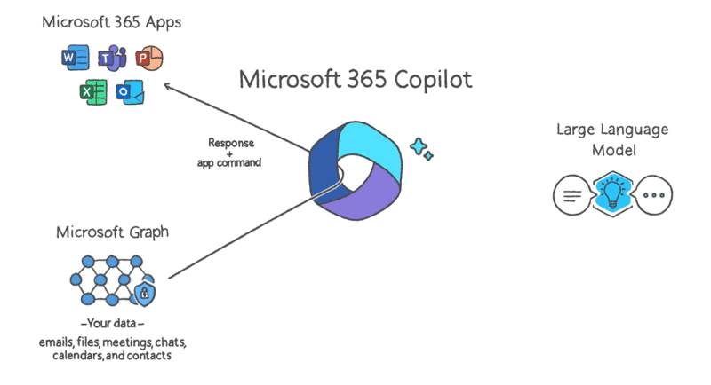
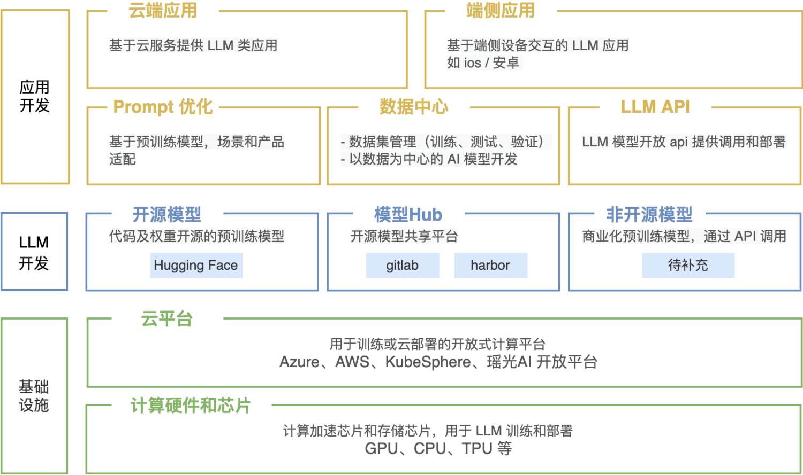

## 1. 背景

https://www.youtube.com/watch?v=S7xTBa93TX8

3 月 16 日，微软发布了集成了 ChatGPT 大模型的 Microsoft 365 Copilot 应用，针对普通打工人来说简直是降维打击。
Copilot（一个聊天机器人）可以帮助用户快速生成文章草稿，创建 PPT，数据整理和分析，生成会议记录/总结，
正如微软 CEO 纳德拉所言：从此我们的工作方式将永远改变，开启了新一轮的生产力大爆发。

作为一个战战兢兢的打工码农，一方面震惊于 AI 所开启的技术革命，另一方面也很好奇，作为一个聊天机器人，
从技术上是如何做到访问企业内部知识库，给出具备深度领域上下文知识的回答，并能根据用户反馈来优化输出？

当我把这个问题抛给 chatGPT，它是这么回答的：

带着问题我们来看下， Copilot 背后的这套系统设计方案。

## 2. Copilot 系统设计

1. 用户通过客户端提出问题，以「Prompt」的形式提供给 Copilot

2. Copilot 对问题进行 pre-processing（预处理），也被成为 grounding，本质上就是调用 Microsoft Graph
   获取 prompt 的上下文知识（和问题相关的文档、链接、会话内容、邮件等）， Graph 可以认为是一个图数据库

3. 通过 Graph 对 prompt 进行上下文增强以后，再次通过 Copilot 将真正的 Prompt 提交到 LLM（大语言模型）
   这里包含了一个隐性信息：LLM 模型已经通过了大数据集的训练（trained），或是基于已有模型优化（fine-tuning），
   但 LLM 本身不会访问已有现有的知识库，换句话说，LLM 是无状态的。

4. LLM 返回结果到 Copilot，会做一次 post-processing（后处理），后处理是包含了复杂的任务，如格式检查、安全验证、生成命令（唤起应用）等。

5. Copilot 将预处理的结果再返回给用户，包含了初始提问的上下文知识、应用命令等。通过 Copilot 可以将 Office 全家桶串联起来。

## 3. LLM 平台架构

## 4. 可能风险

GPT 大模型目前仍然处于早期阶段，在设计企业级大模型应用的角度来看，抛开高昂的实现成本（算力资源，
模型定制等）不说，还有很多业务问题需要在架构设计之前明确：

1. 数据隐私和安全风险：比如是否允许把敏感信息（用户信息）交给模型，模型如何保证信息不会被泄露，
   以及用户可访问数据的权限控制？
2. 结果的可解释性：大模型意味着没有人能够知道真正的内容生成逻辑，如何判断模型返回结果真实可信？
3. 安全可信的 Prompt：针对不同角色，不同用户，不同场景设计不同的 Prompt？
