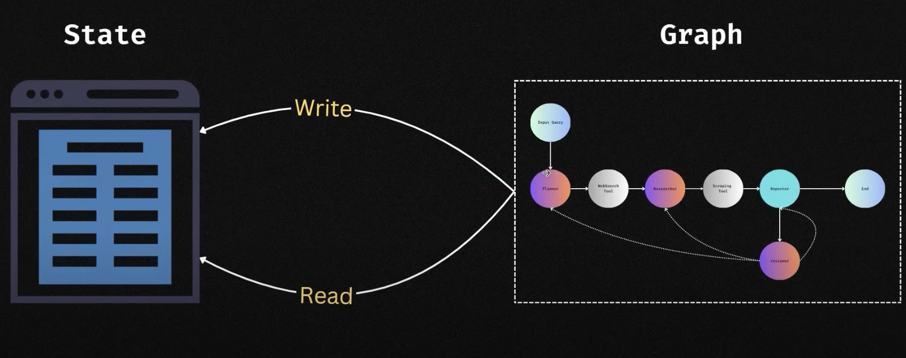
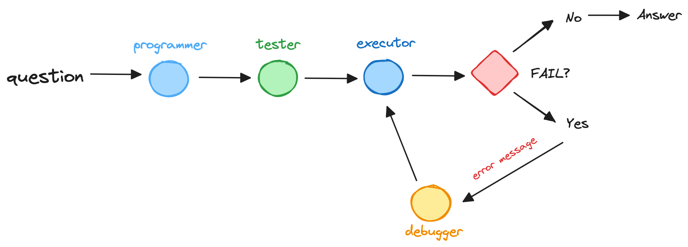

在[AI 思考的快与慢](/principle-of-ai-agent/)里，我们介绍 AI Agent 背后的思考范式，以及 ReAct 设计模式的实现，本篇我们介绍 Reflection agent 设计模式。

## Reflection 反思模式

Reflection 设计模式是让 Agent 审视并修正自己的输出。

因为 LLM 的不确定性，AI 初次输出往往无法达到理想的效果，如果我们此时提供一些关键信息反馈，帮助 LLM 改正其响应，
此时我们获得理想输出的概率就能大幅提升。

**如果能够自动执行「关键反馈」的步骤， 让 LLM 自动校正自己的输出并改进其响应，结果会怎样？这就是 Reflection 设计模式的出发点。**

以 LLM 编写程序代码为例，我们可以提示它根据某个任务生成代码，之后，我们提示它反思（reflection）自己的输出，如：

```shell
以下是任务 {X} 的代码：{之前生成的代码}

仔细检查代码的正确性、风格和效率，并对如何改进它提出建设性的批评。
```

重复以上批评/重写过程，产生进一步的改进。设定重复次数，满足条件之后退出。这种自我反思过程使 LLM 能够发现缺陷，并改善输出结果。

### Langgraph

Langgraph 是一种基于状态机（state-machine）管理，开发 AI Agent 的应用框架。Langraph 采用人在回路（Human-in-Loop）的交互方式，让应用开发更加可控。



Langgraph 核心设计有三个概念：

- State: 状态。当前应用的全局状态
- Node: 节点。每个节点代表一个 Agent，节点可以读取 State，经过内部数据处理以后返回新的 State
- Edge: 连线。连线代表数据的流转方向，连线包括固定和分支两种类型

### Usage

假设现在有这样一个场景，给定一个编程问题，设计以下三个节点共同完成编程任务：

- programmer: 开发者角色。基于用户问题，给出编码实现
- tester: 针对 progammer 编码给出一组 test cases(测试用例)
- executor: 执行 test cases，如果用例完全通过，任务结束。反之基于错误信息（error）重新执行上述循环

基于以上场景我们可以设计流程图



#### 1. 定义全局状态

```typescript
// 测试用例
export type TestCase<I = any, O = any> = {
  input: I;
  output: O;
};

export type GraphState = {
  /**
   * The LLM to use for the graph
   */
  llm: AzureChatOpenAI;
  /**
   * 开发需求
   */
  requirement: string;
  /**
   * 用户编码
   */
  code: string;
  /**
   * 用户测试用例，包含 input 输入和 output 输出
   */
  testCases: TestCase[] | null;
  /**
   * 执行过程中的错误信息
   */
  errorMessage: string | null;
};
```

#### 定义 Agent 节点

**1. Programer 节点**

```typescript
export async function programmer(
  state: GraphState
): Promise<Partial<GraphState>> {
  const { llm, requirement } = state;
  const prompt = ChatPromptTemplate.fromMessages([
    [
      "system",
      `You are an expert Javascript engineer, helping user complete the requirement.
      Use a Chain-of-Thought approach to break down the problem, create pseudocode, and then write code in Javascript language. 
      Ensure that your code is efficient, readable, and well-commented.

      **Instructions**:
      1. **Understand and Clarify**: Make sure you understand the task.
      2. **Algorithm/Method Selection**: Decide on the most efficient way.
      3. **Pseudocode Creation**: Write down the steps you will follow in pseudocode.
      4. **Code Generation**: Translate your pseudocode into executable Javascript code. DON'T INCLUDE TEST OR EXAMPLR CODE IN CODEBLOCK.
      `,
    ],
    ["human", `*REQURIEMENT*\n: {requirement}`],
  ]);

  const chain = prompt.pipe(llm).pipe(new StringOutputParser());

  const response = await chain.invoke({
    requirement,
  });

  // 提取返回文本中的函数
  const code = extractCodeBlockFromMarkdown(response);

  return {
    code,
  };
}
```

**2. Tester 节点**

```typescript
export async function tester(state: GraphState): Promise<Partial<GraphState>> {
  const { llm, requirement, code } = state;
  const prompt = ChatPromptTemplate.fromMessages([
    [
      "human",
      `As a tester, your task is to create Basic and Simple test cases based on provided Requirement and code.

*REQURIEMENT*
{requirement}
**Code**
{code}\n\n{format_instructions}`,
    ],
  ]);

  const schema = z.array(
    z.object({
      input: z
        .unknown()
        .describe("Input for Test cases to evaluate the provided code"),
      output: z
        .unknown()
        .describe(
          "Expected Output for Test cases to evaluate the provided code"
        ),
    })
  );
  const parser = StructuredOutputParser.fromZodSchema(schema);

  const chain = prompt.pipe(llm).pipe(parser);

  const response = await chain.invoke({
    requirement,
    code,
    // 生成 JSONSchema prompt 提示
    format_instructions: parser.getFormatInstructions(),
  });

  return {
    testCases: response as TestCase[],
  };
}
```

**3. Tester 节点**

```typescript
export async function executor(
  state: GraphState
): Promise<Partial<GraphState>> {
  const { llm, requirement, code, testCases } = state;
  const prompt = ChatPromptTemplate.fromMessages([
    [
      "human",
      `
      You have to add testing cases after *Code* that can help to execute the code. 
      You need to pass only Provided Input as argument and validate if the Given Expected Output is matched.

      *Instruction*:
      - Generate the error free code that can be execute without adding markdown around
      - comment non-code style content, avoid being executed

Javascript Code to excecute:
{code}

Input and Output For Code:
{testCases}

Here Testing Cases begins:
`,
    ],
  ]);

  const chain = prompt.pipe(llm).pipe(new StringOutputParser());

  const response = await chain.invoke({
    requirement,
    code,
    testCases: testCases
      .map(
        ({ input, output }) =>
          `*Input*: ${input}
*Expected Output*: ${output}`
      )
      .join("\r\n"),
  });

  const codeWithTestCase = `${code}\n${response}`;

  let errorMessage = null;
  try {
    new Function(codeWithTestCase)();
  } catch (err) {
    console.error(`execute err: `, err);
    errorMessage = err.message;
  }

  return {
    code: codeWithTestCase,
    errorMessage,
  };
}
```

**4. Debugger**

```typescript
export async function errorDebugger(
  state: GraphState
): Promise<Partial<GraphState>> {
  const { llm, errorMessage, code } = state;
  const prompt = ChatPromptTemplate.fromMessages([
    [
      "human",
      `You are expert in Javascript Debugging. 
      You have to analysis Given Code and Error and generate code that handles the error
      
      *Instructions*:
      - Make sure to generate error free code without explanation
      - Generated code can be execute

      *Code*: {code}
      *Error*: {errorMessage}`,
    ],
  ]);

  const chain = prompt.pipe(llm).pipe(new StringOutputParser());

  const response = await chain.invoke({
    errorMessage,
    code,
  });

  return {
    code: response,
    errorMessage: null,
  };
}
```

#### 定义连线

连线代表数据的流转方向，针对开始和结束节点，`Langgraph` 定义了专门的标识：`START` 和 `END`。

```typescript
// 定义节点
graph.addNode("programmer_node", programmer);
graph.addNode("tester_node", tester);
graph.addNode("code_executor_node", executor);
graph.addNode("debugger_node", errorDebugger);

// 定义连线规则
graph.addEdge(START, "programmer_node");
graph.addEdge("programmer_node", "tester_node");
graph.addEdge("tester_node", "code_executor_node");
graph.addEdge("debugger_node", "code_executor_node");

const validateCode = (state: GraphState): "debugger_node" | "__end__" => {
  return state.errorMessage == null ? END : "debugger_node";
};
// 条件判断规则
graph.addConditionalEdges("code_executor_node", validateCode);
```

#### 运行应用

```typescript
async function main(requirement: string) {
  const app = createGraph();

  const llm = new AzureChatOpenAI({
    temperature: 0,
  });

  const stream = await app.stream({
    llm,
    requirement,
  });

  let finalResult: GraphState | null = null;
  for await (const event of stream) {
    // 判断是否可以输出运行结果
    if (Object.keys(event)[0] === "code_executor_node") {
      finalResult = event["code_executor_node"];
      if (finalResult.errorMessage === null) {
        console.log(finalResult.code);
      }
    }
  }
}
```

### 使用总结

本文基于 `Langgraph` 实现了一个代码编写，单测和运行的 Reflection agent 工作流原型。

Reflection 反思通过迭代反馈和完善提升了 LLM 的输出质量，其主要思想是：

**使用 LLM 生成一个初步输出，然后提供另一个 agent 为其输出提供反馈，并使用这个反馈对 LLM 输出进行迭代优化。**

Reflection 的优化思路非常朴素，使用成本较低。在实际应用中，Reflection 面临着一些挑战：

1. 在一些复杂的场景下，agent 之间容易陷入无限循环的迭代过程
2. Reflection 完全依赖 LLM 自身的能力，使用者参与有限，无法显著提升输出质量
