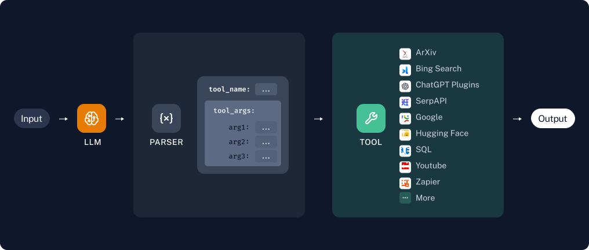
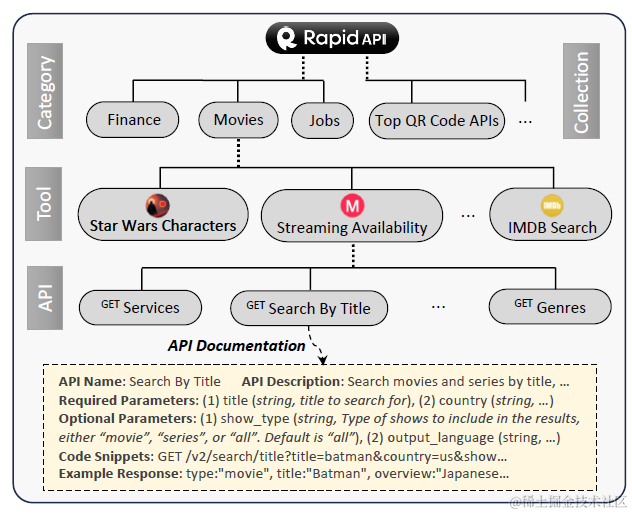

## 前言

人类最显著特征之一就是能够使用工具。人类通过创建、修改和使用外部对象，来完成超出自身能力之外的任务。对于 AI Agent 来说，调用外部工具，可以扩展 LLM 既有能力的边界，包括代码执行能力、上下文扩展能力和三方能力集成等。

Agent 集成外部工具的流程如下:


1. 基于用户的提问，LLM 会设计并规划一个解决方案的思路。类似于人类的思考方式：针对问题 XX，应该选择什么工具来解决，用户提问的关键参数包括哪些？

2. 模型选择合适的工具，提取参数传递给工具执行，获取输出结果（observation），再次传递给 LLM 进行评估，并重新开启 Action(执行) => Observation(输出) => Reflection(思考) 的循环

3. 当模型判断已经掌握了足够多的信息，可以给出最终答案之后，结束循环，并给出最终输出（output）



> tool-use agent parser

## Function calling

LLM 调用外部工具的能力是基于 Function calling 实现，Function calling 是指根据 LLM 规划出来的 Action 描述，按照 tools 中定义的 API，生成正确的调用方式。


Agent 的执行能力强烈依赖于模型的 function calling 能力，同样的代码使用不同模型运行，会出现完全不同的输出，所以选择合适的模型是关键因素。幸好美国 berkekey 大学发起了 Function-Calling [排行榜](https://gorilla.cs.berkeley.edu/leaderboard.html)，截至 2024-06-22 排行前三的分别是：

- 🏅 Claude-3.5-Sonnet
- 🥈 GPT-4-0125-Preview
- 🥉 Claude-3-Opus

> 备注：唯一一个国产模型上榜的是 DeepSeek，一家杭州量化私募基金推出的大模型，吊打一众大厂

对于开发者而言，我们需要准确地定义 API 的功能，参数的命名和描述。以获取天气预报 Tool 为例，我们需要通过 LLM 查询外部 API，才能完成输出。在此以 OpenAI 为例：

```javascript
// 定义获取天气函数
function getCurrentWeather(location: string, unit: string) {
  // ......
}

// 基于 JsonSchema 定义函数的描述信息
const tools = [
  {
    // function 类型，必需
    type: "function",
    // 以下定义函数的详细描述
    function: {
      // 对应上面定义的函数名
      name: "getCurrentWeather",
      // 函数描述，要清晰明确地表达函数的效果，LLM 据此来决定给是否调用该函数
      description: "Get the current weather in a given location",
      // 参数描述，用于提取 Action 参数
      parameters: {
        type: "object",
        properties: {
          location: {
            type: "string",
            description: "The city and state, e.g. San Francisco, CA",
          },
          unit: { type: "string", enum: ["celsius", "fahrenheit"] },
        },
        required: ["location"],
      },
    },
  },
];

// 调用 LLM
const messages = [
  {
    role: "user",
    content: "杭州今天天气怎么样",
  },
];

const result = await openai.chat.completions.create({
  model: "gpt-4-turbo",
  messages,
  tools,
});
console.log(result.choices[0]);
```

返回输出如下:

```typescript
{
  // 完成对话的原因
  finish_reason: "tool_calls",
  message: {
    content: null,
    role: "assistant",
    tool_calls: [
      {
        function: {
          arguments: '{\n  "location": "hangzhou",\n  "unit": "celsius"\n}',
          name: "getCurrentWeather"
        },
        type: "function"
      }
    ]
  }
}
```

返回内容里 `content` 为空，代表 LLM 没有返回文本信息，而是在 `tool_calls` 申明了需要调用的函数名称与参数。值得注意的是，LLM 还指定了另一个参数 unit 为 `celsius`，这也是大模型基于大量数据训练所涌现出来的智能，当检测到用户输入为中文时，就返回中文常用的 `celsius`。

## 在 langchain 中使用 tools

上文我们发现使用原生 API 调用 tools 比较繁琐，使用 langchain 能够极大简化 tools 使用门槛，并且能和现有的 langchain 开发链无缝集成。

首先在 langchain 中，我们一般使用 [Zod](https://github.com/colinhacks/zod) 来定义函数的描述信息，Zod 是 js 生态中流行的类型定义和验证的工具库。

以上文获取天气信息场景为例：

```typescript
import { z } from "zod";
import { zodToJsonSchema } from "zod-to-json-schema";

const getCurrentWeatherSchema = z.object({
  location: z.string().describe("The city and state, e.g. San Francisco, CA"),
  unit: z.enum(["celsius", "fahrenheit"]).describe("The unit of temperature"),
});

// 生成函数的 JsonSchema 定义
const schema = zodToJsonSchema(getCurrentWeatherSchema);

const model = new AzureChatOpenAI();

// 将 tools 传递给 model
const modelWithTools = model.bind({
  tools: [
    {
      type: "function",
      function: {
        name: "getCurrentWeather",
        description: "Get the current weather in a given location",
        parameters: zodToJsonSchema(getCurrentWeatherSchema),
      },
    },
  ],
});

await modelWithTools.invoke("杭州的天气怎么样");
```

执行以后返回 AIMessage 信息，并携带 tool_calls 参数：

```javascript
AIMessage {
  content: "",
  additional_kwargs: {
    tool_calls: [
      {
        function: {
          arguments: '{\n  "location": "北京",\n  "unit": "celsius"\n}',
          name: "getCurrentWeather"
        },
        id: "call_IMLAkWEhmOyh6T9vYMv65uEP",
        type: "function"
      }
    ]
  },
}
```

可以看到，langchain 返回的数据结构和原始 OpenAI 结果类似。

## AnyTool

在现实场景下，agent tools 使用场景要复杂很多：

1. 真实世界的 API 数量多且繁杂
2. 多工具调用，解决一个问题需要使用 N 个工具，需要多轮迭代实现
3. 当 API 数量多且设计多工具时，关键点是如何有效地规划工具调用，并召回相关工具用于推理

针对这个问题，[ToolLLM](https://github.com/beijixiong1/ToolLLM) 和 [AnyTool](https://github.com/dyabel/anytool) 这两篇 paper 提出了各自的解决方案，其中 AnyTool 是 ToolLLM 的改进版本，这里重点介绍 AnyTool。

AnyTool 使用了[RapidAPI Hub](https://rapidapi.com/hub) 开源的真实世界各类 API，通过初步测试以后，收集了 3451 Tools，总共 16464 APIs。



RapidAPI 自上而下分为 category（分类）、Tool（工具）、API 三层，category 包含多个 Tool，Tool 又有多个 API。例如 IMDB search 属于「Movies」分类，该 tools 下面又有 `search_by_title`，`get_detail` 等众多 API。这样的分类体系被用于后续多工具（multi-tools）调用 prompt engineering 的依据。

AnyTool 更好地利用了 RapidAPI 的分层结构进行 API Pool 的召回。论文里使用的是 3 类 Agent 交互的方案，分别是：

1. Meta Agent：基于用户 Query，联想问题所属分类（category），并创建对应分类的 agent
2. Category Agent: Cagetory Agent 思考相关的工具（Tool），并初始化对应 Tool Agent
3. Tool Agent: Tool Agent 召回相关的 API，合并到 API 候选池（candidate Pool）


以上三类 Agent 在 AnyTool 里通过 Prompt 来实现，[链接](https://github.com/dyabel/AnyTool/blob/public/anytool/prompt_template.py):

```typescript
const META_AGENT_PROMPT = `
You are APIGPT, with access to a database of APIs. This database is organized
into the following categories: {categories}. Your task is to help users
identify the relevant categories for their needs. To do this, you can
use the 'get_tools_in_category' function to retrieve the available tools
within a specific category. If you are unsure about the functionality of
some tools, the 'get_tools_descriptions' function can be used to obtain
detailed information about these tools. This information will aid you in
understanding the general functionality of each category. Additionally, the
'create_agent_category_level' function allows you to assign a relevant category
to an agent, with each agent being assigned only one category. However,
you can assign multiple categories to different agents. It is important
to explore as many categories as possible, as the solution to a query may
be found in unexpected categories. Remember, your goal is not to answer
the query directly but to identify all potentially relevant categories and
assign them to agents. Once you have completed the assignment, call the
'Finish' function.
At each step,  you should call functions to actually excute your step.
All the thought is short, at most in 3 sentence.
`;

const CATEGORY_AGENT_PROMPT = `
You are APIGPT, with access to a database of APIs categorized into various
groups. Each category contains numerous tools, and each tool encompasses
multiple APIs. Your task is to assist users in finding relevant tools within
the category: {category}. If uncertain about the functionality of some tools, use
the 'get_tools_descriptions' function to obtain detailed information. Then,
employ the 'create agent tool level' function to allocate a subset of pertinent
tools to an agent, ensuring that similar tools are assigned to the same agent
and limiting the allocation to no more than five tools per agent. You may
assign different subsets to multiple agents. Remember, your role is not to
answer queries directly, but to assign all possible tools. Once you complete
the assignment, or if you determine the query is irrelevant to the tools in
the specified category, invoke the 'Finish' function.
At each step,  you should call functions to actually excute your step.
All the thought is short, at most in 3 sentence.
`;

const TOOL_AGENT_PROMPT = `
You are APIGPT with access to a database of APIs, categorized into various
sections. Each category contains multiple tools, and each tool encompasses
numerous APIs. Your task is to assist users in finding relevant APIs within
the tools '{tools}' of the '{category}' category. You will be provided with
descriptions and details of these tools and their APIs. Upon identifying
relevant API names, use the 'add_apis_into_api_pool' function to add them to
the final API list. If you conclude that all possible APIs have been explored,
or if there are no relevant APIs in these tools, invoke the Finish function.
During the process, you may receive feedback on these APIs.
At each step,  you should call functions to actually excute your step.
All the thought is short, at most in 3 sentence.
`;
```

AnyTool 采用的这种策略称之为 Divide-Conqure（分治策略），大模型推理成本较高，通过多层召回降低每一层的候选数量，并在同一层 Agent 推理进行并发，所以整体推理耗时相对可控。

当一轮推理结束，如果大模型给出”Give up“的结果，则使用模型放弃理由作为 Context 触发反思模式，重新触发上一层的推理。

```typescript
const REFIND_CATEGORY_PROMPT = `
Current APIs failed to solve the query and the result is: {{failed_reason}}.
Please assign more unexplored categories to the agents.
`;

const REFIND_TOOL_PROMPT = `
Current APIs failed  to solve the query. The result is: {{failed_reason}}.
Please assign more unexplored tools to the agents.
`;

const REFIND_API_PROMPT = `
Current APIs failed to solve the query. The result is: {{failed_reason}}.
You need to analyze the result, and find more apis.
It is possible that the tools do not have the relevant apis. In this case, you should call the Finish function. Do not make up the tool names or api names.
`;
```

## 实现方案

基于 `Langgraph`，我们可以将 AnyTool 论文落地，产品流程如下：


### 1. 定义分类、工具和 API

```typescript
export const CATEGORY_MAPPING = {
  Data_and_Analytics: [
    "Data",
    "Database",
    "Text_Analysis",
  ],
  Travel_and_Transportation: ['Travel', 'Transportation', 'Logistics', 'Location'],
  //...
};

export const apiList = [{
   {
    "id": "c84af6be-804a-4965-93a5-cdbc29586f00",
    "category_name": "Travel",
    "tool_name": "Booking com",
    "api_name": "Hotels Search",
    "api_description": "string",
    "required_parameters": [
      {
        "name": "string",
        "type": "STRING",
        "description": "",
        "default": "popularity"
      },
    ],
    "optional_parameters": [],
    "method": "GET",
    "api_url": "https://booking-com.p.rapidapi.com/v2/hotels/search"
  },
}]

// 用户问题
const query = `I'm organizing a charity event to raise awareness for animal rights. Can you recommend a book that highlights the importance of compassion towards animals? Additionally, provide me with a random word that symbolizes unity and empathy`
```

`CATEGORY_MAPPING` 定义了 category，此处为了精简不单独列出 tools。

`apiList` 则包含了 `api` 描述，请求参数等，以及所关联的 `category_name` 和 `tool_name`。

我们接下来要做的就是肝功能就用户的提问，从这 16000+ api 中大海捞针，挑选最适合的 api 并执行请求，获取我们想要的结果。

是不是很有挑战性，接下来我们一步步来实现这个挑战。

### 2. 定义图数据结构

```typescript
const graphChannels = {
  // llm 实例
  llm: null,
  // 用户查询内容
  query: null,
  // 匹配类别
  categories: null,
  // 该类别下对应 api 列表
  apis: null,
  // 模型返回最佳匹配 api
  bestApi: null,
  // 模型从 query 提取参数
  params: null,
  // 执行 api 返回结果
  response: null,
};
```

### 3. 定义节点

```typescript
// 1. LLM 从用户提问中提取分类
graph.addNode("extract_category_node", extractCategory);

// 2. 从前一节点提取到 category 下的所有 api 列表
graph.addNode("get_apis_node", getApis);

// 3. 选择最合适的 api
graph.addNode("select_api_node", selectApi);

// 4. 获取 api 所需参数
graph.addNode("extract_params_node", extractParameters);

// 5. 补充 api 缺失必需参数
graph.addNode("human_loop_node", requestParameters);

// 6. 执行请求，获取最终结果
graph.addNode("execute_request_node", createFetchRequest);
```

### 4. 定义连线

```typescript
// 1. 起点 => 提取分类节点
graph.addEdge(START, "extract_category_node");

// 2. 分类节点 => 分类接口接口
graph.addEdge("extract_category_node", "get_apis_node");

// 3. 分类节点 => 匹配api 节点
graph.addEdge("get_apis_node", "select_api_node");

// 4. 匹配 api 节点 => 抽取 api 参数节点
graph.addEdge("select_api_node", "extract_params_node");

// 条件判断连线
graph.addConditionalEdges("extract_params_node", verifyParams);
graph.addConditionalEdges("human_loop_node", verifyParams);

// 5. 完成 API 请求，循环结束
graph.addEdge("execute_request_node", END);

const verifyParams = (
  state: GraphState
): "human_loop_node" | "execute_request_node" => {
  const { bestApi, params } = state;
  // 参数校验
  const missingKeys = findMissingParams(
    requiredParamsKeys,
    extractedParamsKeys
  );
  // 如果必需参数校验不通过，先补充参数
  if (missingKeys.length > 0) {
    return "human_loop_node";
  }
  // 校验通过，执行请求
  return "execute_request_node";
};
```

### 5. 完整代码

[链接]()

## 总结

现阶段 Agent 在生产环境的可靠性方面离传统软件还有不少距离，以 AutoGPT 为代表的 Autonomous Agent 不会是好的落地方向，因为太过强调 LLM 的自驱和自动化能力。理想的 Agent 需要具备的特性，是面向用户为中心的「human-in-loop」的交互方式，让使用者有可控的空间。

Tool-use agent 就像人类打开了使用工具的新世界一样，帮助 LLM 扩展能力边界，从外部寻找合适工具的助手。随着大模型的持续进化和复杂推理能力的提升，未来 agent + tools 的结合肯定大有前景。
