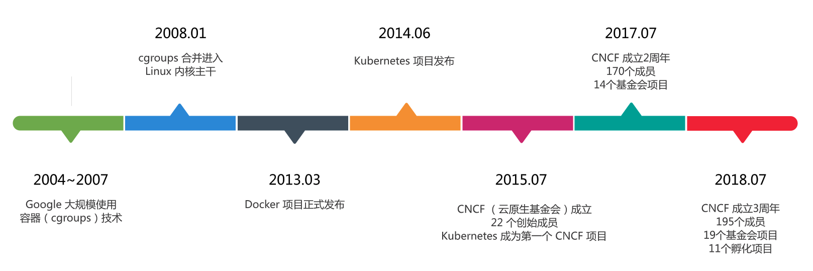
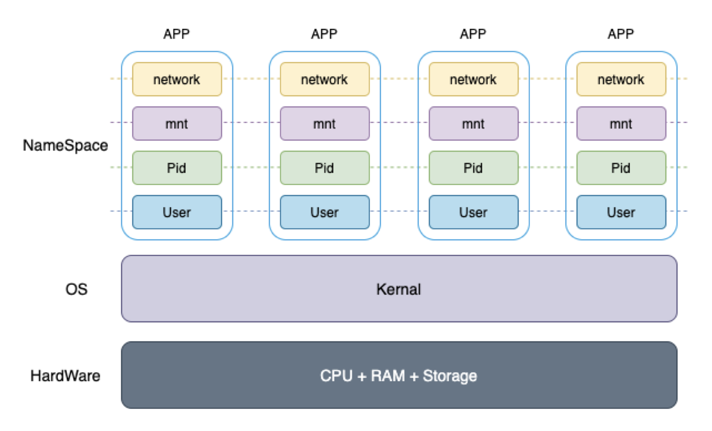
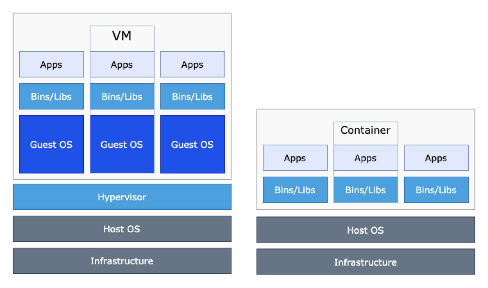
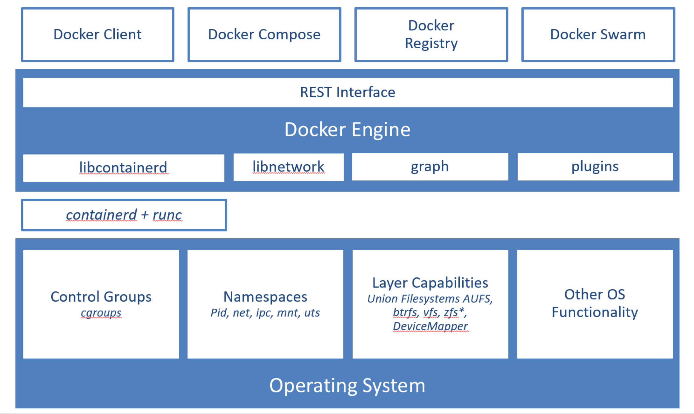
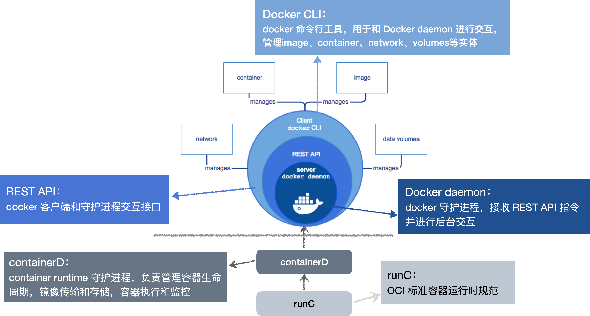
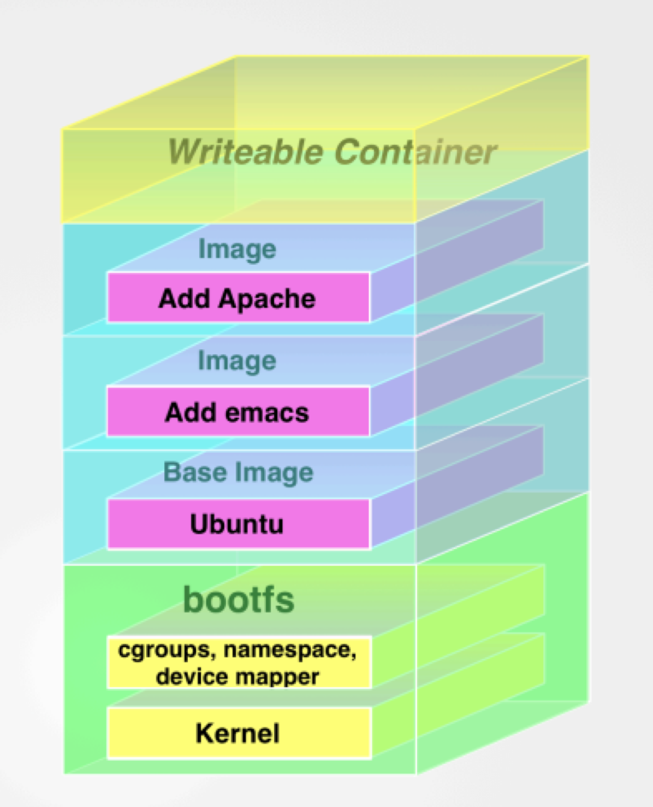

## 云原生

云原生（cloud native）是一种构建和运行应用的方法论。cloud 代表应用运行在云上，而 Native 表示应用程序设计之初就要考虑云环境，原生为云而设计，充分运用云平台的弹性 + 分布式。 

### 云原生的历史



> 问题：
>
> 1. docker、kubernetes、CNCF 有啥历史渊源？
>
> 2. 为啥说 docker 没落了？

## 从 Docker 到 k8s

> 问题：
>
> 运行一个应用需要什么资源？



namespace 提供了全局资源隔离方法
  - Mount: 隔离文件系统挂载点
  - PID: 隔离进程的ID
  - Network: 隔离网络资源
  - User: 隔离用户和用户组的ID
  - UTS: 隔离主机名和域名信息
  - IPC: 隔离进程间通信

### 容器的定义

容器（container）是一个沙盒（sandbox）技术，基于操作系统层虚拟化（OS level virtualization），为应用程序及其完整依赖提供了一个完全隔离的运行环境。

容器就像一个集装箱一样把“应用”装起来，应用与应用之间有了边界，就不用相互干扰。而被装进集装箱的应用，就可以被方便地搬来搬去。这就是 PaSS 服务的理想状态。

### 容器 VS 虚拟机（VM）



1. 虚拟机

- 虚拟机提供了硬件级别虚拟化，用来共享主机物理资源。
- 虚拟机需要单独的操作系统，硬件也是虚拟化的，需要启动管理程序管理虚拟机程序。
- 虚拟机适合搭建完整运行环境
 
2. 容器

- 容器通过操作系统虚拟化共享宿主机操作系统。
- 容器非常轻量级，提供了一套可移植，一致性的应用程序操作环境
- 容器适合运行单独的应用程序

3. 容器 VS 虚拟机

| 特性   | 容器        | 虚拟机          |
|------|-----------|--------------|
| 虚拟程度 | 操作系统级虚拟   | 硬盘级虚拟        |
| 隔离性  | 部分隔离      | 完全隔离         |
| 启动时间 | 秒级        | 分钟级          |
| 硬盘使用 | 一般为 MB    | 一般为 GB       |
| 性能   | 接近原生      | 效能较慢         |
| 硬盘使用 | 单击支持近千个容器 | 一般为几个，不超过几十个 |
| 可移植性 | 方便        | 困难           |

### 容器核心架构

> 基于 Namespace 对容器资源进行隔离。

- User：
  - User Namespace 提供了对访问用户的隔离
  - 容器内部提供了一个虚拟的 ROOT 用户，能访问容器内部所有文件资源权限，但无法修改宿主机文件

- PID：
  - 将容器内部进程与外部环境进行隔离
  - pid namespace 是一个嵌套关系父子关系，pid 1 代表系统初始化进程信息，是所有进程的祖先节点
 
- Mount
  - 对容器文件系统进行隔离
  - BOOT filesystem: kernal（内核）
  - ROOT filesystem: 操作系统根目录 `/`
  - User fileSystem: 操作系统用户目录：`/home/user`
  - App fileSystem: 应用文件系统

- Network
  - 容器在内部创建了一个虚拟的网络环境，将容器网络与宿主机隔离
  - 详细参考：https://zhuanlan.zhihu.com/p/57203485

### Docker 架构

Docker 基于 linux 容器技术，进行了进一步的封装，从文件系统、网络互联到进程隔离。

> build once, run everywhere



### Docker 产品架构



### docker run 背后做了什么？

```bash
docker run -itd —-rm jenkins
```

1. pull 镜像
2. create 容器配置
3. 启动容器阶段
   - 创建 User Namespace
   - 创建 PID Namespace
   - 创建 MNT Namespace
   - 创建 Net Namespace
4. 创建根进程 `pid=1`

### PID 1 的魔法

PID 1 在 linux 系统中代表系统启动的初始进程（init process），系统其它进程都为其子进程


```bash
# 获取所有 docker 进程信息
docker ps -a

# 进入容器内部文件系统
docker exec -it 容器id bin/sh

# -e: 显示所有进程 -f: 显示pid 和 ppid（parent pid）
ps -eaf

# 查看容器进程在宿主机下的进程信息
docker top [containerName]

# 打印容器内进程 PID 为 1 的 STDOUT
docker logs [containerName]
```

### Docker 镜像

镜像（Image）的设计使得 Docker 从以往的容器技术中脱颖而出，Image 本质上就是一个压缩包，通常由一个完整的操作系统的文件目录组成。无论在什么环境下使用这个压缩包，都可以得到你本地测试时完全一样的环境！

这就是 Docker 镜像的精髓。



- 镜像是一个只读模板，用于创建容器。镜像分层（layers）构建，而定义这些层次的文件叫 `Dockerfile`
- 镜像就是分层的文件系统，镜像通过挂载到容器生效
  - ROOT fileSystem：如：ubuntu/centOS/debian
  - USER fileSystem：/home/user
  - App fileSystem：如：nodejs/java/python...
- 镜像一层一层往上叠加，内容为增量更新，为了支持写操作，镜像最上层为可读写层，其他层面都为只读层
- 底层镜像层可以被多个容器共享，可反复读取与启动

## 总结

### 1. 云原生是什么

- 云原生是一种基于云的应用开发和部署的方法论
- 云原生的底座是容器 + 容器编排

### 2. 虚拟机和容器

- 虚拟机基于硬件虚拟化提供了完整隔离环境
- 容器基于操作系统虚拟化，轻量、可移植开发环境

### 3. Namespace 提供隔离环境

- User Namespace
- Network NameSpace
- PID NameSpace
- Mount NameSpace

### 4. docker 容器

- 基于 NameSpace 提供单独隔离环境
- 通过 exec 和 attach 可以进入容器调试
- 神奇的 pid 1

### 5. docker 镜像

- 镜像是分层的文件系统，用于创建容器
- 镜像支持增量更新，下层镜像只读，最上层可读写
- 镜像文件分为静态文件系统和元文件信息

### 6. 更多

- docker 网络通信
- docker 监控
- ......