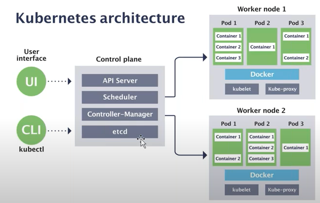
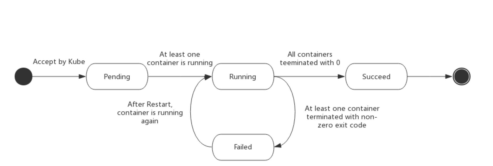
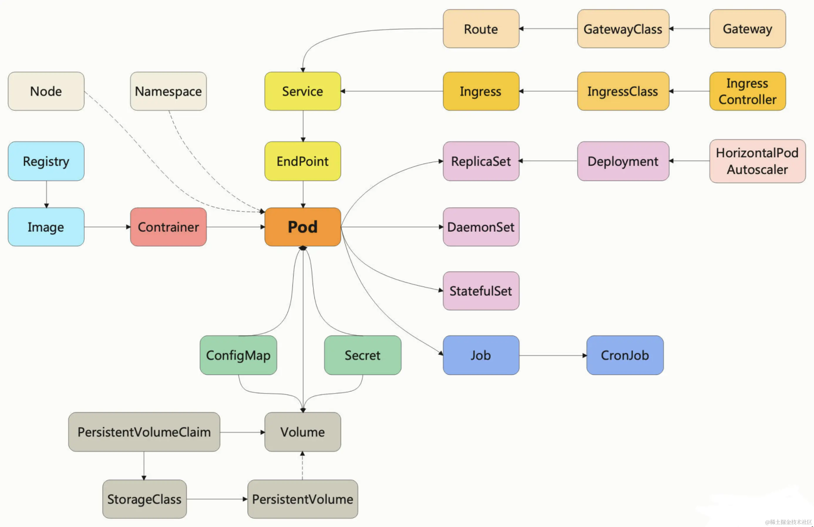
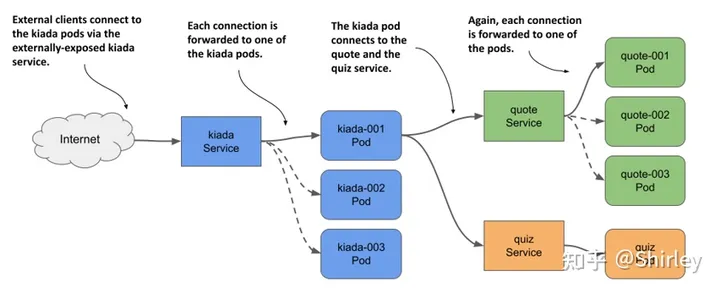
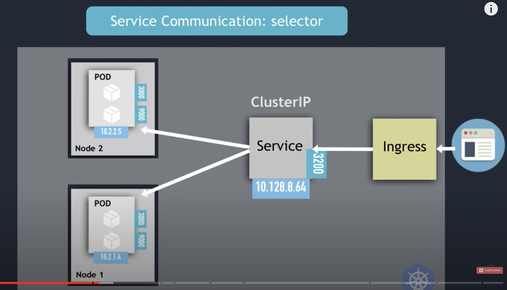
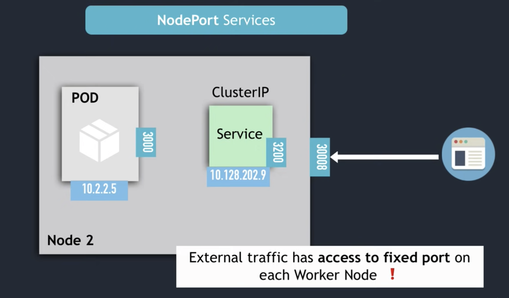
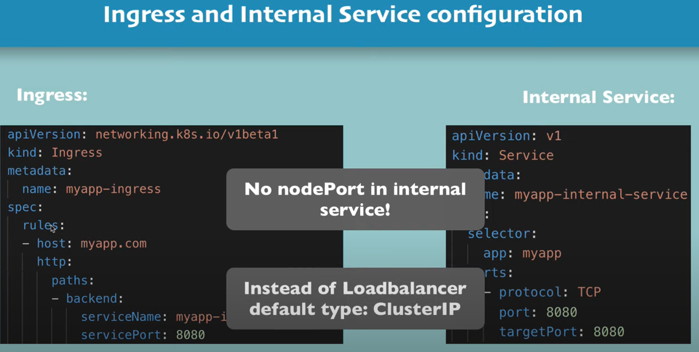
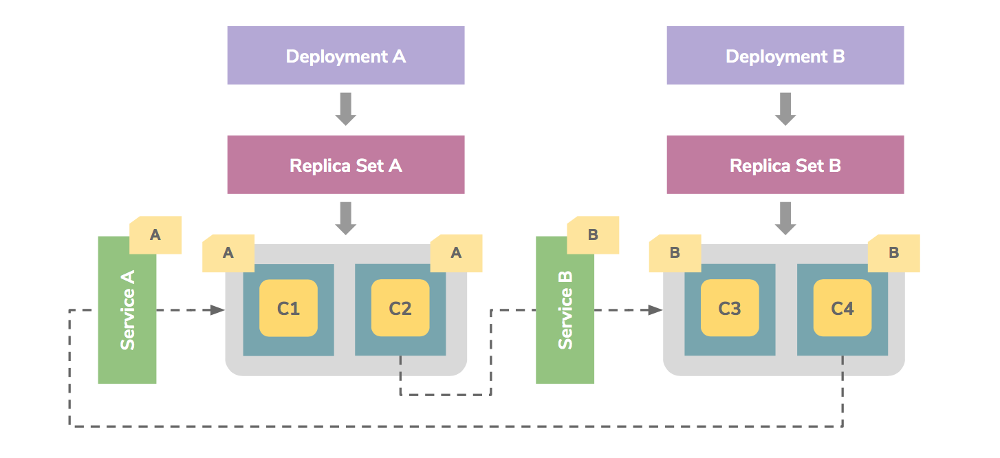

## 容器无法解决的问题

[前文](https://wulucxy.github.io/blog/from-docker-to-cloud-native-01/)我们提到「容器化」是云原生的基石，既然「容器化」已经解决了应用隔离，镜像传输，网络通信等问题，那为啥还需要类似于 kubernetes 这样的容器编排工具呢？

我们设想一下，应用开发一般会按照环境进行隔离，开发环境用于开发工程师本地开发或联调，测试环境则被 QA 用于应用模块集成测试，而生产环境则是开放给最终用户访问。一般来说，生产环境所需要的服务资源，应用数量，运维服务都是开发环境（测试环境）的数倍，且生产环境需要专业运维工程师来维护。

|  项目  | 开发环境 | 生产环境 |
| ------ | ------ | ------ |
| 宿主机数量 |  通常是一个     |  看集群规模，小型团队 10+ 以上   |
| 应用数量   |   通常是一个     |  至少百级别   |
| 网络复杂度  |   简单     |  复杂度高   |
| 存储  |   单机存储     |  分布式存储   |
| 网关  |   通常不需要     |  必需   |
| 部署复杂度  |   不考虑     |  复杂度高   |
| 日志  |   本地输出     |  集中化日志工具  |
| 监控  |   不考虑     |  集中化监控接入  |
| 容灾  |   不考虑     |  必需  |
| 水平扩展  |   不考虑     |  必需  |

可以看到，以上这些都是运维层面需要考虑解决的问题，普通开发者只需要按照运维要求接入即可。k8s 本质上就是一个对底层基础设施统一抽象的“能力接入层”，是“平台的平台”（The Platform of Platform）。

有了类似于 k8s 这样的容器编排（container Orchestration）工具 —— 定义容器组织和管理规范的技术，容器技术实现了从“容器”到“容器云”的飞跃，成为云技术领域的绝对基石。

## kubernetes 架构



kubernetes（希腊语，意为“舵手”）是一个容器编排平台，架构分为 Master 和 Node 两类节点，分别对应控制节点（Control plane）和工作节点（Worker Node）。其中控制节点即 Master 节点，由三个紧密协作的独立组件组合而成，分别是：

- 负责 API 服务的 API-Server
- 负责调度的 Scheduler
- 负责容器编排的 Controller-Manager

整个集群的持久化数据，则由 API-Server 处理后保存在 etcd 中。

> etcd 是基于 key-value 类似的存储系统，etcd 负责存储涉及集群相关的数据，但不保存应用级的数据。
>
> etcd 是集群的大脑🧠和中枢系统

工作节点最核心的部分，是一个名为 Kubelet 的组件，Kubelet 负责同容器运行时对话，比如 ContainerD。这种交互依赖一个称作 CRI（Container Runtime Interface）的远程调用接口，该接口定义了容器运行时的各项核心操作，比如启动一个容器所需的各项参数。

Kube-proxy 则是工作节点上的网络代理组件，运行在每个工作节点上，它的作用是使发往 Service 的流量负载均衡到正确的 Pod。

## Kubernetes 核心概念

### 以资源设计为中心的系统

Kubernetes 是一个完全以资源为中心的容器编排平台，从 API-Server 对外暴露的 REST API 的设计上可以很明显感受得到。可以将 Kubernetes 理解为是一个「资源控制系统」。

#### Group / Version / Resource

[参考链接](https://kubernetes.io/docs/reference/using-api/#api-groups)

针对「资源」这一概念，Kubernetes 又进行了分组和版本管理，于是就有了一些常见的术语：

- Group：资源组，基于资源功能划分，如 apps，extensions；group 可以为空，此时代表核心组
- Version：资源版本，如 v1（稳定版），v2/alpha（内部测试版）等
- Resource：资源，Kubernetes 核心概念，Kubernetes 的本质就是管理、调度及维护各种资源
- Kind：资源种类

他们之间的关系是这样的：

- Kubernetes 系统支持多个 Group(资源组)；
- 每个 Group 支持多个资源版本(Version)；
- 每个资源版本又支持多种资源(Resource)，部分资源还拥有自己的子资源；
- Kind 与 Resource 属于同一级概念，Kind 用于描述 Resource 的种类；

定义一个资源完整的形式如下：

```bash
<GROUP>/<VERSION>/<RESOURCE>[/<SUBSOURCE>]
```

以 Deployment 为例：`apps/v1/deployments/status`

每个资源都有一定数量的操作方法，称为 `Verbs`，如 create / delete / update / get / …（8种），熟悉 REST API 的开发者应该都很习惯。

#### Resource

Resource 实例化后称为一个 Resource Object，在 kubernetes 里面成为 Entity；可以通过 kubernetes API-Server 去操作 Entity。

Kubernetes 目前将 Entity 分为两大类：

- Persistent Entity：即 Resource Object 创建后会持久存在，绝大部分都是 PE，如 Deployment / Service；
- Ephemeral Entity: 短暂实体，Resource Object 创建后不稳定，出现故障/调度失败后不再重建，如 Pod；

#### 资源操作方法：

在 Etcd 层面而言，对于资源的操作最终转换为增删改查这些基本操作，但是抽象到资源层面，Kubernetes 赋予了资源比较多的操作方法，称之为「Verbs」，我们可以把它们归到增删改查四大类:

- 增：
  - create：Resource Object 创建
- 删
  - delete：单个 Resource Object 删除
  - deletecollection：多个 Resource Objects 删除
- 改：
  - patch：Resource Object 局部字段更新
  - update：Resource Object 整体更新
- 查：
  - get：单个 Resource Object 获取
  - list：多个 Resource Objects 获取
  - watch：Resource Objects 监控

#### Resource 和 Namespace

Kubernetes 同样支持 Namespace（命名空间）的概念，可以解决 Resource Object 过多时带来的管理复杂性问题。

- 每个 Namespace 可以视作「虚拟集群」，即不同的 Namespace 间可以实现隔离；
- 不同的 Namespace 间可以实现跨 Namespace 的通信；
- 可以对不同的用户配置对不同 Namespace 的访问权限；

Namespace 即可实现资源的隔离，同时能满足跨 Namespace 的通信，是一个非常灵活的概念，在很多场景下，比如多租户的实现、生产/测试/开发环境的隔离等场景中都会起到重要作用。

#### Resource Manifest File 资源对象描述文件

Kubernetes 通过资源对象描述文件（resource Manifest File）进行 Resource Object 的创建。

Kubernetes 中 Manifest File 可以通过两种格式来定义：YAML 和 JSON，以下是每个字段的定义：

- apiVersion：注意这里的 APIVersion 其实指的是 APIGroup/APIVersion，如 Deployment 可以写为 apps/v1，而对于 Pod，因为它属于 Core Group，因此省略 Group，写为 v1 即可；
- kind：Resource Object 的种类；
- metadata：Resource Object 的元数据信息，常用的包括 name / namespace / labels；
- spec：Resource Object 的期望状态（Desired Status）
- status：Resource Object 的实际状态（Actual Status）

**参考链接**

- [理解 Kubernetes 的 Resource 设计概念](https://blog.yingchi.io/posts/2020/4/kubernetes-resources.html)

## Pod


Pod 是 Kubernetes 中最小的调度以及资源单位，Pod 是对容器（Container）的抽象概念，Pod 可以包含 1 个或多个容器，Pod 基于 IP 和其他 Pod 通信，通过 volume 挂载外部数据。

注意：Pod 是一种临时性的资源对象（Ephemeral Entity），Pod 随时可能会被删除，系统会自动生成一个新的 Pod，新 Pod 可能名字不变，但 UID 不一样，IP 地址也不一样。

Pod 是 Kubernetes 里的虚拟概念，Pod 基于 Deployment 被 node 上的 kubelet 实例化（instantiation），但无法像容器一样作为实体存在（physical entity），所以 Pod 没有像容器类似的 create（创建），destroy（销毁）生命周期阶段。

Pod 状态如下：

1. Pending：Pod 容器镜像尚未创建
2. Running：Pod 中所有容器都已被创建，至少有一个容器正在运行
3. Succeeded：所有容器都被成功终止，并且不会被重启
4. Failed：所有容器都已终止，并且至少有一个容器因为失败被终止



Pod 是 kubernetes 里的最小单元，基于 Pod 可以扩展出更多对象：



从图中能够看出来，所有的 Kubernetes 资源都直接或者间接地依附在 Pod 之上，所有的 Kubernetes 功能都必须通过 Pod 来实现，所以 Pod 理所当然地成为了 Kubernetes 的核心对象。

### 使用 YAML 描述 Pod

```yaml
apiVersion: v1
kind: Pod
metadata:
  name: busy-pod
  labels:
    owner: evan
    env: demo
    region: north
    tier: back
spec:
  containers:
  - image: busybox:latest
    name: busy
    imagePullPolicy: IfNotPresent
    env:
      - name: os
        value: "ubuntu"
      - name: debug
        value: "on"
    command:
      - /bin/echo
    args:
      - "$(os), $(debug)"
```

Pod 属于 API Resource，所以 Pod 也拥有 apiVersion, kind, metadata, spec 这四个基础组成部分。

apiVersion 和 kind 比较简单，就是固定值 `v1` 和 `Pod`。

`metadata` 要有 `name` 和 `label` 字段，`name` 是 Pod 标识，`labels` 负责给 Pod 打标签，可以添加任意数量的 `key-value` 标签，后续和其他资源通信就方便识别和管理了。

比如：

- 根据运行环境，设置 `env=dev/test/production`
- 根据所在数据中心，使用标签 `region=north/south`
- 根据应用所在系统层次，使用 `tier=front/middle/end`
- ...更多实际业务场景

`spec` 字段用来进行过 Pod 管理、维护的参数配置

```yaml
# 容器对象列表配置
  containers:
  - name: 容器名称
    image: 容器所需的镜像
    ports: 
      - containerPort: 容器对外暴露的端口
    imagePullPolicy: IfNotPresent  # 指定镜像的拉取策略，默认为 IfNotPresent
    env: 
      - name: 环境变量名称
        value: 环境变量的值
    command: 容器启动时要执行的命令
    args: 
      - 参数1
      - 参数2
```

可以看出，基于 YAML 的声明式的写法，把容器的运行所需参数描述得非常清晰明确，要比 `docker run` 那一堆参数要整洁得多。

### kubectl 操作 Pod

```bash
# 创建 Pod
kubectl apply -f pod.yml

# 查看 pod 内容器日志
kubectl logs busy-pod

# 查看 pod 列表
# wide 参数可查看 ip
kubectl get pod -o wide

# pod 详情，包含了详细 Pod 生命周期状态
kubectl describe pod busy-pod

# 进入 Pod 内容器 shell
kubectl exec -it ngx-pod -- /bin/bash

# 拷贝文件
kubectl cp a.txt ngx-pod:/tmp

# 删除 Pod，避免 Pod 持续自动重启
kubectl delete -f pod.yml
# 删除指定 pod name
kubectl delete busy-pod
```

**参考资料**

- https://juejin.cn/post/7299673335503536147

## Service

Kubernetes 中 Service 是 将运行在一个或一组 Pod 上的应用程序公开为网络服务的方法。

Service 对象定义了 EndPoint（通常是 Pod） 的集合，以及如何访问这些 Pod 的策略，Service 所对应的 Pod 集合通常选择标签（Selector label）来确定。

### 1. 为什么不能直接用 Pod IP 访问？

前面提到过，Pod 创建后会被分配一个Virtual IP（VIP），但通过 Pod IP 访问会有许多问题：

- Pod 是临时资源，意味着 Pod 随时有可能被删除或被其他 Pod 替换，比如为了给更高优先级的 Pod 提供资源，而被 node 驱动；应用的复本（repica）数量变更而不需要该 Pod 了。
- Pod VIP 被分配以后才会被指定，这也意味着无法提前知晓 Pod IP。
- Pod 支持多副本扩展，每个副本都有独立的 IP，如果指定 IP 访问，就实现实现负载均衡访问。

下图是通过 Service 访问 Pod 应用的一个栗子：



### 定义 Service

Service 和 Pod 一样，也是 Kubernetes 的资源对象，以下 YAML 文件可以定义一个 Service: 

```yaml
apiVersion: v1
kind: Service
metadata:
  name: nginx-service
spec:
  # 选择符，和 Pod label 关联
  selector:
    app.kubernetes.io/name: proxy
  ports:
  - name: name-of-service-port
    protocol: TCP
    port: 80 # Service 端口，集群内部访问 Service 的端口，最终映射到 Pod targetPort
    targetPort: 80 # 也可以直接指向 port name
---
apiVersion: v1
kind: Pod
metadata:
  name: nginx
  # Pod Label，和 Service 关联
  labels:
    app.kubernetes.io/name: proxy
spec:
  containers:
  - name: nginx
    image: nginx:stable
    ports:
      - containerPort: 80 # Pod 内部容器暴露的端口号
        name: http-web-svc
```

系统会创建一个名为 `nginx-service`， 服务类型默认为 `ClusterIP` 的 Service。该 Service 指向带有标签 app.kubernetes.io/name: proxy 的 Pod 的 TCP 端口 80。

将以上配置写入`service.yaml` 文件，执行命令：

```bash
kubectl apply -f service.yaml

# 以下为标准输出
$ service/nginx created
$ deployment.apps/web created
```

### Service 类型

根据服务暴露的方式，Service 分为四种类型：

- ClusterIP：默认类型。只能通过集群内部 IP 访问 Service
- NodePort：通过节点上的 IP 和端口（NodePort）可访问 Service
- LoadBalancer：负载均衡服务，通过节点外部服务转发到 Pod
- HeadlessService：和 StatefulSet 相关，后续再讲

#### ClusterIP Service

ClusterIP 类型的 Service 只能在集群内访问。Service 基于 `spec.selector` 匹配对应的 pod，并通过 `port:targetPort` 匹配对应的 Pod 内的容器端口。



```bash
# 进入容器内部
kubectl exec -it [containerName] -- /bin/bash

# 校验 service 请求
curl [vip]
# 也支持 service name 访问，无需 IP
curl http://[serviceName]
```

#### NodePort Service

port 和 nodePort 都是 Service 的端口，前者暴露给集群内访问服务，后者暴露给集群外访问服务。



**NodePort Service yaml 配置**
```yaml
spec:
  type: NodePort          # 类型为 NodePort, 将服务暴露到节点的端口上
  ports:                  # 定义端口. nodePort 映射到 port，port 再映射到 targetPort
    - nodePort: 30880
      port: 80
      name: web
      targetPort: 80
      protocol: TCP
```
如果`ports.nodePort`未定义，kubernetes 会自动分配一个`30000-32767` 区间内的端口号。

```bash
# 获取节点信息，包含 ip 地址
kubectl get node -o wide

# 服务获取端口
kubectl get service -o wide

# 访问 http://ip:port
```

注意：NodePort Service 直接将 Node 暴露给了用户使用，需要保证访问安全性。

#### LoadBalancer Service

LoadBalancer Service 是对 NodePort Service 的优化。NodePort Service 不支持负载均衡，一旦指定 Node 出现故障，那么外部访问请求就会无响应。

LoadBalancer 将 Service 放置到 Node 之前，确保外部发送的请求能够被转发到健康的节点上，此时项目流程就变成了这样：


相比于 NodePort Service，只需要将`type` 改成 `LoadBalancer`。
```yaml
spec:
  type: LoadBalancer      # 类型为 LoadBalancer,
  ports:                  
    - port: 8080          # service 端口
      name: web
      targetPort: 80
      protocol: TCP
```

此时可以获取对应 service 对应的 EXTERNAL-IP：

```bash
kubectl get svc
```

展示结果类似如下：

```
NAME                  TYPE           CLUSTER-IP       EXTERNAL-IP   PORT(S)        AGE
kubernetes            ClusterIP      10.96.0.1        <none>        443/TCP        7d18h
loadbalancer-service   LoadBalancer   10.107.142.179   <pending>     80:30881/TCP   13m
```
注意：在本地环境无法分配 EXTERNAL-IP，所以一直是 `pending` 状态。

## Ingress

Ingress 是对集群中不同服务提供统一负载均衡服务的对象。可以这样理解，Ingress 就是 Service 的 “service”。

上一节 Service 对象我们提到的 LoadBalancer Service 也可以创建每个 Service 对应的负载均衡服务。

但用户更希望提供一个全局负载均衡服务，然后通过访问 URL 将请求转发给不同的 Service，在 Kubenetes 里面对应的模块就是 Ingress。

以下述 Ingress yaml 配置文件为例：

```yaml
apiVersion: networking.k8s.io/v1
kind: Ingress
metadata:
  name: minimal-ingress
spec:
  rules:
  - host: example.com
    http:
      paths:
      - path: /tea
        pathType: Prefix
        backend:
          service:
            name: test-svc
            port:
               number: 80
      - path: /coffee
        pathType: Prefix
        backend:
          service:
            name: test-coffee
            port:
             number: 80
```

`apiVersion`，`kind`，`metadata` 很好理解，略过不表。

`spec` 定义了 Ingress 的访问规则：

- 可选的 host。如果 host 未指定，则该规则适用于指定 IP 的所有流量。如果提供了 host，则 rules 适用于指定主机。
- 路径列表（paths）。每个路径都有一个 `service.name` 和 `service.port` 的关联服务。基于路径匹配，对应的流量会引导到所引用的 Service。



通过以上描述不难看出，所谓的 Ingress 对象，其实就是 Kubernetes 对于“反向代理”的一种抽象。

有了 Ingress 这一层抽象，使用者只需要选择一个具体的 Ingress Controller，并部署到 Kubernetes 集群即可。

### Ingress Controller

以 miniKube 为例，启动内置的 nginx-ingress-controller: 

```bash
minikube addons enable ingress
```


## Deployment

Deployment 为 Pod 和 ReplicaSet(副本集) 提供声明式创建和更新能力。

Deployment 也是 Kubernetes 里面的资源对象，相对于 Pod，Deployment 是持久性的（Persistent），并且可以实现水平扩缩容（horizontal scaling out/in），Deployment 是创建 Pod 的蓝图（blueprint），是对 Pod 的上层抽象。在 kubernetes 实践中，你应该优先考虑使用 Deployment 来创建 Pod。

> 注意：Deployment 只适合创建无状态（stateless）应用，Kubernetes 提供了另外一个组件 StatefulSet 来创建有状态（stateful）应用。

以下述 Deployment 配置为例：

```yaml
apiVersion: apps/v1
kind: Deployment
metadata:
  name: nginx-deployment
  # service selector 关联 label
  labels:
    app: nginx
spec:
  # 副本数量
  replicas: 3
  # Deployment Pod 选择符
  selector:
    matchLabels:
      app: nginx
  template:
    metadata:
      # selector 和 label 匹配
      labels:
        app: nginx
    spec:
      containers:
      - name: nginx
        image: nginx:1.14.2
        ports:
        - containerPort: 80
```

`apiVersion` 和 `kind` 都是标准的资源对象字段。

`metadata` name 是一个标识符，labels 则用来和 service 关联。


`spec.replicas` 定义了 Pod 副本数量 3， 而 Pod 副本通过 ReplicaSet 进行管理。

### ReplicaSet

ReplicaSet 用来维护一组给定数量的，在任何时候都稳定运行的 Pod 副本的的集合。

Deployment 通过 replicaSet 副本实现“水平扩缩容”，Deployment 操作的是 ReplicaSet 对象，而非 Pod 对象。

实际上，你可能永远不需要直接操作 ReplicSet 对象，而使用 Deployment 在 `spec` 里声明即可。

基于上述 yaml 配置可以创建 RelicaSet 及其管理的 Pod: 
```bash
kubectl apply -f deployment.yaml
```

可以看到当前被部署的 RelicaSet:

```
NAME                          DESIRED   CURRENT   READY   AGE
nginx-deployment-77d8468669   3         3         3       6s
```

也可以查看 RelicaSet 状态变更：
```
kubectl describe rs nginx-deployment
```

可以看到类似下面的输出：

```
Name:           nginx-deployment-77d8468669
Namespace:      default
Selector:       app=nginx,pod-template-hash=77d8468669
Labels:         app=nginx
                pod-template-hash=77d8468669
Controlled By:  Deployment/nginx-deployment
Replicas:       3 current / 3 desired
Pods Status:    3 Running / 0 Waiting / 0 Succeeded / 0 Failed
Pod Template:
  Labels:  app=nginx
           pod-template-hash=77d8468669
  Containers:
   nginx:
    Image:        nginx:1.14.2
    Port:         80/TCP
    Host Port:    0/TCP
    Environment:  <none>
    Mounts:       <none>
  Volumes:        <none>
Events:
  Type    Reason            Age   From                   Message
  ----    ------            ----  ----                   -------
  Normal  SuccessfulCreate  8h    replicaset-controller  Created pod: nginx-deployment-77d8468669-2hfn7
  Normal  SuccessfulCreate  8h    replicaset-controller  Created pod: nginx-deployment-77d8468669-qzhjx
  Normal  SuccessfulCreate  8h    replicaset-controller  Created pod: nginx-deployment-77d8468669-jhbpl
```

## 本章总结



1. kubernetes 是一个「以资源管理为中心」的容器编排平台
1. Deployment 控制 RelicaSet
2. ReplicaSet 控制 Pod（副本数）
3. Service 提供 Pod 访问能力
4. Pod 是 Container 的抽象层
5. Ingress 对集群中不同服务提供统一负载均衡服务