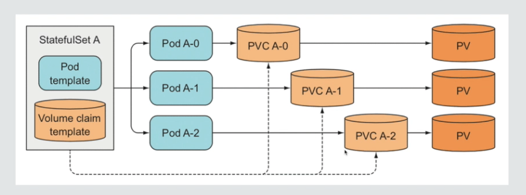

[上一节](/blog/from-docker-to-cloud-native-02/) 主要聊到了 Kubernetes 里的核心组件，包括 Pod, Deployment, Service 和 Ingress。其中 Deployment 的设计是对 Pod 的抽象，以及基于 Deployment 能实现“水平扩缩容”的应用编排能力。

但 Deployment 在面对有状态类（Stateful）应用就有心无力了。问题的根源出自于 Deployment 对应用做了一个简单化的假设：应用的不同 Pod 副本是无差别一致的，Pod 之间没有顺序之分，也无所谓在哪台宿主机上运行。Deployment 可以基于 Pod 模板（Pod template）创新副本，也可以按需结束任意一个 Pod。

但实际场景中，并非所有应用都满足这样的要求，尤其是分布式应用，实例之间往往有依赖关系，比如主从关系，主备关系；还有存储类应用，它的多个实例往往会在本地持久化数据；一旦实例结束，即使重建以后，实例和数据的对应关系已经丢失，从而导致应用失败。

所以，这种实例之间存在不对等关系，以及实例对外部数据有依赖关系的应用，称为有状态应用（Stateful App）。

Kubernetes 使用 StatefulSet 组件实现了对有状态应用的编排。

## StatefulSet 

StatefulSet 的设计是把应用抽象为了两种情况：

1. 拓扑（topology）状态。应用的多个实例之间不是完全对等的，应用实例必须按照顺序依次启动。比如应用的主节点 A 必须先于节点 B 启动。而如果删除 A 和 B 两个 Pod，它们再次被创建也必须严格遵循这个顺序运行。并且，新建的 Pod 标识必须和原来一样，这样原先的访问者仍然能用同样的方法继续访问 Pod。
2. 存储状态。应用的多个实例分别绑定不同的存储数据。即使 Pod 被重新创建过，对于应用实例来说，前后访问到的数据还是同一份。这种情况最典型的例子就是一个数据库应用的多个存储实例。

StatefulSet 的核心功能，就是通过某种方式记录这些状态，然后在 Pod 被重新创建时，能够为新 Pod 恢复这些状态。

在讲 StatefulSet 的核心原理时，要先来介绍一下[上一节](/blog/from-docker-to-cloud-native-02/) 提到过的 Headerless Service。

## Headless Service

Service 是将 Pod 暴露给外部访问的一种方式，比如，一个 Deployment 实现了 3 个 Pod 副本，那就可以定义一个 Service，用户只要能访问到 Service，就能访问到对应的 Pod。

在有状态应用（Stateful App）中，我们需要保证 Service 能够访问到指定的 Pod，那就需要分配 Pod 一个唯一标识，即使 Pod 被删除重建后依然保持同一个唯一标识，在 Kubernetes 里面就通过 Headless Service 组件来实现。

以下是一个 Headless Service YAML 文件：

```yaml
apiVersion: v1
kind: Service
metadata:
  name: my-service
spec:
  # Headless Servive
  clusterIP: None
  selector:
    app: my-app
  ports:
    - protocol: TCP
      port: 80
      targetPort: 9376
```
Headless Service 和标准 Service 最大的区别在于 `spec.clusterIP` 设置为 `None`，即这个 Service 没有一个 VIP 作为“头”。该 Service 创建以后不会被分配 VIP，而是会以 DNS 记录的方式暴露出它所代理的 Pod。

DNS（Domain Name System，域名系统）在 Kubernetes 里面是用于服务发现和负载均衡的一种实现，它允许 Pod 和 Service 使用节点名（而不是 IP 地址）进行通信，简化了集群内部服务之间的相互访问。

Service 在创建时，Kubernetes 会分配一个 DNS 名称。例如，一个名为 `my-service` 的 Headless Service 在默认命名空间中，可以通过`my-service.default.svc.cluster.local` 这样的方式访问。同时该 Service 为每个 Pod 也会创建 DNS 记录，如 `pod-name.my-service.default.svc.cluster.local`，这个 DNS 地址会直接解析到该 Pod 的 IP 地址。

这个 DNS 记录，正式 Kubernetes 为 Pod 分配的唯一可解析身份（resolvable identity），有了这个可解析身份，只要知道了 Pod 名称及其对应的 Service 名称，就可以非常确定通过这条 DNS 记录访问到 Pod 的 IP 地址。

### StatefulSet

基于下面 YAML 我们创建一个 StatefulSet: 
```yaml
apiVersion: v1
kind: Service
metadata:
  name: nginx
  labels:
    app: nginx
spec:
  ports:
  - port: 80
    name: web
  # 定义 Headless Service
  clusterIP: None
  selector:
    app: nginx
---
apiVersion: apps/v1
kind: StatefulSet
metadata:
  name: web
spec:
  selector:
    matchLabels:
      app: nginx # has to match .spec.template.metadata.labels
  # 使用上面定义的 Headless Service
  serviceName: "nginx"
  replicas: 3 # by default is 1
  minReadySeconds: 10 # by default is 0
  template:
    metadata:
      labels:
        app: nginx # has to match .spec.selector.matchLabels
    spec:
      terminationGracePeriodSeconds: 10
      containers:
      - name: nginx
        image: registry.k8s.io/nginx-slim:0.8
        ports:
        - containerPort: 80
          name: web
  # 挂载持久卷
  volumeClaimTemplates:
  - metadata:
      # 对应 pvc 资源的前缀名称
      name: www
    spec:
      accessModes: [ "ReadWriteOnce" ]
      storageClassName: "my-storage-class"
      resources:
        requests:
          storage: 1Gi
```
相比于 deployment，StatefulSet 区别在于多了一个`spec.serviceName` 字段，该字段作用就是告诉 StatefulSet controller，在执行控制循环是使用 `nginx` 这个 `Headless Service`。

通过 `kubectl` 创建 service 和 statefulSet 之后，我们可以看到两个对象：

```bash
$ kubectl apply -f statefulSet.yaml
service/nginx created
statefulset.apps/web created

$ kubectl get svc nginx
NAME    TYPE        CLUSTER-IP   EXTERNAL-IP   PORT(S)   AGE
nginx   ClusterIP   None         <none>        80/TCP    18s

$ kubectl get statefulSet web
NAME   READY   AGE
web    0/3     33s

$ kubectl get pod -l name=nginx
NAME    READY   STATUS    RESTARTS   AGE
web-0   1/1     Running   0          2m
web-1   1/1     Running   0          20s
```

可以看到，StatefulSet 给所有 Pod 命名规则是`<statefulSet-name>-[0]`, `<statefulSet-name>-[1]` 这样的编号递增规则，编号与 Pod 实例一一对应。

更重要的是，Pod 的创建也是严格按照编号顺序进行的。比如，在 web-0 进入 Running 之前，web-1 会一直处于 Pending 状态。

当两个 Pod 都进入 Running 状态后，就可以查看各自唯一的网络身份了。

我们可以尝试以 DNS 方式访问这个 Headless Service:

```bash
# 启动一个临时 Pod，--rm 代表退出就会被删除
$ kubectl run -i --tty --image busybox dns-test --restart=Never --rm /bin/sh

# 通过 nslookup 查看 service 对应的网络地址
$ nslookup nginx.default.svc.cluster.local
Server:		10.96.0.10
Address:	10.96.0.10:53


Name:	nginx.default.svc.cluster.local
Address: 10.244.0.8
Name:	nginx.default.svc.cluster.local
Address: 10.244.0.6
Name:	nginx.default.svc.cluster.local
Address: 10.244.0.7

# 查看 pod 对应的网络地址
$ nslookup web-0.nginx.default.svc.cluster.local
Server:		10.96.0.10
Address:	10.96.0.10:53


Name:	web-0.nginx.default.svc.cluster.local
Address: 10.244.0.6
```

可以看到，DNS 查询 Service 会返回代理的两个 EndPoint(POD) 对应的 IP，这个 IP 跟通过 DNS 查询 pod 返回是保持一致的。

需要注意的是，尽快 DNS 记录是保持不变的，但它解析到的 IP 地址并不是固定不变，这就意味着，对于有状态应用实例的访问，只能通过 DNS 记录方式访问，而绝不应该直接访问 pod 的 IP 地址。

### PV 和 PVC

在聊 StatefulSet 如何解决分布式存储状态的一致性前，要先聊另外一个概念 `PV` 和 `PVC`。

PV（PersistentVolume，持久卷）是集群中的一块存储，可以由 admin 事先生成。持久卷是集群资源，就像节点也是集群资源一样，它们拥有独立于 Pod 的生命周期。

```yaml
apiVersion: v1
kind: PersistentVolume
metadata:
  name: pv0003
spec:
  capacity:
    storage: 5Gi
  volumeMode: Filesystem
  accessModes:
    - ReadWriteOnce
  persistentVolumeReclaimPolicy: Recycle
  storageClassName: slow
  mountOptions:
    - hard
    - nfsvers=4.1
  nfs:
    path: /tmp
    server: 172.17.0.2
```
作为应用开发者，可能对分布式存储项目（Ceph/HDFS/GFS）不甚了解，自然无法编写对应的 Volume 配置文件，而且有暴露公司基础设施敏感信息（秘钥、管理员密码）等的风险。所以 Kubernetes 又引入了 PVC（PersistentVolumeClaim，持久卷申领）API 对象。

定义一个 PVC，声明想要的 Volumn 属性：

```yaml
kind: PersistentVolumeClaim
apiVersion: v1
metadata:
  # 定义 claim 名称
  name: pv-claim
spec:
  # 可读写权限
  accessModes:
  - ReadWriteOnce
  # 资源占用
  resources:
    requests:
      storage: 1Gi
---
apiVersion: v1
kind: Pod
metadata:
  name: pv-pod
spec:
  containers:
    - name: pv-container
      image: nginx
      ports:
        - containerPort: 80
          name: "http-server"
      volumeMounts:
        - mountPath: "/usr/share/nginx/html"
          name: pv-storage
  volumes:
    - name: pv-storage
      # 申领 volumn 名称
      persistentVolumeClaim:
        claimName: pv-claim
```
PVC 表达的是Pod对存储的请求。概念上与 Pod 类似。 Pod 会耗用节点资源，而 PVC 申领会耗用 PV 资源。有了 PVC 后，在需要使用持久卷的 Pod 定义里只需要声明使用这个 PVC 即可，这为使用者隐去了很多关于存储的信息。而具体存储的信息就交给 PV 实现即可。

PVC 和 PV 的设计思想可以参考面向对象领域的接口（interface）和实现（implement）。开发者只需知道并会使用接口，即 PVC，具体的接口绑定实现则由运维人员负责，即 PV。

### StatefulSet 的 PVC 模板

在 `StatefulSet` yaml 配置中，声明了一个 `volumeClaimTemplates` 字段：

```yaml
volumeClaimTemplates:
  - metadata:
      name: www
    spec:
      accessModes: [ "ReadWriteOnce" ]
      storageClassName: "my-storage-class"
      resources:
        requests:
          storage: 1Gi
```
`volumeClaimTemplates` 和 Deployment 里的 Pod template 类似。也就是说，凡是被 StatefulSet 管理的 Pod，都会声明一个对应的 PVC，而 PVC 的定义，就来自于 volumeClaimTemplates 这个模板字段。更重要的是，这个 PVC 的名字会被分配一个与 Pod 完全一致的编号，相当于 PVC 就与 Pod 绑定了。

StatefulSet创建的这些PVC，都以“PVC名-StatefulSet名-序号”这个格式命名的。

对于上面这个StatefulSet来说，它创建出来的 Pod 和 PVC 的名称如下：

```
Pod: web-0, web-1
PVC: www-web-0, www-web-1
```

StatefulSet 架构如下：



假设现在 Pod-web-0 被删除，对应的 PVC 和 PV 并不会被删除，volumn 写入的数据依然存储在远程存储服务上。此时 StatefulSet 控制器会重新生成一个名为 Pod-web-0 的 Pod 对象，用来纠正这种不一致的情况。

新生成的 Pod 对象，由于 volumeClaimTemplates 的存在，它声明使用的 PVC 名称还是 www-web-0，由于 PVC 的生命周期是独立于 Pod，这样新 Pod 就接管了以前旧 Pod 留下的数据。通过这种方式，Kubernetes 的 StatefulSet 就完成了对应用存储状态的管理。

总结一下：

1. 首先 StatefulSet 控制管理的是 Pod。每个 Pod 携带了固定的编号，且不随 Pod 调度而变化。
2. Kubernetes 通过 Headless Service 为这些有编号的 Pod，在 DNS 服务器中生成带有相同编号的 DNS 记录。只要 StatefulSet 保证 Pod 名字编号不变，那么 Service 类似于 `pod-0.my-service.default.svc.cluster.local` 的记录就不会变，而这条记录对应的的 IP 地址，会随着 Pod 的删除和重建而自动更新。
3. 最后 StatefulSet 为每个 Pod 分配并创建一个相同编号的 PVC，这样 Kubernetes 可以通过 PVC 绑定对应的 PV，从而保证每个 Pod 都有一个独立的 Volumn。

**参考**

1. [深入理解StatefulSet](https://juejin.cn/post/6962417834425057310?searchId=20240514210028836D79D9BC05892E7FF2)