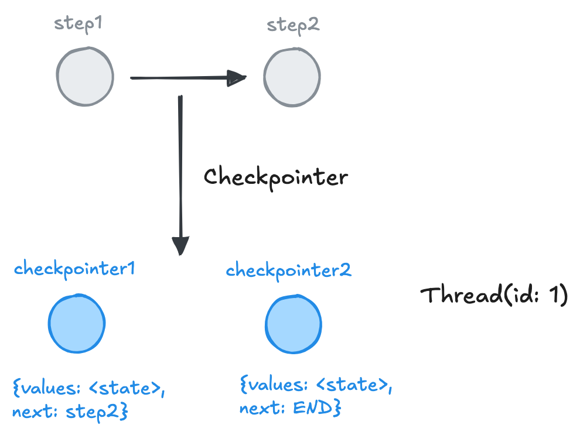
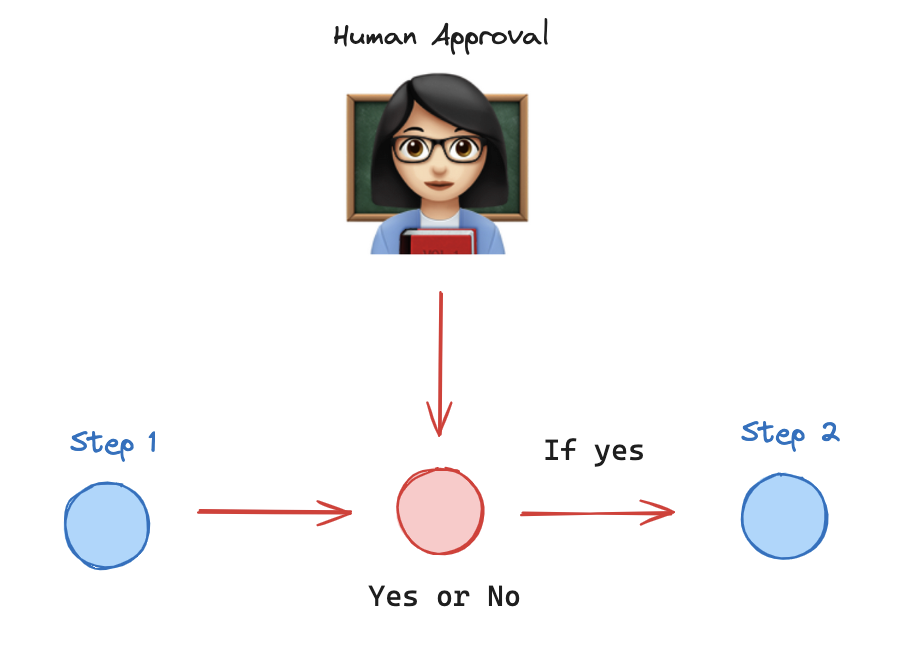
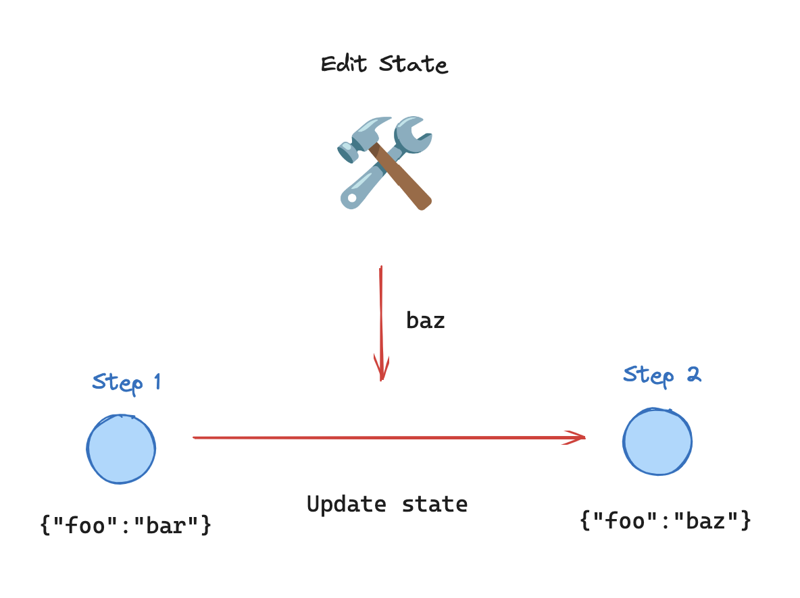
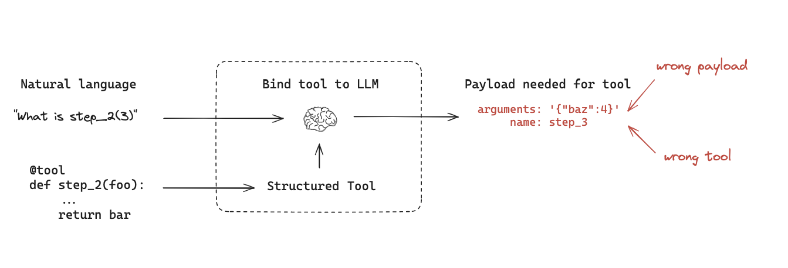

## 背景

人机协作（Human-in-loop）AI Agent 开发是一种协作方法，它将人类输入和专业知识融入到 AI 应用开发的生命周期中。人类可以参与到模型的训练、评估和运行，提供有价值的反馈、输入和指导，通过这种协作，旨在利用人类和 AI 的独特优势，提升 AI Agent 的准确性、可靠性和适应性。

在 [持久化 Agent](/ai-agent-pattern-persistence) 一文中，我们在 Langgraph 中使用 `checkpointer` 和 `thread` ，实现了 AI 对话多轮交互的持久化能力。



## 人工介入(interrupt)



在实际场景中，涉及到一些复杂的用户交互场景，AI 需要寻求用户的帮助来提升任务的完成率和准确率。比如在一些智能客服场景中，当聊天机器人无法解决问题时，Agent 工作流可以指定关键节点需要人工介入（interrupt），而这个过程对于用户是完全透明的。

以上图为例，系统设定在执行 `step2` 之前通过人工确认来指定流转方向，如果用户回复是 `yes` 则继续下一步，否则就退出当前对话。

基于 `langgraph` 给出以下解决方案：

```javascript
const memory = new MemorySaver();

// 定义 state
const graphState = {
  input: null,
};

function step_1(state) {
  console.log("---Step 1---");
  return {
    input: "step1",
  };
}

function step_2(state) {
  console.log("---Step 2---");
  return {
    input: "step2",
  };
}

const workflow = new StateGraph({
  channels: graphState,
})
  .addNode("step1", step_1)
  .addNode("step2", step_2)
  .addEdge(START, "step1")
  .addEdge("step1", "step2")
  .addEdge("step2", END);

// interruptBefore: 定义在节点 step2 之前支持外部介入
const graph = workflow.compile({
  checkpointer: memory,
  interruptBefore: ["step2"],
});
```

调用函数：

```javascript
async function main() {
  const initial_input = { input: "hello world" };

  // thread 定义对话 id，用于保存多轮次交互记录
  const thread = { configurable: { thread_id: "1" } };

  // 执行 interrupt 之前的流程
  for await (const result of await graph.stream(initial_input, {
    ...thread,
    streamMode: "values",
  })) {
    console.log("===result11====", result);
  }

  // 基于命令行读取用户输入
  const userApproval = await readUserInput(
    "Do you want to go to Step 3? (yes/no):"
  );

  // 只有当用户输入 yes 时才进入 Step2 节点逻辑
  if (userApproval.toLowerCase() === "yes") {
    // 这里传递 null 代表恢复上一次会话记录，对应 thread 会从保存的 checkpointer 读取历史记录
    for await (const result of await graph.stream(null, {
      ...thread,
      streamMode: "values",
    })) {
      console.log("===step2====", result);
    }
  } else {
    console.log("Operation cancelled by user.");
  }
}

main();
```

## 可编辑状态

AI 生成的结果存在一定的随机性，难以保证一致的结果和风格。为了应对这一问题，在 Agent 设计过程中，需要开放给开发者修改状态的能力，在`langgraph` 里对应 `updateState` 函数。



以下图为例，LLM 有时无法给出符合预期的 `function_calling` 输出结果，为了保证下游输入参数的可靠性，我们需要对 LLM 返回结果进行修改。



我们重新定义 `main` 函数：

```javascript
async function main() {
  const initial_input = { input: "hello world" };
  const thread = { configurable: { thread_id: "1" } };

  for await (const result of await graph.stream(initial_input, {
    ...thread,
    streamMode: "values",
  }));

  // 手动更新状态
  await graph.updateState(thread, {
    input: "hello universe",
  });

  console.log("===currentState", (await graph.getState(thread)).values);

  for await (const result of await graph.stream(null, {
    ...thread,
    streamMode: "values",
  }));
}

main();
```

## 总结

虽然基于 LLM 的 Agent 具有强大的能力，但在需要判断力、结合上下文的理解和处理不完整信息的领域，人类的知识能够提供可靠的帮助。Human-in-loop 通过将人工输入和反馈整合到 Agent 工作流，增强 AI Agent 系统的适应性，使模型能够随着用户的偏好和真实场景的变化不断进化。
