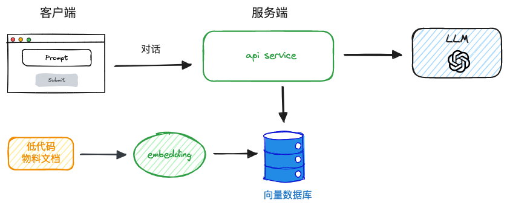
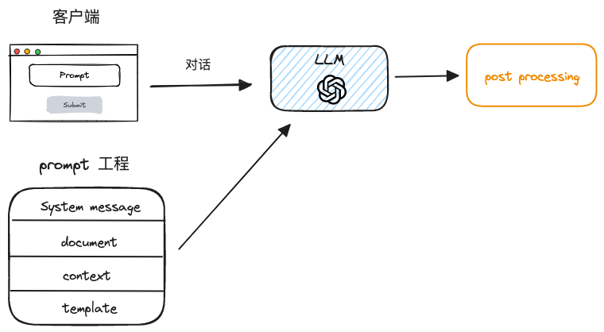
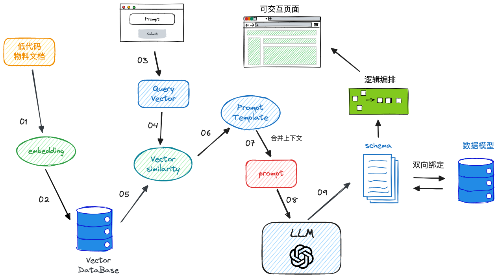
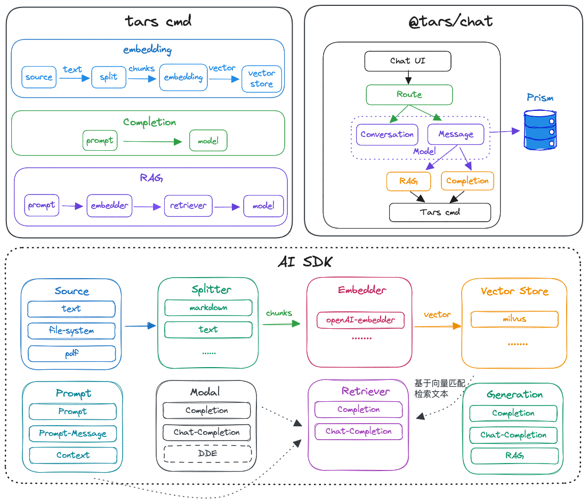
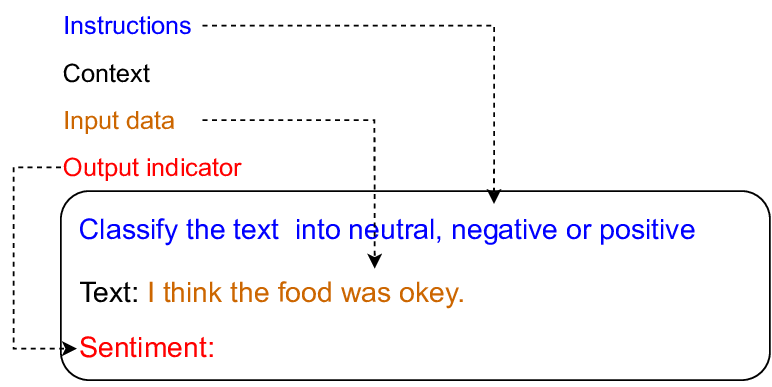
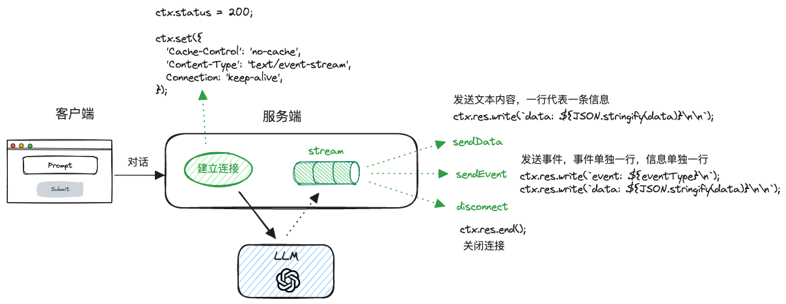
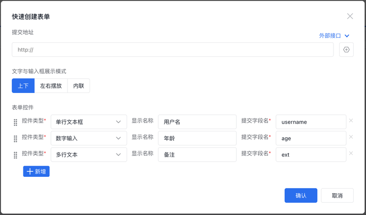
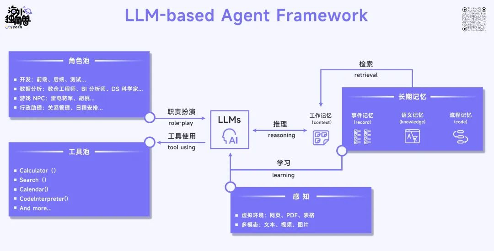

## 背景

TARS 是一款面向前端页面生成低代码平台。随着大模型（LLM）不断涌现的各种能力，生成式 AI 与低代码结合有了更广阔的应用空间。TARS 在接入大模型的过程中踩坑无数，经历了数个版本迭代以后，也算是对大模型应用开发落地有了一些片面的思考，希望对大家有所帮助。

## 功能概览

在 TARS studio 中，用户可以通过聊天的交互方式，通过自然语言输入与模型服务对话，生成前端页面（本质上是一段符合 TARS 定义的低代码协议，以下称为 schema）。使用者无需记忆大量的组件配置和功能点，仅需简单的业务场景的描述，就能生成表单、表格、页面布局和管理界面等，有效提升了页面的搭建效率，搭建完毕的页面可以多次需改，直到满足交付标准。交付产物还可以借助 TARS admin 实现版本管理和发布上线。

<video width="100%" controls>
  <source src="./assets/demo.mp4" type="video/mp4" />
</video>

## 技术路线

### 1. 看山是山

23 年 6 月，TARS 开始尝试接入 LLM。当时对于大模型应用落地的理解远不成熟，加上平台功能并不完善，第一版的大模型接入主要由算法和后端牵头，前端主要负责组件开发，文档整理和协议制定。和大模型相关交互都由服务端来实现。



本阶段的大模型只支持初始化页面生成，无法对产物进行二次修改，只能说勉强证明了大模型接入低代码的可行性，更偏向于一个功能可用性验证。

此外，该方案还有些明确的缺陷：

1. 组件文档和 system prompt 基于 excel 同步，无法即使更新，难以做 prompt 工程化
2. 调试困难，从使用者提交对话，到大模型返回结果，难以跟踪完整链路
3. 角色错位，作为低代码平台的开发者和使用者，前端未参与到大模型应用的核心流程

### 2. 看山不是山

> What I cannot create, I do not understand

吸取第一个版本的教训，在攻关 DDE 期间，开始尝试对现有的产品方案做重构。由于这段期间没有后端资源，这一版方案落地完全由客户端来实现。本方案的技术架构如下：



相比于前一版，该方案改进点包括：

1. 前端对于大模型调用链路有完整的控制能力，可调试可跟踪
2. system message 和组件文档和代码一起管理，方便 prompt 工程化
3. 返回结果做了一层后处理（post processing），确保返回结果健壮可用
4. 支持页面无限修改，前提是未超出 token 限制

方案的缺陷也很明显：

1. 每次发送全量组件文档，token 消耗成本高。一旦组件文档超出限制，系统完全不可用
2. 数据安全风险，每次发送 prompt 包含了 system message 信息，数据安全无法保障

### 3. 看山还是山

有了前两个方案的铺垫，对于大模型应用落地已经有了相对清晰的认知，整体产品接入流程如下：



考虑到未来大模型应用场景的可复用性，本期技术方案将更突出 LLM 应用接入的通用能力建设，技术架构如下：



接下来我们详细分解下新版技术架构：

## 技术架构

### 名词解释

- source：

  数据来源。大模型无法直接访问私有数据，可基于 RAG 或是 Fine-Tune（微调）提供数据源。数据源可以包括各种格式，如 text/markdown/pdf/excel 等

- splitter

  数据库存储单条数据有容量限制，所以需要对源数据进行拆分(split)生成文本块（chunk）。常见有 TextSplitter, MarkdownSplitter 等

- embedder

  将文本转换为向量的过程称之为 embedding。本质上大模型无法直接识别文本，而是理解文本背后的 token，向量化的过程就是将
  token 转化为一组二维数组。

- vector store

  向量数据库是 RAG 的核心，向量数据库存储 embedding 后的向量和原始文本，并提供向量相似性对比用于检索匹配的文本。

- prompt

  prompt 提示是用户与大模型的交互入口，prompt 质量很大程度上决定了 LLM 返回结果是否符合预期，所以 prompt engineering 一直来都是大模型应用实践的重点

- model

  模型对 LLM 进行一层封装，并对外提供一个公共基类。模型通常支持流式输出和批量输出两种方式。

- retriever

  基于向量匹配，从向量数据库获取与目标文本相似度（similarity）最高的 N 组序列数据，常用的相似度匹配算法有 L2（欧式距离）、余弦定理等。

- generation

  将上述模块进行组合，完成一个特定的生成式任务，称之为 generation。比如 completion 只需要组合 prompt 和 model，而 RAG 需要组合 prompt、embedder、retriever、model。

### 向量化（embedding）

TARS 物料文档对外提供了一个向量化的入口，物料只需提供 ai.ts 文件，并符合规范，就可以通过 cli 一键完成向量化。以 `Button` 组件为例：

```typescript
export const aiConfig = {
  prompt: `
  ## Button
  按钮组件，用于触发一个操作。组件属性类型定义如下：

  \`\`\`typescript
  type ButtonComponentProps = {
    /** 按钮样式/类型 */
    type: 'default' | 'primary' | 'link' | 'text' | 'dashed';
    /** 文本 */
    title: string;
    /** 按钮尺寸/大小 */
    size?: 'small' | 'middle' | 'large';
    /** 是否块状 */
    block?: boolean;
    /** 是否危险样式 */
    danger?: boolean;
  }
  \`\`\`
  `,
  postProcessing(data: NodeSchema) {
    // 对 ai 返回结果进行后处理
  }
```

该组件提供的 ai 生成文档的核心在于：

1. 使用 markdown 生成，方便后续做文本分割（split）
2. 基于 typescript 类型定义，LLM 对 ts 有天然的理解能力

值得注意的是，langchain 提供 markdownSplitter 默认按照 1000 词进行分割，如果组件示例过长，有可能会被拆分成数个独立的 chunk，在 retriever 召回的文本序列中顺序可能不一致。所以在 TARS 项目中，我配置了 `chunkSize: 5120`，但仍然有可能部分文档过长，导致被拆分多多个文本块。

向量数据库作为 AI 的基础技术底座，可选项也非常之多，并且绝大部分都实现 node client。

- 单机型的 chroma，orama，可以直接部署在本机，操作方便。如果数据量不是很大可以考虑
- 分布式的 Milvus、qdrant，适用于大量文档场景，但分布式部署导致了运维成本高，比如 Milvus 还依赖了 etcd、minio 等
- 基于已有服务扩展，可以使用 RedisSearch、pgvector、Elasticsearch，它们可以直接在现有服务上扩展，避免新增运维成本。
- 使用 aPaas 服务，比如开源的 supabase

TARS 直接沿用了之前已经在使用的 Milvus。值得注意的是，TARS 也提供了对其他数据库的支持，只需要基于公共类实现接口即可。

### 模型（model）

按照使用场景分类，模型可分为以下两种常见类型：

1. completion（自动补全）：最基础的大模型类别，AI 通过分析已有的上下文信息，基于用户当前输入内容，来预测下一段可能出现的序列。completion 常用于文字编辑、代码编程等。
2. chat-completion(聊天)：相比于 completion，聊天模型增加了 role 角色信息，role 可以是 system（系统角色），assistant(助理)，user（用户）和 function（函数式调用）。

模型推理结果输出方式有两种：

1. 流式输出（stream）：模型在推理过程中，逐步生成输出结果。适合于需要实时处理的场景，比如语音识别、实时翻译等。
2. 批量输出（batch）：模型完成推理过程后，一次性生成全部输出结果。适合于需要一次性生成结果的场景，比如图像识别、图片生成等。

TARS 集成的模型基于 azure openAI 实现，completion 和 chat-completion 模型通过区分 deployName 实现。针对推理结果输出方式，azure openAI 提供了 `streamCompletions` 和 `getCompletions` 实现。

以下是对应的类型实现：

```typescript
/**
* Returns textual completions as configured for a given prompt. 批量返回文本补全结果
* @param deploymentName - 区分模型 endpint
* @param prompt - 用户提示
* @param options - 自定义配置
* @returns 返回补全结果
*/
getCompletions(deploymentName: string, prompt: string[], options?: GetCompletionsOptions): Promise<Completions>;
/**
*  Lists the completions tokens as they become available for a given prompt. 流式输出模型推理返回 token
* @param deploymentName - 模型 endpint
* @param prompt - 用户提示
* @param options - 自定义配置，比如 topK、temperature、maxTokens 等
* @returns An asynchronous iterable of completions tokens. 返回一个异步可迭代的补全 token
*/
streamCompletions(deploymentName: string, prompt: string[], options?: GetCompletionsOptions): Promise<EventStream<Omit<Completions, "usage">>>;
/**
* Get chat completions for provided chat context messages. 基于聊天上下文返回聊天补全结果
* @param deploymentName - 模型 endpint
* @param messages - 用户聊天提示（chat message）
* @param options - 自定义配置
* @returns The chat completions for the given chat context messages.基于聊天上下文返回 Chat Message
*/
getChatCompletions(deploymentName: string, messages: ChatRequestMessage[], options?: GetChatCompletionsOptions): Promise<ChatCompletions>;
/**
* Lists the chat completions tokens as they become available for a chat context. 流式输出模型推理返回 chat completion token
* @param deploymentName - 模型 endpint
* @param messages - 用户聊天提示（chat message）
* @param options - 自定义配置
* @returns An asynchronous iterable of chat completions tokens.  返回一个异步可迭代的补全 token
*/
streamChatCompletions(deploymentName: string, messages: ChatRequestMessage[], options?: GetChatCompletionsOptions): Promise<EventStream<ChatCompletions>>;
```

### 检索增强生成（RAG）

公开的大模型训练数据比较滞后，GPT-4 的训练数据截至 23 年 4 月，且大模型无法直接访问企业内部知识库。google 研究人员提出了 RAG（Retrieval-Augmented Generation）的模型架构，核心思想是将检索器（Retriever）与生成器（Generator）相结合，以实现更精确的文本生成。检索器负责从知识库中检索与输入匹配的文本片段，生成器则使用检索到的信息，和用户输入结合生成最终输出文本。简单来说，RAG 就是提供了一个大模型的「外挂」。

Generator 就是上面提到的「model」，实现 RAG 的核心是 retriever，基于 retriever 实现信息的检索和召回（recall）的效率和准确度对于模型输出有决定性的作用。

retriever 通常依赖向量数据库实现，向量数据库会提供一些相似性检测的算法（欧式距离算法、余弦定理等）来输出文本匹配的返回。

以 milvus 为例：

```typescript
const response = await this.client.search({
  collection_name: this.collection_name, // 类似于 sql 表
  vector: embeddings, // 用户输入向量化的二维数据
  metric_type: IndexCreateParams.metric_type, // 相似度算法，默认为欧式距离算法
  params: { nprobe: 64 }, // 和 nlist 相关，配置检索效率和速度
  ...(options || {}), // topk, limit, expr...
});

// 返回结果
const matches = response.results || [];

return matches.map((match) => {
  return {
    id: match.id, // 对应数据 id
    chunk: {
      id: match.id,
      content: match.content, // 匹配文本
      metadata: match.metadata,
    },
    similarity: match.score || null, // 相似度
  };
});
```

值得注意的是检索结果 score 排序和算法有关，L2 算法匹配度越高，score 反而越低。其他算法则相反。在处理召回结果排序的时候需要尤其注意。

retriever 还有一个隐含的风险在于：如何评价召回结果的准确度？目前的方案完全依赖向量数据库的检索精度。业界也有一些探索，本文不做展开。

### prompt（提示）

Prompt 是用户和大模型交互的入口。通常可以将 Prompt 分为 4 部分：

- Instruction（指令） - 即你希望模型执行的具体任务
- Context（上下文）- 模型所需要了解的背景信息
- Input（用户输入）- 用户的指令
- Output（模型输出） - 大模型输出内容



考虑到数据的准确性和安全性，通常 Instruction 和 Context 是不对用户开放的，所以这两者又称为 hidden prompt(隐藏提示词)，隐藏提示词一般放在对话的最前面。

> hidden prompt 有时又称为 system prompt（系统提示词）

基于 `Chat-Completion`和 `Completion` model 的区别，prompt 分为两类：

```typescript
/** 最简单prompt */
type Content = "string";

/** 对话消息类 prompt */
export type MessageBase = {
  /** 角色: system/user/assistant */
  role: Role;
  /** 消息内容 */
  content: string;
};
```

实际业务场景的 prompt 要接入上下文信息，比如 RAG 检索返回文本，或是一些自定义业务数据，需要需要进一步 Prompt 扩展能够接受模板、上下文变量的类：

```typescript
/** 上下文对象 */
export interface PromptMessageContext {
  chunks: string[];
  [key: string]: any;
}

// 接受template 模板、context上下文入参
export class PromptMessageWithContext {
  // 外部传入的 prompt 模板，支持纯文本，Message
  private template: string | ChatRequestMessage | ChatRequestMessage[];

  // 接收用户输入，模板，上下文，和自定义数据生成最终 prompt
  async render(values: {
    query: string;
    context: PromptMessageContext;
    customData: CustomData;
  }) {
    const message = fromTemplate(this.template, {
      query,
      chunks,
      customData,
    });
    return message;
  }
}
```

以 TARS 为例，以下是 TARS 定义的系统 prompt：

```typescript
/**
 * 基于 nunjucks 模板实现 prompt 模板
 */
export const promptTemplate = [
  {
    role: "system",
    content: `
    你是一个页面开发助手, 基于 TARS 智能低代码平台，你需要把我的需求转换为 JSON 数据结构(使用 JSONPatch 描述的数组格式)。
    请记住，如果用户输入和页面、组件不相关，直接返回文本内容：无法识别，请重新输入；否则每次只返回一段 JSONPatch 代码。
    `,
  },
  {
    role: "user",
    content: `
    使用 JSON 描述一个页面，示例如下：
    \`\`\`json
    {
      "componentName": "Root",
      "children": [{
        "componentName": "Form",
        "props": {}
      }]
    }
    \`\`\`
    其中 componentName 代表组件类型，每个页面必需且仅有一个 Root 组件作为根组件。
        
    以下是组件说明：
    
    {{ chunks | safe }}

    接下来以上面的示例页面配置为例，我们来做一些演练。

    注意: 作为页面开发助手，你实际返回的内容只需包括 content 里的 JSONPatch 数据结构, role 是用来模拟角色，无需返回。
    
    \`\`\`json
    [
      {
        "role": "user",
        "content": "当前页面下，增加一个警告提示组件"
      },
      {
        "role": "assistant",
        "content": 
        \`\`\`
        [{
          "op": "add",
          "path": "/children/-",
          "value": {
            "componentName": "Alert",
            "props": {
              "type": "info",
              "message": "警告提示",
            }
          }
        }]
        \`\`\`
      }
    ]
    \`\`\`
  `,
  },
  {
    role: "user",
    content: `现有页面数据如下，后续操作都基于这个页面来进行：\`\`\`{{ customData.schemaTree | dump | safe }}\`\`\``,
  },

  {
    role: "user",
    content: `{{ query }}`,
  },
  {
    role: "assistant",
    content: `以下是返回的内容：
    `,
  },
];
```

> query: 用户当前输入
>
> chunks: 根据用户输入从 vector store 检索并召回的组件文档
>
> customData: 业务自定义数据，这里提供了页面组件树作为 ai 修改的上下文来源

在提示词工程（prompt engineering）方面目前主要使用 few-shot，好处是足够简单且通用，效果也基本符合预期。

更多的提示词技巧可以参考：https://github.com/brexhq/prompt-engineering

### 数据处理工程（data processing）

#### 1. prompt 自定义生成（prompt processing）

`@tars/ai` 是一个通用的 ai 开发框架，对上层业务接入提供了足够灵活的扩展能力。比如在低代码生成场景下，需要提供 prompt 自定义生成的能力。

以 TARS 为例，封装一个高阶函数，接收 RAG 实例作为入参，返回一个新函数用来构建增强后的 prompt，再发送到 LLM 进行推理

```typescript
/**
 * 基于 RAG 生成用户 prompt，并返回参考引用
 */
export function makeRagGenerateUserPrompt(params: {
  rag: RAGChat;
}): GenerateUserPrompt {
  return async ({ userMessageText, conversation, customData }) => {
    const { rag } = params;
    try {
      // 基于用户输入，通过向量匹配数据后，返回 result，包含 prompt 和 chunks
      const { prompt } = await rag.renderPrompt(userMessageText, customData);

      return {
        userMessage: prompt,
      };
    } catch (err) {
      throw err;
    }
  };
}
```

以上步骤基本上已经概括了从原始知识库向量化存储，到用户输入查询，经过 RAG 增强，组装 prompt 发送到 LLM 推理的全链路过程。

#### 2. 推理结果后处理（post processing）

大模型是一个很通用的技术，可以用来做很多类型应用。但大模型作为一个基于概率分布的预测引擎，在一些对精度容忍度较低的场景下，大模型往往不一定适用。并且大模型天然存在幻觉问题，至今无法克服。

在低代码这样一个对于生成 schema 精度要求较高的领域，我们需要对推理结果进行后处理（post processing），基于防御性编程的方式，即使模型返回结果不符合预期，也有兜底的方案。

以 `Form` 组件为例：

```typescript
postProcessing(data: NodeSchema) {
    // 模型生成后，经过 JSONPatch 解析后返回结果
    const { componentName, children, slots, props, ...meta } = data;

    const nextData = cloneDeep(data);

    // 确保初始化 props
    if (Object.keys(data.props || {}).length === 0) {
      nextData.props = {
        layout: 'horizontal',
        formItemColumn: 1,
        labelWidthType: 'grid',
        labelCol: 4,
      };
    }

    // slot 为空，确保返回 actionGroup
    if (Object.keys(data.slots || {}).length === 0) {
      nextData.slots = {
        actionGroup: {
          componentName: 'ActionGroup',
          props: {
            title: '弹窗',
          },
        },
      };
    }

    return nextData;
  },
```

### 服务端推送（SSE）

SSE 全称为 Server Sent Event，也就是服务端推送事件。通常来说，客户端要想获取更新的数据，需要从客户端发送请求到服务端更新。使用 SSE 可以实现由服务端主动推送客户端事件的能力。

#### SSE 原理

SSE 本质上是一个 HTTP 的长链接，只不过它发送给客户端的不是一次性的请求，而是一个 stream 流，响应格式是 text/event-stream。

所以客户端不会断开连接，会一直等着服务端发过来的数据流。

#### 技术方案



SSE 客户端可以使用原生 [EventSource](https://developer.mozilla.org/en-US/docs/Web/API/EventSource) 实现，但 EventSource 只支持 `get` 请求，且无法自定义请求头，一般优先推荐试用 [fetch-event-source](https://www.npmjs.com/package/@microsoft/fetch-event-source)。

### prisma

prisma 是一款基于 typescript 的 nodejs 端 ORM 实现，是我目前使用过最简单方便的 ORM。ORM 全称是 Object Relation Mapping，用于将数据库操作映射为面向对象操作，简单来说，就是使用面向对象（类、属性、关联等）的写法实现 sql 操作，使得代码更加直观和易于维护，且更加安全可靠。

prisma 由以下部分组件成：

- Prisma Client：查询构建器，提供了 Prisma 对象的调用能力
- Prisma Schema：定义了一套声明书式的独立语法
- Prisma Migrate：将 Prisma Schema 迁移为 sql
- Prisma Studio：数据库可视化展示

以 TARS 为例，首先定义 Prisma schema，执行 `prisma migrate` 之后会映射为 sql。

```shell
generator client {
  provider = "prisma-client-js"
}

datasource db {
  provider = "mysql"
  url      = env("DATABASE_URL")
}

// model 可以理解为 sql 表，或是 no-sql 的 collection
model Message {
  id             String             @id @default(uuid())
  type           MessageType?
  actionType     MessageActionType?
  content        String             @db.VarChar(5120)
  Conversation   Conversation?      @relation(fields: [conversationId], references: [id])
  conversationId String?
  gmtCreate      DateTime           @default(dbgenerated()) @db.Timestamp(3)
  role           Role
}

model Conversation {
  id             String    @id @default(uuid())
  gmtCreate      DateTime  @default(dbgenerated("NOW()")) @db.DateTime
  gmtModified    DateTime  @default(dbgenerated("NOW() ON UPDATE NOW()")) @db.Timestamp(0)
  title          String?
  messages       Message[]
  createUserId   String
  createUserName String
}

enum MessageType {
  unknown
  text
  json
  feedback
}

....

```

有几点需要注意的是：

1. Prisma 不支持自定义类型

```shell
# ❌ ERROR
model Conversation {
  createUser: CreateUser
}

type CreateUser {
  userId   String
  userName String
}

# ✅ YES
model Conversation {
  createUserId   String
  createUserName String
}
```

2. 时间类型默认不支持时区配置，时间精度只到 s

```shell

# ❌ 默认返回 UTC 时间；精度只到 s
model Conversation {
  gmtCreate      DateTime     @default(now()) @db.DateTime
}

# ✅ 配置 mysql 时区；精度到 ms
model Conversation {
  gmtCreate      DateTime     @default(dbgenerated()) @db.Timestamp(3)
}
```

3. prisma 默认访问的是国外源，可能会出现无法下载，建议设置国内源

```Dockerfile
ENV PRISMA_BINARIES_MIRROR http://npmmirror.com/mirrors/prisma/
```

Prisma Client 提供了强大的 typescript 类型能力，此处见演示。

值得注意的是，Prisma Client 是一个全局实例，无需重复定义。

## 大模型应用落地面临的挑战

### 算力挑战

王坚院士在《新年第一课》里提到：送走了摩尔定律，迎来了香农定理。未来的算力竞争不再依赖于硬件性能的指数级增长，也取决于算法、数据和信息处理的进步。近半年来，azure openAI 模型推理速度进行飞快的迭代，从最初版本平均约 1 min，到第二个版本 10s 内，以及最新版本 3s 以内的响应时间，未来大模型「推理端」的速度仍然处于飞速增长阶段。

大模型爆发的背后，离不开巨大的算力开销。众所周知的原因，国内高端显卡严重短缺，一张 A100 已经被炒到了二三十万人民币（官方售价 1w 美元），月租价格甚至搞到 5w-7w 人民币，[来源](https://finance.sina.cn/blockchain/2023-10-17/detail-imzrmexm4165048.d.html)。即便如此，高昂的价格仍然然拿不到芯片。

按 chatGPT 月均访客 1300w 来说，其对应的芯片需求是 3w 多张 A100 GPU，初始算力成本超过 8 亿美金，每天光机房运营的电费就超过 5w 美元，每天耗电量与国内 27.5w 户家庭相当。作为对比，2023 年滨江区的人口总数是 54w 人，相当于 chatGPT 运营阶段的电费就能支撑半个滨江区人民的电费开支，更不用提大模型训练阶段更多的资源消耗！

### 使用成本

和传统软件基于严密逻辑和规则约束实现，带来的是可靠性和稳定性。而基于概率分布预测的大模型应用，虽然比传统软件交互方式更灵活，但在结果的可靠性方面就不太「可靠」了。加上中文高质量数据集的缺失，openAI 对于中文的语义理解远不如英语自然。不过，沿着当前的技术路径迭代下去，在可预期的未来，LLM 应用能够达到与传统软件接近的可靠性。

正如施乐发明的鼠标成为了 PC 时代人机交互的重要起点，而 iPhone 的触摸屏则改变了移动时代的规则，关于「自然语言」是不是 AI 时代最适合的交互方式，笔者不敢苟同。不是所有的操作都适合通过自然语言来实现，比如通过自然语言去删除某个组件，就远不如鼠标右键来得方便。而且自然语言只适合于描述简单明确的操作，一旦操作的复杂度提升以后，更适合的还是类似于代码的结构化表达。

举例来说，配置这样的一个表单组件：

在 TARS 平台上基于模板生成就分分钟的事情，还很准确。反之使用 自然语言 + AI 效率肯定不如手动操作。



#### 应用场景

> 以下内容参考自[AI Agent 赛道，如何重构知识工作](https://m.huxiu.com/article/2169231.html?type=text&visit_source=home_page&collection_id=139)，感兴趣可自行查阅

即使解决了算力问题、数据问题、使用问题，LLM 要真正落地，最关键的还是落地场景。有了落地场景，就会产生大量的业务数据，吸引大量人才加入，也能够带动算力的增长，和产业链上下游的发展。

AI Agent 类自 ChatGPT 发布以后开始爆火，AutoGPT 成为 Github 历史上涨星最快的项目，国外围绕 AI Agent 的创业公司火热朝天。比如 Notion AI 产品上线一个月就带来了超过 1000w 美元的营收。

前 OpenAI 工程师 Andrej Karparthy 在 State of LLM 演讲中对 LLM 和 AI Agent 做了一个区分。在行为经济学定义中将人类思考模式分为两个系统，快系统与慢系统。快系统是快速、直觉性的，负责我们的自动反应和本能决策；慢系统是慢速、分析性的，负责我们的深思熟虑和复杂决策。

LLM 能胜任快系统的工作，因为它能够快速地处理大量信息并生成反馈，就像人类在听到某事时的快速理解和回答。而 AI Agent 的长期目标则是使 LLM 胜任慢系统的工作，为 LLM 搭建一套框架来进行深度思考和分析，从而做出更复杂和可靠的决策。

## 未来畅想

Agent 是在大模型语境下，可以理解成能自主理解、规划、执行复杂任务的系统。LLM 是整个系统的“大脑”，围绕其语言理解能力，Agent 系统有以下几个模块组成：



### 一、记忆

LLM 是无状态的（stateless），大参数量使得模型无法既有每次交互更新已有内部参数。不过 LLM 能理解大量语义信息，可以通过 Agent 在模型之外建立一个知识信息的记忆系统，来模仿人类大脑从过往的经验中学习正确的工作模式。

根据人类医学对记忆的研究类比，可以将大模型的记忆分为以下几类：

#### 短期记忆

##### 工作记忆（Working Memory）

这一轮决策所需要用到的所有信息。其中包括本次交互的全部上下文内容（context），以及从外部知识库（RAG）中获取的相关信息，也包括基于 function call 从其他能力获得数据。

目前基于 LLM 开发的应用都属于这一类。

#### 长期记忆

##### 事件记忆（Episodic Memory）

对过去多轮决策中所发生事情的记忆。每一次 LLM 有了新的行为和结果，Agent 都会把内容写进情节记忆。

##### 语义记忆（Semantic Memory）

对自身所在世界的语义知识记忆。

##### 程序记忆（Procedural Memory）

基于程序化工作流的方式来执行的特定事件。

### 二、行动

面对不同的任务，Agent 有一个完整的行动策略集，在决策时可以选择需要执行的行动。

#### 工具使用

通过文档和数据集教会 agent 如何调用外部工具的 API，来补足 LLM 自身的弱项

#### 职责扮演

不同 Agent 需要进行分工机制设计，Agent 之间各司其职，按照各自的职责去完成任务，形成一个完整的协同组织。

#### 记忆检索：

从长期记忆中找到与本次决策相关的信息，将其放到工作记忆、交给 LLM 处理的过程。

#### 推理

从短期工作记忆生成新知识，并将其存入长期记忆中。

#### 学习

将新的知识和对话历史加入长期记忆，让 Agent 更了解用户。

### 三、决策

前面提到很多行动可以由 Agent 进行规划和执行，而决策这一步就是从中选择最为合适的一个行为去执行。

- 事前规划：LLM 能够将一个大目标分解为较小的、可执行的子目标，以便高效的处理复杂任务。对于每一个目标，评估使用不同行为方案的可行性，选择其中期望效果最好的一个。

- 事后反思：Agents 可以对过去的行为进行自我批评和反省，从错误中吸取经验教训，并加入长期记忆中帮助 agent 之后规避错误、更新其对世界的认知。这一部分试错的知识将被加入长期记忆中。
