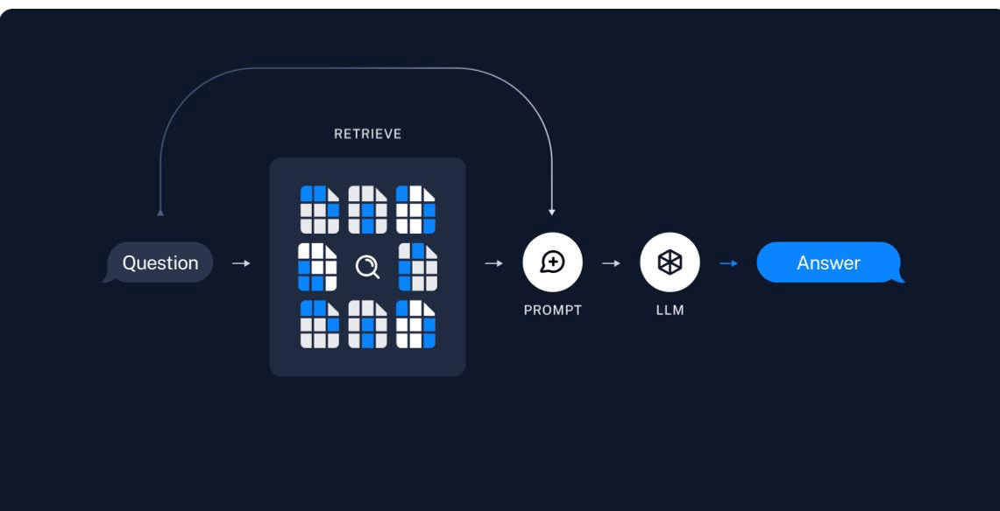
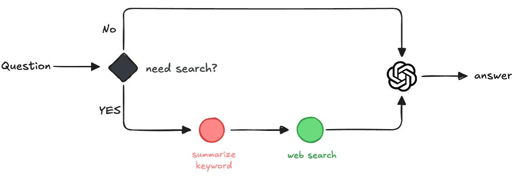

## 问题来源

某天在钉钉群里突然被 cue 到一个问题：


正好这段时间在做「大模型服务平台」建设，借着这个引子，我准备将这段时间以来从事大模型应用开发的经历，做一个知识梳理,也方便后续回顾的时候查漏补缺。

## 解决思路

大模型应用有一体两面，一面是「训练」.一面是「推理」。

训练的难度非常大，成果是一堆称为权重(weight) 的参数， 绝大多数人一般接触不到。

推理不一样，我们每天和 DeepSeek 的对话， 就是一次推理的过程。

大模型训练是基于已有知识的投喂，必然是有知识边界限制的，譬如 DeepSeek V3 训练数据的截至时间是 2024.07，理论上大模型是无法获取在这之后的知识。

为了解决这个问题，研究者提出了 RAG (Retrieval Augmented Generation) 思路来 LLM 提供一个「知识外挂」。



RAG 用较小的接入成本，让大模型获得了检索私有化知识库的能力，到目前为止依然是 Al + 知识库最为普遍的技术手段。

如果将思路再开放一点，搜索引擎就是目前世界知识(world knowledge) 获取的最佳方式之一，如果大模型 + 搜索引擎结合，是否就能够让大模型具备了搜寻世界知识的能力?

答案是肯定的，国外的 Perplexity.ai 在短短的两年时间内， 就成长为了百亿级估值的公司，撼动了传统搜索引擎的市场。

## 技术方案



### 01 判断是否需要搜索

当用户开启「联网搜索」开关以后，系统还是会调用大模型进行用户输入识别。

如果当前用户输入的内容，仅需要模型已有知识就能回答，就不需耗费资源去进行网络搜索。

毕竟用户说个”你好”，还要给出一排联网搜索内容，对于系统的智能化印象就大打折扣。

以下给出判断是否需要给出联网搜索的 prompt:

```csv
你的任务是基于用户消息上下文，确定是否需要通过检索外部信息才能正确回答。

**无需联网搜索**：
   - 纯理论/学术问题（数学计算、代码逻辑等）
   - 问题已包含完整上下文（如用户提供特定文档内容提问）

除此之外，所有其他问题都应该联网搜索，举例：
  - 如果你对用户问题不确定，无法给出确定性的回答
  - 需要实时数据，时间相关的问题（如“当前天气”等）
  - 涉及动态变化的信息（如新闻、股票价格等）
  - 用户问题中包含不确定或模糊的上下文

当前时间: {{ date }}

---

如果此用户消息无需联网搜索就能回答，回复 0，否则回复 1。
不要出现 0 或 1 之外的回答，回答中也不要包含其他内容。
```

> 注意：
>
> 这里给出 date 作为上下文参数,可以让大模型获取用户当前时间,通常这对于后续联网搜索的时效性比较有帮助。

后续阶段我们只需要检测 LLM 返回值，来决定是否开启联网搜索。

1.如果 LLM 返回值为 0，则代表无需开启联网搜索，直接调用 LLM 返回答案。

2.否则调用下一节点，联网搜索返回对应用户输入的网络内容。

### 02 生成搜索关键词

要进行联网搜索,就需要关键词。

目前的搜索引擎还不具备大模型的理解能力,我们需要根据用户输入,和当前上下文整理出合适的搜索关键词。

以下是我整理出来的 prompt:

```csv
你是一名文本关键词专家，擅长从对话中总结关键词。
你的任务是针对用户输入，结合消息对话，总结出多组最合适、精简的搜索关键词。

【关键】：
1. 不要直接回答问题
2. 不要提供与问题无关的信息
3. 不要输出非关键词内容

提取用户输入核心关键词，以及消息对话中和用户输入关联度最高的关键词。

关键词之间用空格分割，不能超过三组，每组关键词长度不超过 7 个字。

示例:
北京 周日 天气
```

这里需要注意的是，搜索关键词除了针对当前用户输入，还要包括历史消息记录，让大模型获取尽量详细的对话上下文，以方便理解。

### 03 调用搜索工具

目前大模型搜索工具主要分为两类:

1. 传统搜索引擎(基于爬虫)
2. AI 搜索服务

传统搜索引擎可以用的包括 Bing、百度、搜狗等，直接调用搜索引擎之后，再通过类似于 cheerio 这样的 DOM 处理工具提取文本、图片内容。

Al 搜索服务近两年来使用起来就更加简单，直接调用 api 即可，不过需要注意的是，大部分搜索 api 服务需要付费。

这里推荐一个开源免费的 [SearXNG](https://docs.searxng.org/)，本地部署完毕即可使用。

以下基于 typescript 定义搜索结果:

```typescript
export interface SearchResult {
  // 索引，用于查询结果标识顺序
  id?: number;
  // 搜索出的标题
  title: string;
  // 页面 url
  url: string;
  // 搜索结果缩略内容
  snippet: string;
  // 搜索结果缩略图
  thumbnail?: string;
  // 搜索网站来源
  source?: string;
}
```

### 04 组装用户输入

在完成发送给大模型之前，还有最后一步任务要做：将搜索结果作为参数，和用户输入进行组合。

有了实时结果作为上下文，大模型就能对用户输入做出及时、精准的回复了。

以下是最后一步 prompt 设计:

```csv
你是由 南湖调度系统 开发的语言 AI 助手。你将收到一个用户问题，并请为其提供清晰、简洁且准确的答案。

你还将获得一组与问题相关的背景信息，每条信息都以类似 [[citation:x]]（其中 x 是数字）的引用编号开头。请使用这些背景信息，并在每个适用句子的末尾进行引用。

你的回答必须正确、准确，并以专家的身份撰写，保持公正和专业的语气。请限制在 1000 个字以内，不要提供与问题无关的信息，也不要重复内容。如果给定的背景信息不足以回答问题，请使用“信息缺失”并附上相关主题，例如：“信息缺失：某某相关信息。”

请按照 [[citation:x]] 的格式引用背景信息。如果一个句子来源于多个背景信息，请列出所有适用的引用，如 [[citation:3]][[citation:5]]。

禁止提供 URL 或链接。

以下是背景信息集：

{{ context }}

请注意，不要盲目逐字复制背景信息。

你的回答必须使用与用户问题相同的语言。

---

以下是用户输入

{{ query }}
```

### 05 效果演示

<video width="100%" controls>
  <source src="./assets/demo.mp4" type="video/mp4" />
</video>

以上效果演示可以发现，通过联网搜索能力的加持，大模型突破了「知识盲区」。

「实时获取知识」的能力，加上大模型本身就擅长的意图识别和推理能力，可以让大模型与各个领域的知识进行深度整合。

## 总结与优化

整套流程下来，我们发现还是有不少地方可以优化。

联网搜索只是增强了大模型的知识获取能力，关键环节还是需要依赖大模型的理解和推理能力。

- 在 **01 判断是否需要搜索** 环节，一旦大模型给出了错误的判断，会造成输出结果完全不符合预期。

- 在 **02 生成搜索关键词环节**，如果历史消息过多，或者用户输入比较含糊，导致搜索关键词不够精准， 就会导致后续「投喂」的上下文质量不够好，进而影响输出质量。

- 贯穿全流程的"大模型幻觉"（hallucination）现象也会导致结果不可靠。

- 虽然目前设计的 prompt 已经经过反复验证，但很难覆盖不同用户的使用习惯，prompt 的质量对 LLM 的输出结果有至关重要的影响。

最后，本次测试的模型基本上以 7B 级别的小模型为主，如果换成更高级别的大模型可能效果会有所不同。

PS：附上本次验证使用的开源模型：

- deepseek-r1-qwen-7b
- llama3.1-8b-instruct
- qwen2.5-7b-instruct
