# 从实现原理看低代码

基于 TARS 低代码平台，你可以使用自然语言生成一个页面，并试着通过可视化搭建去完善它，必要的情况下，还能搭建一个具备完成交互功能的页面。

低代码到底有没有价值，你自己体验了才算。

## 背景

TARS 低代码平台从 3 月份启动之后，即将迎来版本首发。最近也陆续上线多个应用：

- 埋点报表
- 用户信息查询
- 资源池使用率
- ...

这期间也调研了不少业内同类产品，各家产品实现细节上各有千秋，底层原理上也各有特色。

本文将基于 TARS 的实现原理，并结合同类竞品的实现范式，对低代码的本质进行简要拆解。

## 低代码定义

在 AIGC 🔥 出圈之前，低代码是科技领域的流量担当，大大小小的科技公司都在推出自己的低代码平台，同时围绕低代码充满了各种各样的争议。

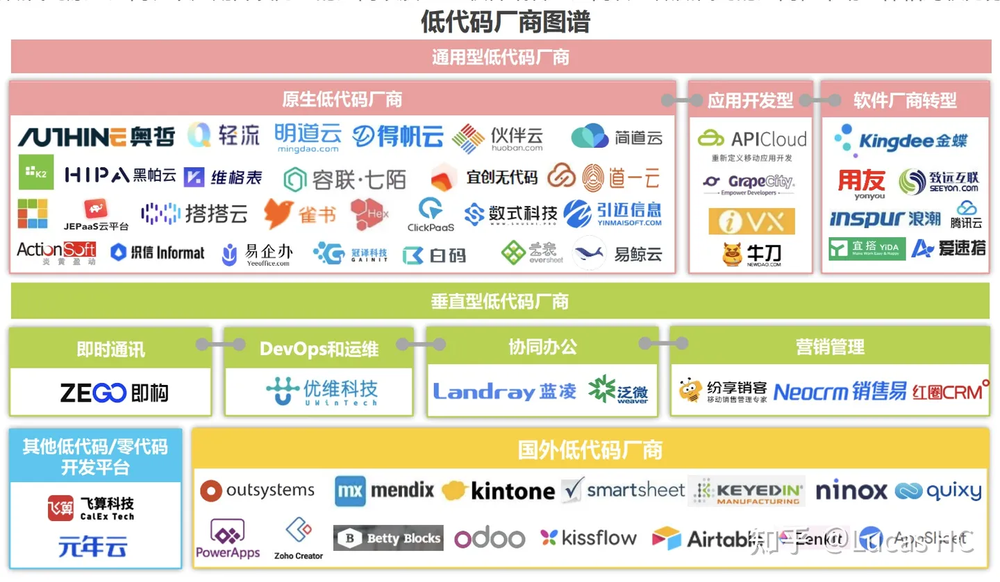

抛开现象看本质，头部分析机构 `Gartner` 对「低代码」给出的定义是：

```
An LCAP is characterized by its use of model-driven or visual development paradigms
supported by expression languages and possibly scripting…

低代码应用开发平台的特征是，「模型驱动」，「可视化开发」，并支持「表达式」和「脚本开发」的能力。
```

低代码平台的出现和流行，其实是有其历史背景的。当 web 应用的前端技术和模型设计的基础越来越成熟，低代码平台就可以站在前人的肩膀上，将应用研发带入下一个阶段。

我认为低代码平台的核心能力是「可视化开发」，「可视化开发」并非单纯的拖拉拽做个页面，而是有着完整的「可视化代码开发」能力。

围绕「可视化开发」笔者将低代码平台核心能力可以进一步拆分为三块领域：

1. 可视化搭建
2. 数据模型
3. 逻辑编排

### 1. 可视化搭建

可视化搭建是开发者对低代码最直观的认知部分。使用者可基于可视化的画布，对画布上的节点进行可视化的配置和操作。

以 lowcode-engine 为例：
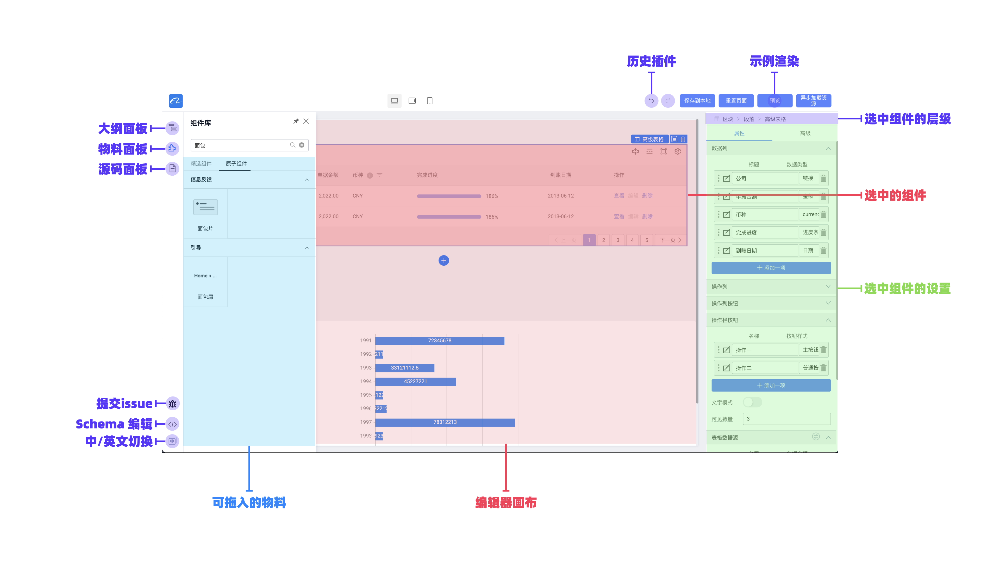

可以发现，通常低代码可视化搭建至少包含以下元素：

- 编辑器画布
- 组件库
- 组件配置器

可视化搭建背后是一套描述页面结构和相关上下文的协议，一般称为 schema 或 DSL（本文统一为 schema）。

设计器内部会包含一套解析引擎，将 schema 解析为组件树，交给框架（react、vue、native）来渲染生成页面。

#### schema

以 React 为例：

我们可以通过 JSON 来描述页面的结构：

```json
{
    "componentName": "Root",
    "children": [
        {
            "componentName": "Button",
            "props": {
                "size": "default"
                "text": "这是文本"
            },
        },
        {
            "componentName": "Input"
        }
    ]
}
```

其中 `componentName` 代表组件的唯一名称，`props` 代表组件属性，`children` 代表组件子节点。

通过平台内置渲染引擎生成结果：

```jsx
<Root>
  <Button size="default" text="这是文本" />
  <Input />
<Root>
```

值得注意的是，目前绝大多数低代码平台 schema 都是采用 JSON 格式（也有 yaml、tsx 实现），原因有两点：

1. JSON 格式对于前端比较友好，JS 原生支持
2. JSON 支持双向编辑，读取和写入一一对象

其中第二点可以让使用者在平台上直接编辑或导入 JSON，对于熟悉的开发者来说，直接操作 JSON ，比在属性面板查找配置参数效率更高。

JSON 也有缺点：

1. 格式过于严格，比如必须双引号、行尾不能有分号等
2. 不支持注释

经常碰到的 case 就是 debug 半天，发现是少了一个双引号，特别奔溃...

### 2. 数据模型

「可视化搭建」只是实现了将组件映射到画布的 UI 展示能力，实际场景下往往需要将数据绑定到 UI，并通过用户交互，将数据再提交到服务端。这一步在 TARS 上是通过「数据模型」来实现。

注意：

可视化设计器可分为「设计态」和「渲染态」，设计态可以修改组件配置，绑定数据字段，其中字段绑定并不立即生效。

预览态无法变更组件配置和数据绑定字段，但会根据设计态的配置生成实例信息

#### 场景 1：表单提交

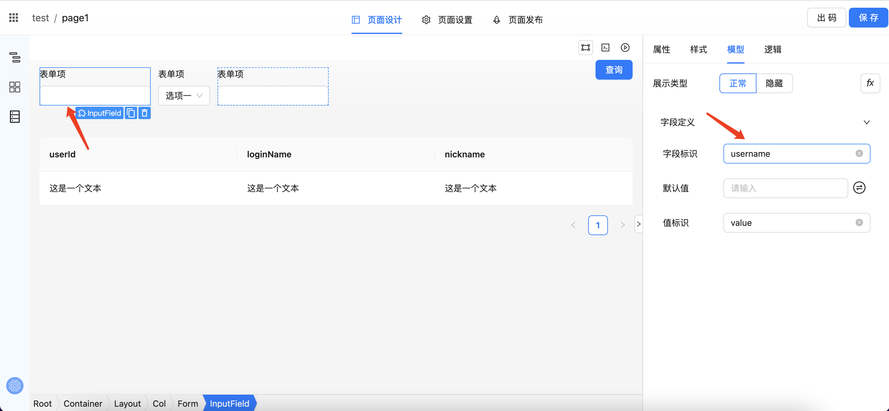

「渲染态」模式下用户在该表单项内输入的内容会存储到 `username` 字段

#### 场景 2：接口获取

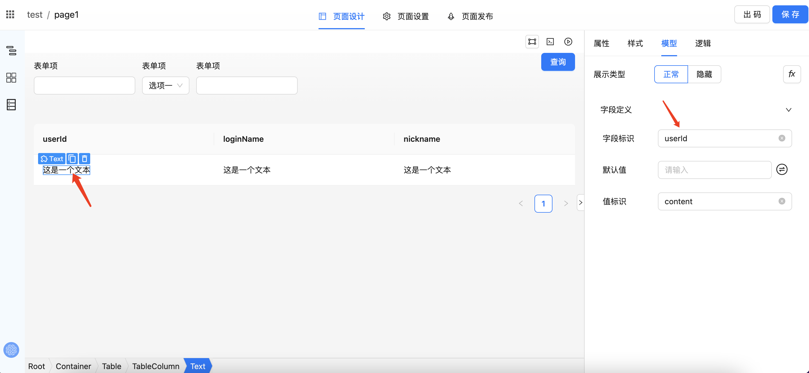

「渲染态」会从接口返回结果渲染对应表格字段

### 场景 3：组件联动

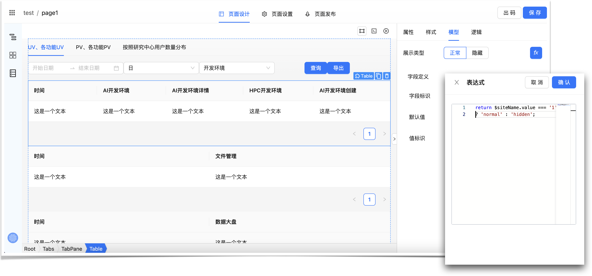

「渲染态」根据用户字段值变更动态展示组件

#### 实现原理

加入数据绑定逻辑之后，原有 schema 字段就不够用了，参考 [formily](https://formilyjs.org/zh-CN/)，我们引入一个新的字段：`x-field` 用于数据绑定。

更新之后的 schema 定义：

```
interface NodeSchema {
componentName: string;
  props?: {
    [key: string]: unknown;
  };
  'x-field'?: unknown;
  children?: NodeSchema[]
}
```

`x-field` 的状态管理使用 redux 实现， redux 虽然代码比较繁琐，好处也是很明显的，数据流清晰明了，可以精确控制订阅。基于 immutable 的数据状态方便实现历史记录管理。

`x-field` 可配置属性目前包括：

- name: 字段唯一名称，如 username
- defaultValue：默认值，可配置 string/number/bool/exp/Date 等
- valuePropName: 事件绑定字段，默认为 value，如果是 Radio 单选，需要配置未 checked
- reactionMeta: 组件联动，支持可视化和表达式能力
- validate rules: 暂不支持

##### 渲染态实现

渲染态对于页面 schema 的渲染和设计态是一样的，通过组件递归实现页面组件树渲染。根据 schema 配置，如果配置了 `x-field` 字段，就给组件包裹一个 `windBind` 高阶组件。

`withBind` 会接收 `x-field` 配置，并从 `redux` 中获取已绑定数据，完成数据绑定。

### 3. 交互逻辑

有了可视化搭建和数据模型，仅仅是完成了单一组件级别渲染和数据绑定。实际应用内的逻辑往往比组件渲染复杂 N 倍，举一个管控类系统常见的 CRUD 查询功能为例：

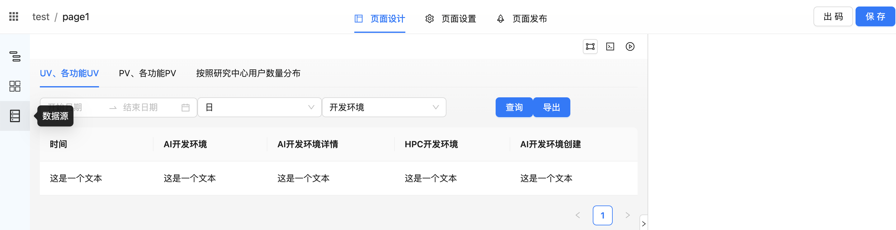

1. 给每个表单元素，表格列元素绑定相对应的字段
2. 表单项每次变更需要更新查询条件，查询条件有可能还要获取外部变量
3. 页面初始化、点击查询/重置、分页条件变更都需要发起异步请求
4. 异步请求需要根据参数和访问路径进行缓存，参数变更则缓存失效
5. 异步请求需要做好竞态管理，区分 loading、error、success 不同 UI 展示
6. 异步请求前置参数、后置返回结果需要进行适配
7. 异步远程 api 和低代码平台跨域处理
8. 根据不同的返回结果类型，来决定自定义行为，比如显示弹窗、页面跳转等

一个简单的 CRUD 查询和表格展示场景，涉及到页面级别组件的交互行为已然不少，这对于设计一套功能完备、符合使用体验、又具备足够灵活性的逻辑编排系统提出了很大的挑战。

#### amis 方案

amis 采用的是方案是「固化交互行为」，将一些常见的交互行为通过配置化实现，比如弹框是下面的配置：

```json
{
  "label": "弹框",
  "type": "button",
  "actionType": "dialog", // actionType 固定交互行为
  "dialog": {
    "title": "弹框",
    "body": "这是个简单的弹框。"
  }
}
```

amis 支持常见 `action` 行为类型：

- ui
  - drawer: 抽屉
  - toast: 消息弹窗
  - dialog: 弹窗
- 动作
  - submit
  - clear
  - search
  - 下载
  - 跳转链接
- 网络
  - ajax
- 表单
  - 校验
  - 提交
  - 重置

详细文档可参考：
https://aisuda.bce.baidu.com/amis/zh-CN/components/action?page=1

#### lowcode-engine 方案

lowcode-engine 采取了「javascript 编程」的方式，可视化界面只提供了组件搭建、属性配置的能力，一旦涉及到交互就需要通过手写 javascript 来实现。

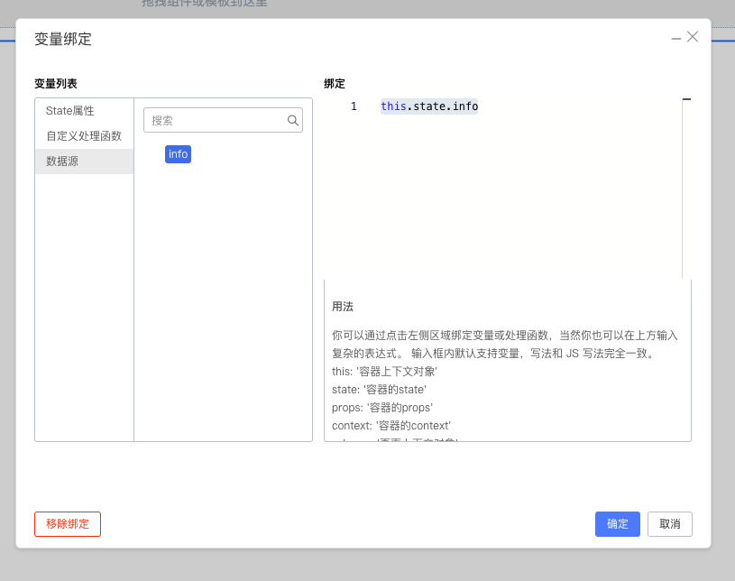

通过 javascript 实现的好处在于足够灵活，很多图形化界面难以表达的能力，可以很方便地用代码来实现。

太灵活当然也有缺陷，长期下来脚本满天飞，项目的可维护性和扩展性会遇到很多挑战。

#### outSystems 方案

outSystems 采取了流程图的策略，将各种逻辑交互能力做成一个元件，并对不同逻辑节点进行组合和串联，真正的逻辑由封装在节点中的函数完成。

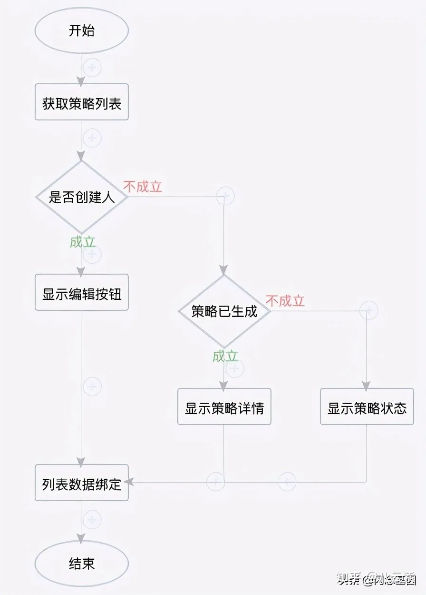

基于流程图 schema，通过 AST 语法树编译，就可以转成代码。

示例如下：

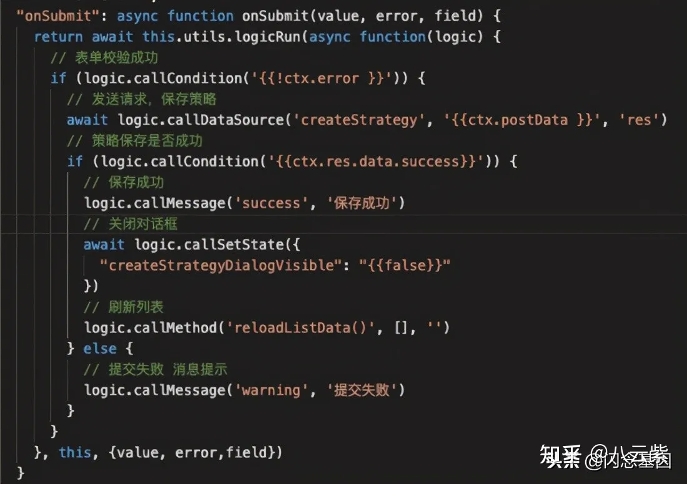

可以看出，基于流程图实现业务逻辑编排，最终会生成一个完整业务逻辑实现。

流程图的特点在于强调整个流程的结构和步骤，从实现角度来说，更偏向于「面向过程」的脚本编程。

#### BluePrint 蓝图方案

BluePrint 最早由 unreal4 推出，主要用于游戏领域创建交互式程序。它允许非开发人员通过图形化界面来创建代码逻辑，而不需要编写传统代码。BluePrint 广泛用于游戏领域创建角色、动画、关卡、特效等，也可以用于创建游戏领域的交互流程、用户界面等。

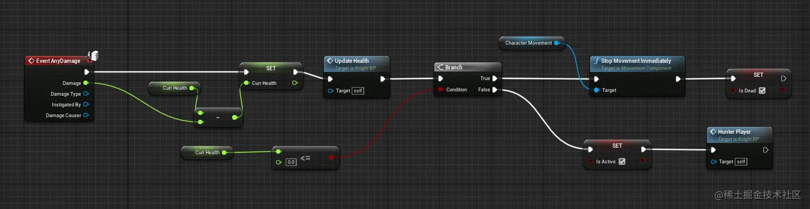

BluePrint 采用逻辑编排有别于「流程图」方案，BluePrint 逻辑元素包括输入和输出，前一个元素的输出作为下一个节点的输入，逻辑编排更加强调信息的流动和数据处理的过程，便于追踪数据流转的轨迹。

相对于「流程图」更加关注「面向过程」的脚本编程，「逻辑编排」方案基于数据流驱动的方式，更接近「面向对象」的实现。

基于以上的产品调研方案，TARS 设计逻辑编排模块选择的方案是更接近「Blueprint 蓝图」的实现。

### TARS 设计方案

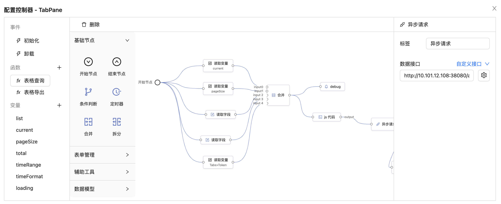

TARS 逻辑编排包括以下定义：

1. 图编排
2. 逻辑物料
3. 编排函数
4. 变量
5. 图编排解析

#### 1. 图编排

「图编排」可分为「节点」和「连线」。

节点可以实现数据转换、网络请求、属性设置、变量操作等能力，一个节点可以有「输入」和「输出」端口。

连线用来连接各个节点，代表数据的流动关系。

#### 2. 逻辑物料

同可视化搭建一样，逻辑编排的物料也封装了部分业务逻辑，系统已经提供一些常见的物料，比如循环、合并/拆分数据、异步请求、组件操作等。

#### 3. 编排函数

逻辑物料编排之后的产物可以被复用，类似于编程语言里面的「函数」，「函数」具备和编排节点一样的输入、输出逻辑。

#### 4. 变量

变量可以被可视化搭建生成的组件消费，逻辑编排内部节点可以操作、监听上下文变量，变量可以在编排图里自由流动。

#### 5. 图编排解析

逻辑编排生成的 schema 最终类似如下：

```json
{
    "nodes": [
      {
        "id": "xx-xx",
        "label": "开始节点",
        "type": "StartNode",
        "materialName": "start",
        "name": "input",
      },
      {
        "id": "xx",
        "label": "读取字段",
        "type": "DefaultNode",
        "materialName": "readFieldValue",
        "inPorts": [
          {
            "id": "tEQUNgfb",
            "name": "input",
            "label": ""
          }
        ],
        "outPorts": [
          {
            "id": "8p96kW7b",
            "name": "output",
            "label": ""
          }
        ],
        "config": {
          "fieldPath": "userIdList"
        }
      },
      {
        "id": "xx-xx",
        "label": "异步请求",
        "type": "DefaultNode",
        "materialName": "request",
        "inPorts": [
          {
            "id": "Xsul0sja",
            "name": "input",
            "label": ""
          }
        ],
        "outPorts": [
          {
            "id": "6XBGQJJB",
            "name": "success",
            "label": "success"
          },
          {
            "id": "RXsjBC68",
            "name": "loading",
            "label": "loading"
          },
          {
            "id": "4jV6aZDL",
            "name": "error",
            "label": "error"
          }
        ],
        "config": {
          "apiControl": {
            "apiType": "customApi",
            "data": {
              "url": "http://alkaidos.cn/api/app/user-center/user/queryUserDetail",
              "method": "GET"
            }
          }
        }
      },
    ],
    "edges": [
      {
        "id": "xx-xx",
        "source": {
          "nodeId": "xx-xx"
        },
        "target": {
          "nodeId": "xx-xx",
          "portId": "xx-xx"
        }
      },
      {
        "id": "xx-xx",
        "source": {
          "nodeId": "xx-xx"
        },
        "target": {
          "nodeId": "xx-xx",
          "portId": "xx-xx"
        }
      },
    ]
  }
}
```

图编排解析引擎主要做两件事情：

1. 解析编排图上的所有节点（nodes），根据每个节点的「输入端口（inPorts）」和「输出端口（outPorts）」配置生成「连接点（jointer）」实例，每个「连接点」实例有从上游连接点（如果有）获取输入数据（inputValue），内部进行数据处理之后，传递给「输出端口」生成的「连接点」实例
2. 解析所有连线（edges），连线逻辑相对简单，只负责建立「输出连接点」和「输入连接点」的关联，数据信息就会从上游节点的「输出连接点」流动到下游节点的「输入连接点」

#### DEMO 示例

以一个管控平面类系统最为常见的表格查询场景为例：

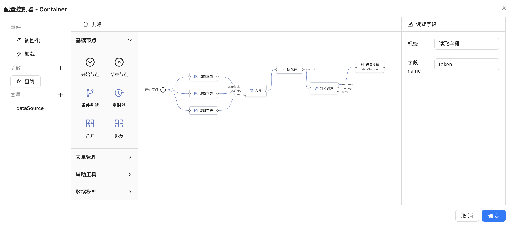

1. 定义一个变量：dataSource，作为表格的数据来源
2. 定义一个函数图编排。函数图编排从「初始节点」开始，获取相应查询字段，
   执行完合并逻辑，生成一个新查询对象，通过自定义的 js 方法进行数据组装（这一步非必需），
   传递给「异步请求」节点，请求成功后将结果赋值给 dataSouce 变量

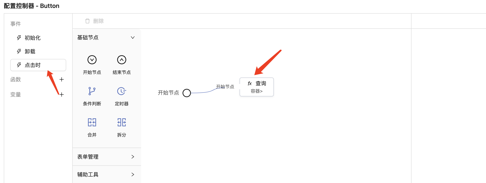

3.「查询按钮」订阅点击事件，触发函数图编排调用。

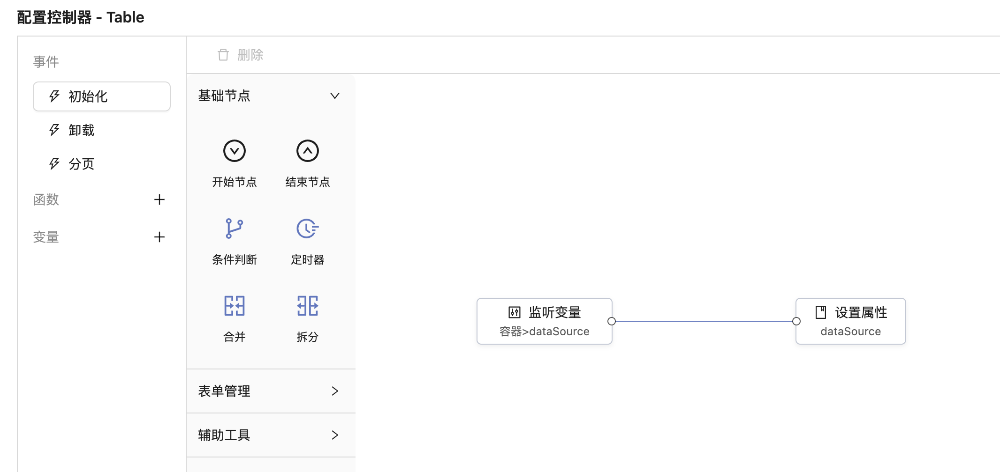

4. 表格组件监听 `dataSource` 变量，每次变更后更新数据源属性。完成渲染。

可以发现，基于逻辑图编排沿用了开发者的日常开发习惯，从定义变量、封装函数、事件监听到设置属性，对于开发者来说都是水到渠成。

每一个逻辑节点只需关心输入（input）和输出（output），业务逻辑都固化到节点内部，节点间功能相互独立，高内聚低耦合。

且节点间可以串联生成新的图节点，基于函数实现业务逻辑的可复用。

## one more thing

基于 AI 语言大模型和低代码的结合，是业界讨论的热点。TARS 在这方面也有了一些尝试，并在线上跑通了部分场景，具体效果怎样，后续有机会再分享。

## 最后

1. 19 年前后，在上一家公司也参与过前端低代码平台的尝试，当时做的平台名也叫 TARS。
   这次重新开始折腾，第一个想到的名称也是 TARS，也算是一种承前启后。
2. TARS 研发过程中得到了开源社区很多热心老师的帮助，很多灵感都来自于你们的启发，感恩。
