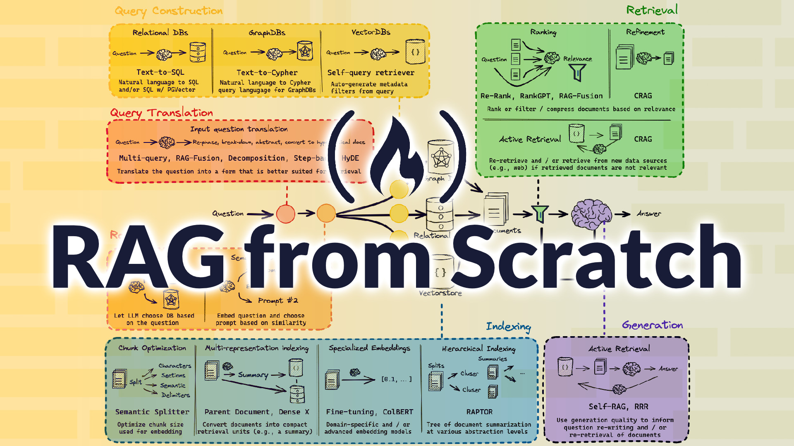
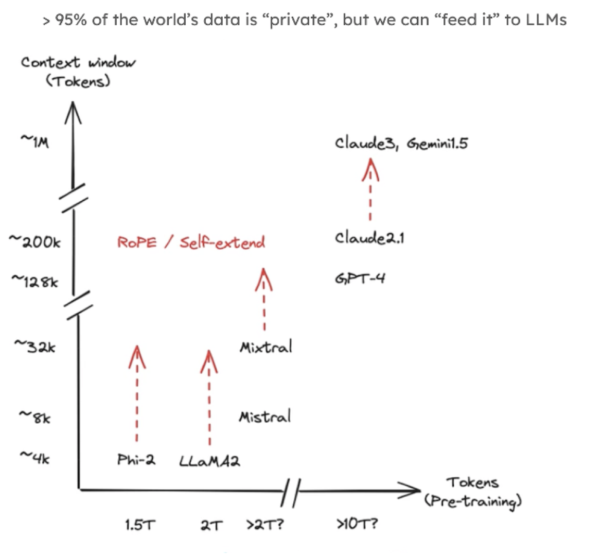
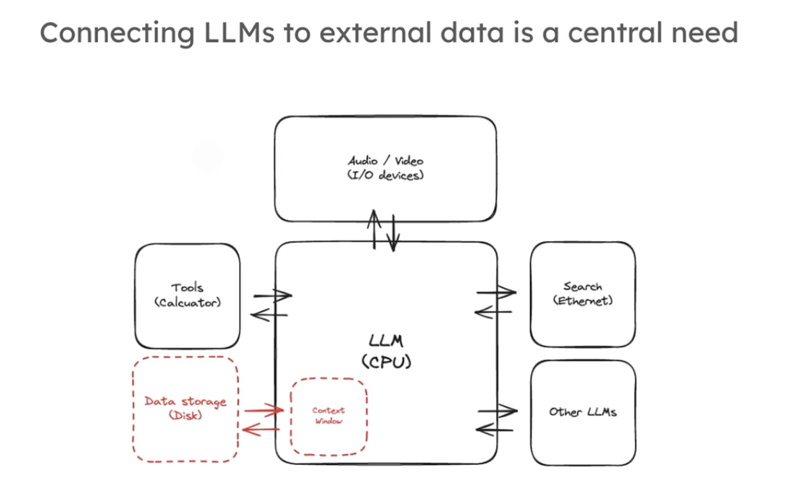
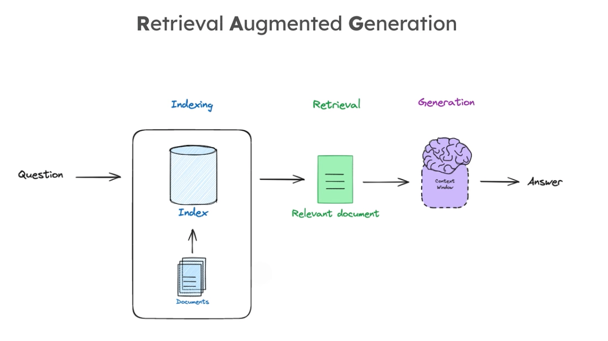
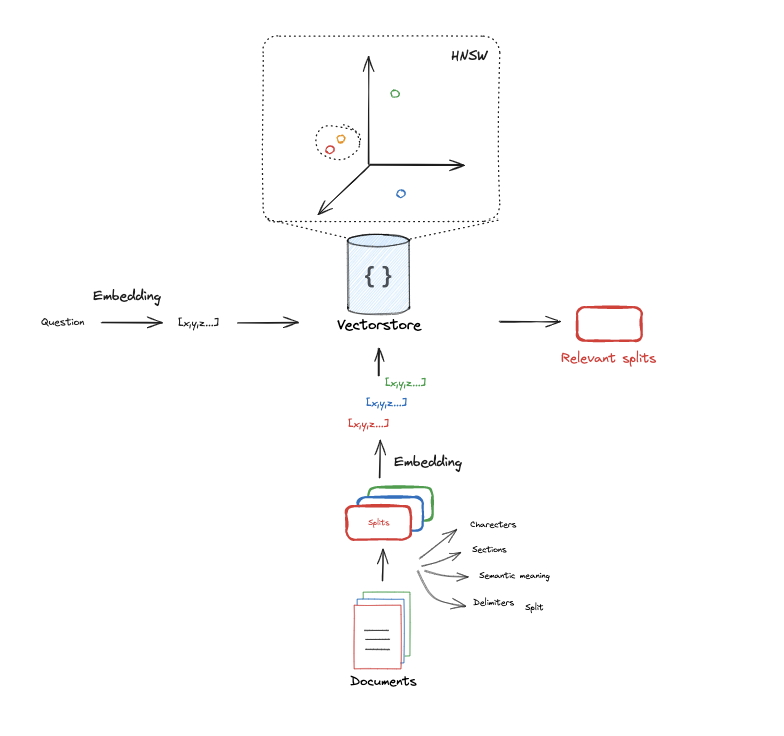
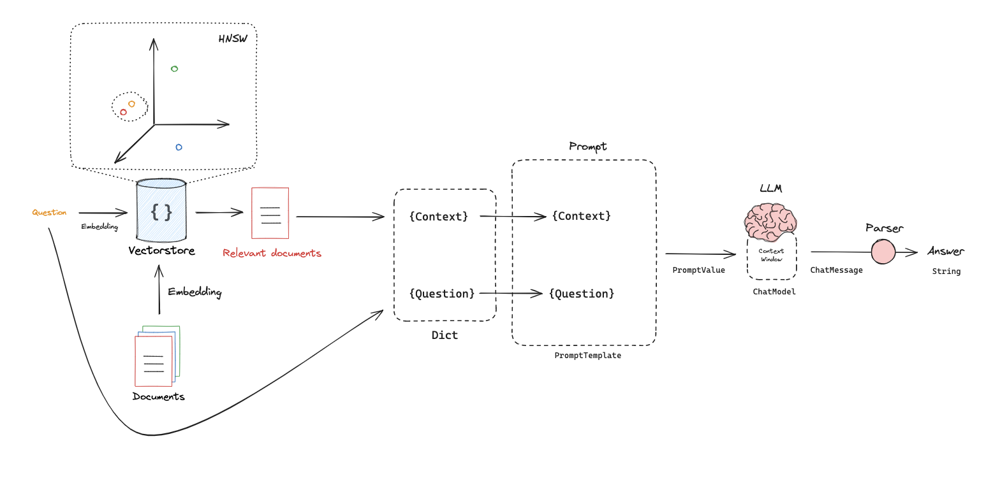

## 前言



前不久，langchain 团队在 freeCodeCamp 上开设一门[《Learn RAG From Scratch》](https://www.youtube.com/watch?v=sVcwVQRHIc8) 的课程。本系列文章将以此为范例，深入学习关于 RAG 的知识，并尝试在项目中实践。

本系列第一篇文章———RAG 概览，将围绕 RAG 相关的知识做一些概要性的介绍，为后续的实践打好基础。

### 大模型现状

#### 1. 越来越大的大模型



从 ChatGPT 横空出世不过 1 年半载时长，大模型的发展已经有了跳跃式的演进。以上图为例，横坐标代表大模型的预训练 token 数量（TB：万亿），纵坐标代表大模型一次推理的窗口（context window）token 大小（KB）。

预训练 token 存在一个跃迁，claude3 的预训练 token 数将之前模型提升了 5 倍以上。

而大模型对话窗口上下文数量限制存在两个跃迁，GPT4 将一次对话 token 限制从 4k 提升到了 128k，而最新的 claude3 进一步飞跃式到了 1M。
更夸张的是，国内的 Kimi chat 号称支持 200 万字超长无损上下文，按中文换算成 token 数量 1:2 来换算，已经到达 4M 的门槛，在可以预见的未来，context window 会持续卷下去。

即使是这样，大模型能够获取的训练数据和真实世界相比，依然是沧海一粟。绝大部分企业的私有数据大模型都是无法直接触达的，大模型和真实世界仍然存在巨大的鸿沟。

#### 2. LLM OS



关于大模型的第二个预测是，未来大模型将发展成为一个类似于 linux 的操作系统，[观点来源](https://twitter.com/karpathy/status/1707437820045062561)。

- 基于多模态（图片、文本、视频）的输入输出（IO）
- 互联互通的网络能力（function_call、search）
- 提供脚本运行环境，独立应用开发（apps）
- 长期记忆（向量数据库）和短期记忆（内存）
- 与外部数据交互（context window、RAG）

#### 3. RAG 定义



RAG 可以使大模型连接外部知识数据库，让 LLM 无需基于专有数据库重新训练，就能够获取最新的信息，并产生可靠的输出。

- 索引（indexing）：对数据进行存储，建立索引，方便检索
- 检索（retrieve）：根据用户查询，基于 LLM 检索相关的外部知识数据，这部分 RAG 核心能力
- 生成（generate）：根据检索匹配内容，合并用户查询，返回生成结果。这里需要注意的是，合并以后的 prompt 不能超出上下文窗口限制

### 课程大纲

https://www.freecodecamp.org/news/mastering-rag-from-scratch

### Part1：基础栗子

https://github.com/langchain-ai/rag-from-scratch/blob/main/rag_from_scratch_1_to_4.ipynb

```python
import bs4
from langchain import hub
from langchain.text_splitter import RecursiveCharacterTextSplitter
from langchain_community.document_loaders import WebBaseLoader
from langchain_community.vectorstores import Chroma
from langchain_core.output_parsers import StrOutputParser
from langchain_core.runnables import RunnablePassthrough
from langchain_openai import ChatOpenAI, OpenAIEmbeddings

#### INDEXING ####

# Load Documents
loader = WebBaseLoader(
    web_paths=("https://lilianweng.github.io/posts/2023-06-23-agent/",),
    bs_kwargs=dict(
        parse_only=bs4.SoupStrainer(
            class_=("post-content", "post-title", "post-header")
        )
    ),
)
docs = loader.load()

# Split
text_splitter = RecursiveCharacterTextSplitter(chunk_size=1000, chunk_overlap=200)
splits = text_splitter.split_documents(docs)

# Embed
vectorstore = Chroma.from_documents(documents=splits,
                                    embedding=OpenAIEmbeddings())

retriever = vectorstore.as_retriever()

#### RETRIEVAL and GENERATION ####

# Prompt
prompt = hub.pull("rlm/rag-prompt")

# LLM
llm = ChatOpenAI(model_name="gpt-3.5-turbo", temperature=0)

# Post-processing
def format_docs(docs):
    return "\n\n".join(doc.page_content for doc in docs)

# Chain
rag_chain = (
    {"context": retriever | format_docs, "question": RunnablePassthrough()}
    | prompt
    | llm
    | StrOutputParser()
)

# Question
rag_chain.invoke("What is Task Decomposition?")
```

### Part2：indexing（准备数据）



把文档转化为一组多维数组，我们称之为向量。为什么这么做，大模型是无法直接识别语义化输入的，必须要转成数字化的向量，方便进行计算、检索和匹配。要完成相似性检索需要有两个条件：

1. 所有的内容都要转化成向量
2. 要有向量管理和检索的工具

用户的查询经过向量化之后，经过向量数据库的相似性检索后，返回对应的文档片段，文档片段除了匹配向量之外，还会文档的元信息（metadata）。

#### HNSW

HNSW 全称 Hierarchical Navigable Small World graphs（分层-可导航-小世界-图），可以说是在工业界影响力最大的基于图的近似最近邻搜索算法，具有超快的搜索速度和出色的召回率。

在 HNSW 中，向量之间的距离计算可以有不同的算法实现，比如欧式距离（Euclidean distance），余弦近似度（Cosine similarity），OpenAI 更加建议的是使用余弦相似度算实现，[文档链接](https://help.openai.com/en/articles/8984345-which-distance-function-should-i-use)。

### Part3：retrieve（检索）

```python
# Index
from langchain_openai import OpenAIEmbeddings
from langchain_community.vectorstores import Chroma
vectorstore = Chroma.from_documents(documents=splits,
                                    embedding=OpenAIEmbeddings())


retriever = vectorstore.as_retriever(search_kwargs={"k": 1})
```

### Part4：generate（生成）



```python
from langchain_core.output_parsers import StrOutputParser
from langchain_core.runnables import RunnablePassthrough

# Prompt
template = """Answer the question based only on the following context:
{context}

Question: {question}
"""

prompt = ChatPromptTemplate.from_template(template)

# LLM
llm = ChatOpenAI(model_name="gpt-3.5-turbo", temperature=0)

rag_chain = (
    {"context": retriever, "question": RunnablePassthrough()}
    | prompt
    | llm
    | StrOutputParser()
)

rag_chain.invoke("What is Task Decomposition?")
```

### 下一章

Query Transformations，如何对输入查询（Query）进行转换，以更好的获取检索（retrieve）召回结果
