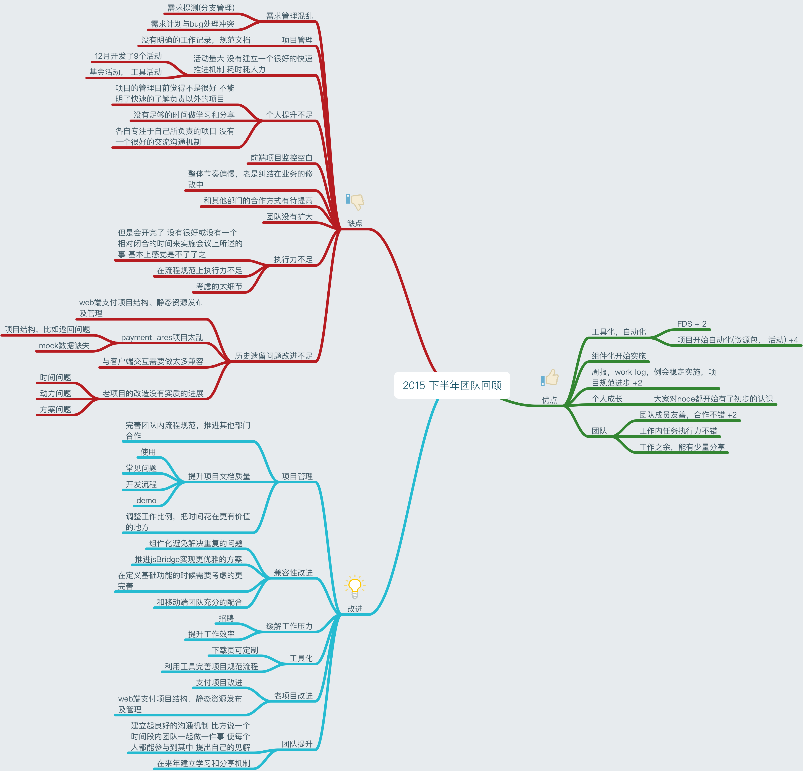
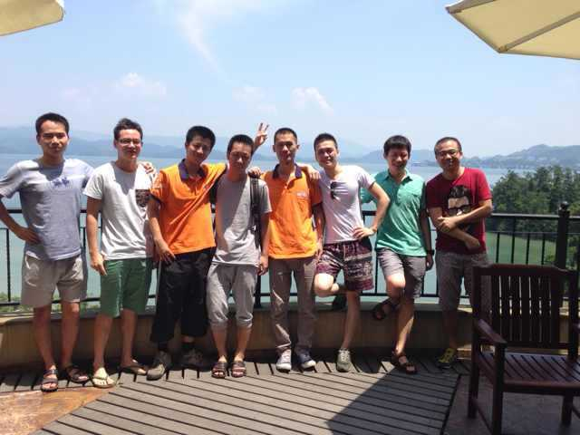
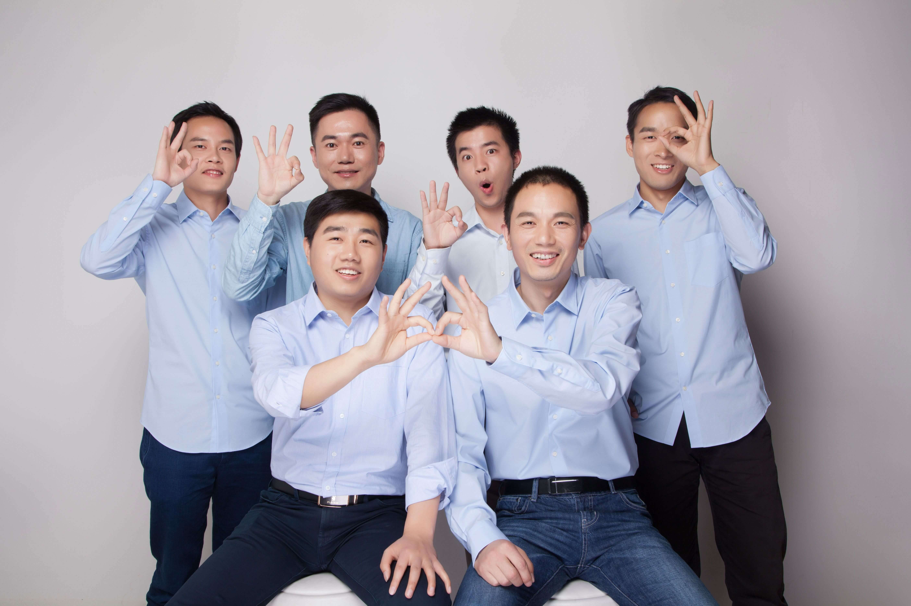
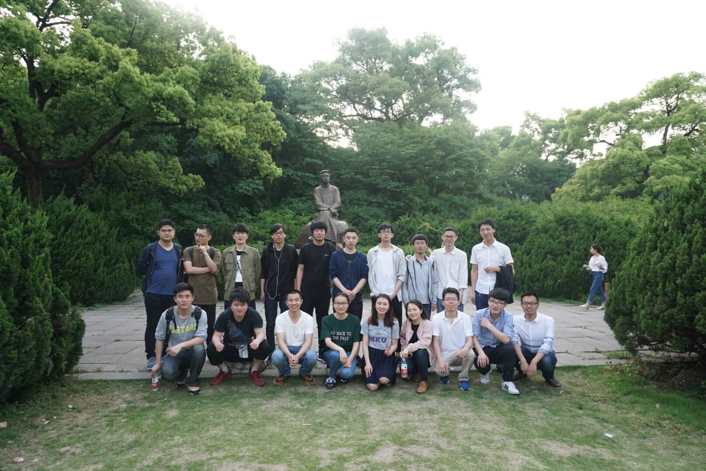
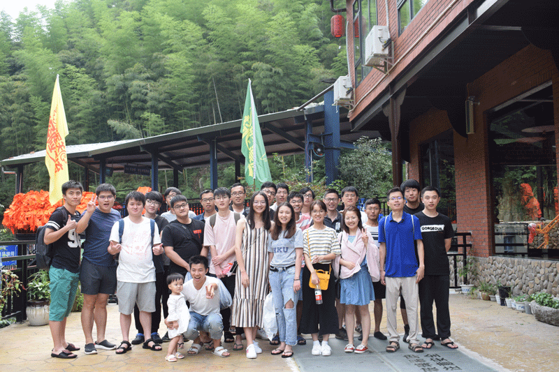
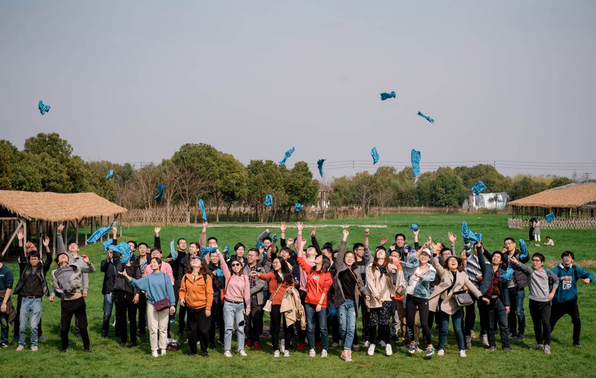
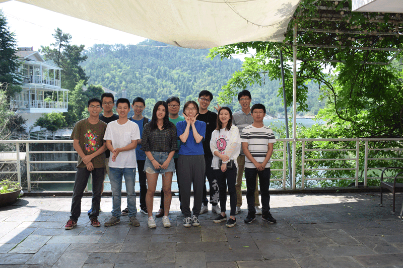

## 前言

几天前在群看到一只老视频，彼时的自己在项目小黑屋里面挑灯夜战，对着镜头谈笑风生，仿佛未来触手可及。多年以后再度重温，虽然间隔短短 5 年有余，仍是感觉白云苍狗，世事沧桑。

## 入行

2014 年入行以来，挖财虽然不是完整的职业履历，却是一段难以忘怀的漫长生涯。见惯了业务的起起伏伏，也习惯了身边同事的来来往往，绕了如此一大圈，终于还是转身，切到了一条全新赛道，重新去面对新一轮的未知。

犹记得第一次去福地创业园的时候，雪刚刚停，长长的斜坡两边积满了雪花，静待春天的到来。彼时的互联网迎来了移动互联网的春天，一大波企业都在争先恐后的抢占赛道，当时的挖财也不例外，在我入职不久以后，借助之前的记账用户积累，很快就开始启动了理财 + 信贷的模式。在移动互联网助力下，借助互联网金融的普惠理念，挖财很快在互金领域站稳了脚跟。

> 2015 518 活动

互联网的速度令人震惊，我们在短短半年之内很快就做到了单日峰值 10 亿的规模，而当时我们整个开发团队甚至不到 10 人。彼时的我们深信前途终将一片灿烂，我们终将改变当前的金融生态。

在技术演进方面，14-15 年恰逢 node.js 成熟的阶段，node.js 在 web 领域蓬勃发展，衍生了像 `gulp/webpack/express/koa` 等非常优秀的框架和工具，当时的理财团队也在公司内部率先尝试基于 node.js 的实践，我们做的第一步尝试是前端本地开发剥离 java 依赖，并且将古老的 jsp 替换为 相对更符合前端开发习惯的 velocity。当时团队大佬 @zhex 开发了非常优秀的 [fds](https://github.com/zhex/fe-dev-server) 开发工具，可以让前端在本地通过 node.js 就可以启动 java 开发环境，非常牛叉。

> 2015 年终回顾

在验证了 node.js 本地环境替代 java 环境可行性的基础上，我们下一步要做的事情就是在生产环境也引入 node。业内当时的标准方案是 BFF（Backend For FrontEnd）。我们做的也不例外，当时采用的方案是 koa + jquery + nunjucks 的方案。node.js 在应用层面对前端很友好，然而客户端和服务端对 javascript 的定位完全不同，客户端我们更加关心页面性能、用户体验等，而服务端 javascript 扮演的角色更多的是通信、规模和效率。并且我们还要思考：

- 如何打造一套分布式集群的 node 服务？
- 如何设计一套完整的应用开发、部署和回滚流程？
- 如何保证生产环境的应用运行得无懈可击？

基于 node.js 在线上大规模应用之后，我们后续陆续打造了 node 发布系统、日志服务、监控告警等 node 周边生态链，让 node 成为了公司前端选型的统一标准。

16 年之后，`React` 和 `Vue` 为代表的 `mvvm` 框架开始在社区火热起来，公司内部也分别有团队各自在生产环境运行。早期的 `React` 和 `Vue` 社区基本上是百家齐放，`Vue` 因为其上手成本低，开发配套方便吸引了一波早期用户，而 `React` 颠覆式的开发理念从一面世就吸引了广大开发者的眼光。

对一个公司而言，统一一套标准的开发框架带来的收益是巨大的，相对于 Vue，React 虚拟 DOM、JSX、单项数据流等虽有别于传统开发理念，在开发模式层面却提出了突破性的新方向。再加上 React 在社区生态上的繁荣，公司在前端选型方面就奠定了 React + Node 的基础框架。

> 理财千岛湖团建

2017 年国内互联网金融领域走上了一个巅峰，大大小小的 p2p、消费金融类公司开始野蛮生长，也为今后的互联网金融整顿埋下了隐患。可是，当时的我们哪有空想这些，看着每天不断上涨的数字，再加上媒体的各种推波作澜， 没有人会觉得末日就在眼前，然而所有命运赠送的财物，早已在暗中标记好了价格。

公司业务越来越多，在产品技术端，我们打算使用 react-native 开发新业务，一个 facebook 出品的移动端开发语言。`Learn once, write anywhere`，意味着你只要学会 `react`，用一套语言就可以开发安卓、IOS 应用。这对于企业来说诱惑太大了，原先分别要针对 安卓、ios、H5 开发三套版本，还要照顾各种平台兼容性，突然有一天，facebook 说你现在只要一套语言开发，就能够抹平三端的差异。理所当然得，公司 2017 开始了轰轰烈烈的 react native 改造计划。

现在回头来看，早期的 `react-native` 技术并不成熟，连接 `javascript` 和 `native` 之间的 bridge 通信效率极低，并且对于长列表也没有垃圾回收，导致应用的系统资源占用始终居高不下。我们做的第一个应用版本上线以后，饱受吐槽，不管是性能还是交互体验方面，不仅没有达到官方宣传的媲美 `native` 的体验，也丢失了 H5 一次部署，随时更新的动态能力。总体而言，`react native` 算不上一个好的 `native` 开发替代工具。

> 3 周年纪念

## 转岗

17 年下半年走到了一个拐点上，一方面所在业务并没有起色，另一方面长期应付各种 C 端需求有点精疲力尽。是继续从事 C 端专注于 hybrid 开发，还是转战 B 端，去探索更多业务和数据逻辑？

当时纠结了许久，在跟 2B 的 TL 简单沟通之后，就愉快的决定转岗过来，接下来的第一个重要任务就是解锁团队可视化能力建设。

> 信贷端团建之西湖

当时整个中后台团队了负责的业务跨度非常之大，从运维到大数据，从风控到用户，从贷前、贷中到贷后，从内部开发工具，到面向三方输出服务，都属于中后台团队的业务范畴。在业务扩展阶段，我们对于可视化的能力都是直接照搬开源工具。然而一旦涉及到深度定制环节，开源框架的限制就暴露出来了。我们的解决方案就是基于 D3 和 React 自研一套可视化框架，目前这套解决方案服务了全公司的可视化能力基建。

针对中后台系统开发模式统一的场景，我们团队开发了一套基于 `cli 脚手架` + `模板` + `node 中间件`的中后台解决方案。

在探索中后台系统可视化搭建方面，我们从业务组件库 + 配置服务入手，探索可视化搭建的可能性。

> 信贷端团建之安吉

## 转折

2018 年互金领域风云突变，年中伴随这买房摇号冻结政策的落地，p2p 开始了一轮大规模的暴雷，从此 p2p 暴雷成为了这两年令人胆颤心惊而又触耳可闻的新词。虽然挖财因为良好的风控措施和及时的政策调整避开了这波风暴，但覆巢之下，焉有完卵，整个互金产业爬坡爬了多年，好不容易爬到半坡，然后开始一路下滚，裹带着一路上泥沙草木，变成了滚雪球，越滚越大，什么时候会停下来？没人知道。

> 工程平台团建

19 年之后，团队经历了一波震荡，我所在团队负责的领域却更加扩大了，我们开始参与 node.js 容器化平台的建设，还将公司内部端研发体系完成统一，并且开始搭建基于微前端 + 微服务的云平台治理架构。

> 卡宴欢送会

2020 年，又是一个甲子年，真是一个令人永生难忘的年份，疫情施虐，巨星陨落，目睹了太多的生死离别，也见证了人性在灾难前的光辉闪耀。4 月 10 号，是我在挖财的 last day，在提交了最后一个 commit 之后，6 年零 46 天，划上了一个终点号。

这 6 年以来的挖财经历，经历了很多的告别，也将收获很多的重逢。要感谢的人很多，也就不一一在这里点名了，你们知道就好，不管未来身在何方，彼此在一起战斗的经历，会永驻心中，希望大家一切安好。

> 每年一度的挖财儿童节

## 尾声

> 经历的人不会都记起，过去的也不会都忘记，
>
> 有些事情有些回忆，成全了我也就陶冶了你。
>
> 《甲方乙方》
