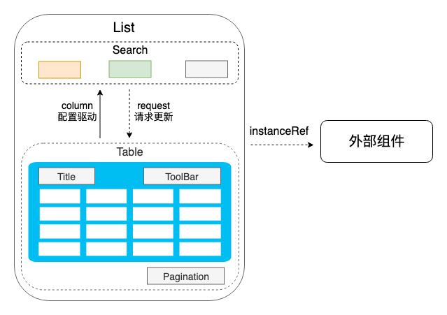
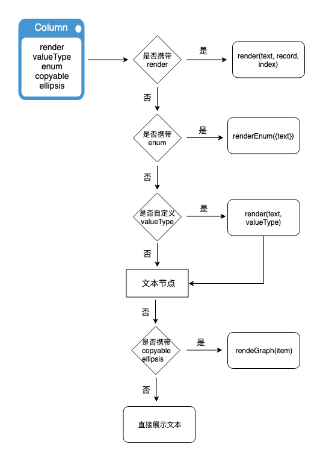
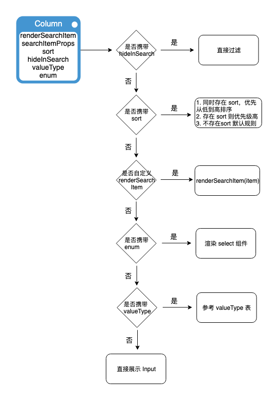

### 背景 & 目标

中后台系统的页面中多是查询+表格的展现形式，为了提高开发效率，减少重复的模版代码的书写，将公共能力收拢到组件，方便用户快速构建页面。

### 产品现状

省略，参考自身业务

### 产品要点梳理

1. 查询和表格通常是一一对应，**同时出现** 的，也有场景是 **只有表格，没有查询** 。只有查询，没有表格目前系统很少见（_如果有的话，请帮忙补充_）。

2. 查询组件只涉及到查询功能，不涉及到数据的更新操作，支持 1 个或多个数据共同查询，**查询字段通常来源于表格字段**，当然也开放自定义字段配置。

3. 查询组件需要按列布局，也要支持**展开/收缩**，查询条件可以指定顺序，也可以默认按照表格列的顺序按先后放置，目前查询操作仅限于**查询**和**重置**。

4. 表格组件**数据源是动态**的，需要通过查询条件向服务端发起请求，查询条件来自于**查询组件**，服务端请求需要做**竞态处理（onLoad, onRequestError）**，初始请求需要 `loading` 标识，查询参数来自于查询组件，以及自定义参数组合而成。

5. 表格组件展示很灵活，包括 **Title**, **ToolBar**，并且表格组件通常会带有**弹窗操作**，弹窗需要获取当前 **record** 数据，操作完毕需要更新 Table。`ToolBar` 需要提供全局操作来更新表格（刷新）。

6. 表格组件分页操作比较固定，每次查询重置当前页码，`page` 和 `pageSize` 变更重新发起请求，这一块公共逻辑需要统一封装，自定义的诉求比较少。

7. 表格列组件有很多常见的开发情景：**超出宽度文本`ellipsis`**，**支持文本复制**，**字符 filter（金额、时间、日期）**，**枚举状态处理** 等等。列组件配置可以直接复用到查询表单组件上。

### 技术设计

`List` 基于 Antd Table 进行扩展，封装了一些常用的 UI 和行为，通过将查询组件和 Table 组合起来，提供给用户一套标准化的组件实现。

#### 整体架构



#### 组件 展示


#### api 设计

> 该组件基于 `Antd Table` 扩展，默认支持 Table 所有属性，并且扩展下列其他属性：

- 应用实例

  - actionRef：返回应用实例，对外提供公共方法，比如 refresh 等
  - formRef：查询表单实例
  - showSearch: 不展示查询栏，默认为 false

- 数据请求

  - request：返回一个 promise
  - params: 请求参数
  - onLoad: 每次请求完毕触发
  - onRequestError: 请求异常触发回调

- UI 展示

  - Title：表格标题，支持 string 或者 ReactNode
  - ToolBar: 自动以工具栏组件，位于标题右侧
  - pagination: 继承 Table pagination，封装 page 和 pageSize 能力

- 配置

  - 提供 columns 作为表格列和查询表单字段

  ```
  key,
  dataIndex,
  width,
  render,
  valueType: 封装一些常见的类型filter，比如 dateTime, money 等
  hideInSearch: 查询组件字段是否展示，默认为true
  hideInTable: 不展示在Table 列，默认为 fasle
  enum: 枚举类字段，比如状态（新建，已发布，已暂停等）
  copy: 是否支持拷贝
  ellipsis: 文本溢出自动展示
  renderSearchItem:SearchItem 自定义展示
  searchItemProps: SearchItem 配置
  sort: 查询表单展示优先级
  span: 表单项自定义宽度，优先于 searchConfig.span 执行
  ```

- 查询表单配置
  - onSearch: 查询表单提交触发
  - onRest: 重置查询条件
  - searchConfig: 查询表单配置
    - span: 列宽度，默认为 8，参考 `antd cols`
    - isCollpase: 当多行分布时是否折叠，默认为 `true`
    - collpaseRows: 2, 最多未折叠展示行数
    - searchText: 搜索文本，默认`搜索`
    - resetText: 重置文本，默认 `重置`
    - collapseRender: 展开/收起 自定义渲染
    - needParamsToUrl：查询完毕更新 url，默认` false`

#### 列渲染逻辑



#### 查询表单渲染逻辑



#### valueType 设计

| valueType        |  说明   |  搜索组件  |  Table   |   search   |
| --------   | -----  |  -----  | -----  | -----  |
|  money    |  金额千分符处理  | InputNumber  | ✓ | ✓  | 
|  date        |   日期处理   |  DatePicker  | ✓ |  ✓ | 
|  dateTime     |    日期+时间    |   DatePicker(showTime)  | ✓ |  ✓| 
|  time      |    时间    | TimePicker  | ✓ |  ✓ | 
|  dateRange      |    日期区间    | RangePicker  | |  ✓ | 
|  dateTimeRange      |   日期时间区间    | RangePicker(showTime)  | | ✓  | 
|  checkbox   |  多选表单组件  | checkbox |   |  ✓ |  Enum 类型  |
|  radio   |  单选组件  | radio |   |  ✓ |  Enum 类型  |
|  inputNumber   |  数字输入组件  | InputNumber |   |  ✓ |   |
|  textarea   |  文本域组件  | TextArea |   |  ✓ |   |
