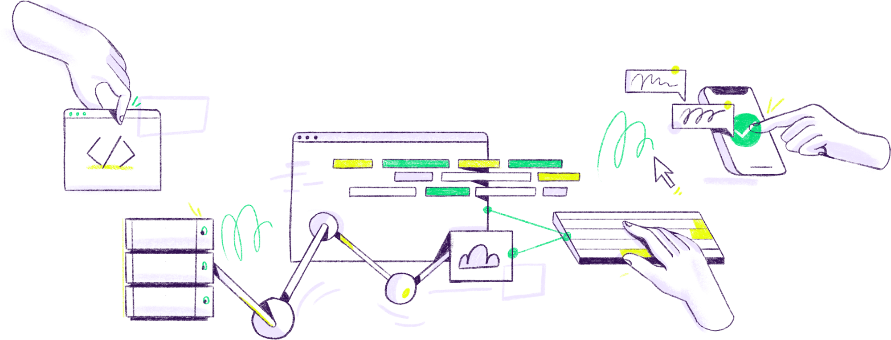

> 注：本文写于 2018 年，基于 react 15 的一些实践分享，部分内容已经不太符合最新 react 架构，请谨慎采纳



React 上手很简单，初次接触 React 的同学花半天时间差不多就能看完 React 官网文档。但要真正掌握 React 是一个漫长的过程，React 真正的威力在于其背后庞大繁荣的生态圈，redux、react-router、mobX、create-react-app、GraphQL 等，你要学习的不是一个库，也不是一个框架，而是一整套技术栈，和完整的 React 的思维方式。

本文不介绍 React 基础知识，也不介绍 React 库 的具体用法，我会分享一些 React 实战开发中的 ”令人眼前一亮“ 的案例，希望能够对你有一定的启发。当然如果你有更好的 case 分享，欢迎评论。

### 1. Component

React 有三种组件构建方式：

- React.Component
- React.pureComponent
- stateless Component

这三种组件区别可以参考 [官方文档](https://reactjs.org/docs/components-and-props.html)，这里要聊得是如何选择组件类型：

通常我们可以按照以下逻辑来确定组件应用场景：

```javascript
if (componentHasNoState) {
  // 1. 如果组件不需要维护应用状态，选择 stateless Component
  return itsStatelessComponent();
} else if (componentHasSimplePropsState && propsHasNoNestedObjects) {
  // 2. 如果组件属性简单，并且不含有嵌套数据，选择 pureComponent
  return itsPureComponent();
} else {
  // 3. 其他情况选择 Component
  return itsComponent();
}
```

> 补充：
>
> React.pureComponent 对于高响应组件（Input 等）也不建议使用，每次比较 props 有性能消耗。

### 2. refs

React 通过声明式的渲染机制把复杂 DOM 操作简化为 state 和 props 操作，但某些特场景，我们仍然离不开 DOM 操作和跨组件调用，React 开放了 ref 属性可以方便我们操作 DOM 和 调用其他组件实例。

React [创建 ref 有三种方式](https://reactjs.org/docs/refs-and-the-dom.html)：

- string 类型 ref - **deprecated，不推荐使用**
- callback ref - 推荐使用
- React.createRef() - **React 16 后添加，推荐使用**

ref 使用有几点需要特别注意：

- stateless 组件上无法直接使用，因为 stateless 组件无实例

```javascript
function MyFunctionalComponent() {
  return <input />;
}

class Parent extends React.Component {
  constructor(props) {
    super(props);
    this.textInput = React.createRef();
  }
  render() {
    // 错误，无状态组件没有实例
    return <MyFunctionalComponent ref={this.textInput} />;
  }
}
```

- stateless 组件内部可以使用 ref

```javascript
function CustomTextInput(props) {
  // ref 需要在组件初始化就创建
  let textInput = React.createRef();

  function handleClick() {
    // 无状态组件内部可以创建ref
    textInput.current.focus();
  }

  return (
    <div>
      <input type="text" ref={textInput} />

      <input type="button" value="Focus the text input" onClick={handleClick} />
    </div>
  );
}
```

- innerRef 跨组件调用

当我们需要在父组件上拿到子组件的 DOM 元素时，我们可以传递一个自定义 innerRef 直接从父组件上拿到子组件的 DOM 元素：

```javascript
function CustomTextInput(props) {
  return (
    <div>
      <input ref={props.innerRef} />
    </div>
  );
}

class Parent extends React.Component {
  _setRef = (el) => {
    this.inputElement = el;
  };
  render() {
    return <CustomTextInput innerRef={this._setRef} />;
  }
}
```

- ref 在 HOC 中传递

ref 属性类似于 key, 本质是给 React 内部使用的，无法通过 props 进行传递。在 HOC 高阶组件内部，ref 往往不能正确获得内部实例，类似于 [react-redux 实现](https://github.com/reduxjs/react-redux/blob/d769be59dafde13cee509185f1bab385b90dd9e7/src/components/connectAdvanced.js#L179-L189)，我们需要对组件增加 getWrappedInstance 和 setWrappedInstance 方法：

```javascript
function HOC(WrappedComponent) {
  class HOCComponent extends React.Component {
    // 提供对外实例的方法
    getWrappedInstance = () => {
      return this.wrappedInstance;
    };

    // 实现 ref 的访问
    setWrappedInstance = (ref) => {
      this.wrappedInstance = ref;
    };

    render() {
      return <WrappedComponent ref={this.setWrappedInstance} {...this.props} />;
    }
  }

  return HOCComponent;
}

const App = HOC(Wrap);

<App
  ref={(comp) => {
    // 只能获取到 HOCComponent
    console.log(comp);
    // 通过中转后可以获取到 WrappedComponent
    console.log(comp.getWrappedInstance());
  }}
/>;
```

- 穿云箭 React.forwardRef

React 16 可以通过 React.forwardRef 更加方便地从父组件传递 ref 到子组件，`ForwardRef` 字面意思就是 `forward(传递)ref`。

我们对上面定义的 HOC 高阶组件做一个改造：

```javascript
function HOC(WrappedComponent) {
  class HOCComponent extends React.Component {
    render() {
      const { forwardRef, ...rest } = this.props;
      return <WrappedComponent ref={forwardRef} {...rest} />;
    }
  }

  return React.forwardRef((props, ref) => (
    <HOCComponent forwardRef={ref} {...props} />
  ));
}

const App = HOC(Wrap);

<App
  ref={(comp) => {
    // 此时就能直接拿到内部组件实例了
    console.log(comp);
  }}
/>;
```

### 3. React-Router 支持路由动态布局

一个复杂的单页应用往往有不止一种 页面布局 展示，比如 A 页面布局是：

```javascript
<Header>
  <Asider>
  <Main>
<Footer>
```

B 页面的布局是：

```javascript
<Header>
  <Main>
<Footer>
```

我们希望实现根据页面路由自定义页面布局展现。

在单一页面布局下，我们通常是这么架构应用路由：

```javascript
<Layout>
  <Switch>
    <Route>
```

为了支持动态 `layout` 布局能力，就无法再沿用 `Layout` 嵌套 `Route` 来实现，我们希望能够实现 `Route` 嵌套 `Layout`：

类似于：

```javascript
<Route {...props}>
  <Layout />
```

这样就可以实现动态路由布局能力了。

`react-router` 提供了 [render](https://reacttraining.com/react-router/web/api/Route/render-func) 方法来自定义`Route`组件。

对 Route 稍加改写就可以支持了：

```javascript
const BaseRoute = ({ component: Component, ...rest }) => {
  return (
    <Route
      {...rest}
      render={(matchProps) => (
        <BaseLayout>
          <Component {...matchProps} />
        </BaseLayout>
      )}
    />
  );
};
```

于是我们在外部调用即可：

```javascript
<Router>
  <Switch>
      <BaseRoute path='/guide' exact component={QuickStart} />
      <WithoutSideBarRoute path='/demo' exact component={Demo} />
      <Redirect to='/guide' />
   </Switch>
<Router>
```

这样我们就可以将`Router`和`Layout`组合起来，衍生出各种布局能力了。

### 4. 单页应用 PV 统计

传统页面 PV 统计是基于页面之间链接跳转实现，但在单页应用里页内路由替代了请求新的页面，PV 统计只在应用初始化才会触发，这就意味着我们需要新的单页应用 PV 统计方案。

我们有两种方式来实现 PV 统计：

1. 监听 hashChange 变化上报 PV
2. 基于 decorate 装饰 Route 组件，每次参数变更上报 PV

第 1 种方案很好实现，在路由文件上侦听 hashChange 事件即可

```javascript
hashChangeHandle = () => {
  ReactGA.pageview(`${location.pathname}${location.search}`)
}
componentDidMount () {
  window.addEventListener('hashchange', this.hashChangeHandler)
}
componentWillUnmount () {
  window.removeEventListener('hashchange', this.hashChangeHandler)
}
```

第二种方案的本质是当路由组件参数变更时，意味着此时路由 `path` 参数变更，直接监听 `componentWillReiveProps` 就能实现 PV 上报。我们需要一个装饰器方法将路由组件包装好。

```javascript
const withRouter = () => (WrappedComponent) => {
  return class extends React.PureComponent {
    trackData = (props) => {
      const { location } = props;
      // 上报PV
      ReactGA.pageview(`${location.pathname}${location.search}`);
    };

    componentDidMount() {
      // 初始化也要上报PV
      this.trackData(this.props);
    }

    componentWillReceiveProps(props) {
      // 每次路由参数变更上报PV
      this.trackData(props);
    }

    render() {
      return <WrappedComponent {...this.props} />;
    }
  };
};
```

在外面调用就很简单了，将 `BaseRoute` 包装一层即可。

```
// ....BaseRoute 原有逻辑
export default withRouter()(BaseRoute)
```

### 5. 权限控制

权限控制是中后台系统的核心功能之一，权限控制一般分为页面粒度和页面元素粒度。

当我们需要对页面元素粒度进行权限控制时，譬如我们需要页面上 button 按钮根据是否有权限，来控制展示或隐藏：

```jsx
render () {
  const {code, resouceList} = this.props
  let hasAuth = resouceList.includes(code)
  return (
    <div>
      {hasAuth ? (<button>创建用户</button>) : null}
    </div>

  )
}
```

一个元素这么写当然没问题，但是如果有 10 个元素需要加权限控制，或者按钮的显示逻辑修改了呢，我们需要一个更加通用的解决办法。

我们可以创建一个组件容器组件专门负责管理权限：

```javascript
function AuthContainer({ resourceList, children, code }) {
  const hasAuth = resourceList.includes(code);
  return hasAuth && children;
}
```

然后将上面的组件改写一下：

```javascript
render () {
  const {code, resouceList} = this.props
  return (
    <AuthContainer code={code} resouceList={resouceList}>
      <button>创建用户</button>)
    </AuthContainer>
  )
}
```

重构完的代码无论是从语义性，还是扩展性都有很大的提升。

### 6. currying React

currying 柯里化是函数式语言基础的写法，通俗化来说就是把多个参数的函数变换成接受一个个单一参数的函数，并且在最后返回新函数。

也广泛应用在 React 及其周边库的写法中，像常用`react-redux` 中 `connect(mapStateToProps, mapDispatchToProps)(App)` 就是标准的柯里化写法。

以下举个栗子来阐释柯里化在 React 开发中的实践：

- 多个过滤条件合并

现在有一个 case，我们分别需要针对 price、age、brand 三个维度过滤筛选产品列表

```javascript
// 通常实现
class Filters extends React.Component {
  // 更新价格条件
  updatePriceFilter = (newValue) => {
    this.props.selectionsChanged({
      ...this.props.filterSelections,
      price: newValue,
    });
  };

  // 更新年龄条件
  updateAgeFilter = (newValue) => {
    this.props.selectionsChanged({
      ...this.props.filterSelections,
      ages: newValue,
    });
  };

  // 更新品牌条件
  updateBrandFilter = (newValue) => {
    this.props.selectionsChanged({
      ...this.props.filterSelections,
      brands: newValue,
    });
  };

  render() {
    return (
      <div>
        <PriceFilter priceChanged={this.updatePriceFilter} />
        <AgeFilter agesChanged={this.updateAgeFilter} />
        <BrandFilter brandsChanged={this.updateBrandFilter} />
      </div>
    );
  }
}
```

我们发现，三个过滤方法除了过滤条件不一样，其他代码逻辑几乎一样，如果后续再增加一个过滤条件，我们几乎是需要再拷贝一遍代码，这不科学。

```javascript
// 柯里化实现
class Filters extends React.Component {
  // 合并过滤条件
  updateSelections = (selectionType) => (newValue) => {
    this.props.selectionsChanged({
      ...this.props.filterSelections,
      [selectionType]: newValue,
    });
  };

  render() {
    return (
      <div>
        <PriceFilter priceChanged={this.updateSelections("price")} />
        <AgeFilter agesChanged={this.updateSelections("age")} />
        <BrandFilter brandsChanged={this.updateSelections("brand")} />
      </div>
    );
  }
}
```

很明显，柯里化改造后的代码大大简化了代码逻辑，也增强后续扩展性。

> > 更新
>
> 目前这种实现方式，还是会导致每次重新创建匿名方法，应该通过如下方式，才能避免文中所说的匿名方法重复创建问题：
>
> updateSelectionsPrice = updateSelections('price')
>
> updateSelectionsAge = updateSelections('age')
>
> updateSelectionsBrand = updateSelections('brand')

### 7. recompose 让生活更美好

[recompose](https://github.com/acdlite/recompose/blob/master/docs/API.md) 是一个优秀的 React 社区开源库，提供了一系列小而美的高阶组件和工具类方法，可以看成是 React 的 lodash。

- pure：可以将函数式组件实现 PureComponent 的能力，减少重复渲染
- withProps: 给组件添加属性，譬如可以将当前页面的路由信息、一些需要计算的信息作为属性注入到组件
- withPropsOnChange: 类似于 withProps, 当时只有当传入组件发生变更才会重新计算属性注入到组件中
- defaultProps：添加默认属性（常用于公共属性的提取和添加）
- setPropTypes：设置属性类型（常用于公共属性设置）
- compose：将多个高阶组件组合起来

```javascript
composedHoc = compose(hoc1, hoc2, hoc3)(App);
// 实际上等于
hoc1(hoc2(hoc3(App)));
```

希望 recompose 同样能够成为你开发的得力助手。
