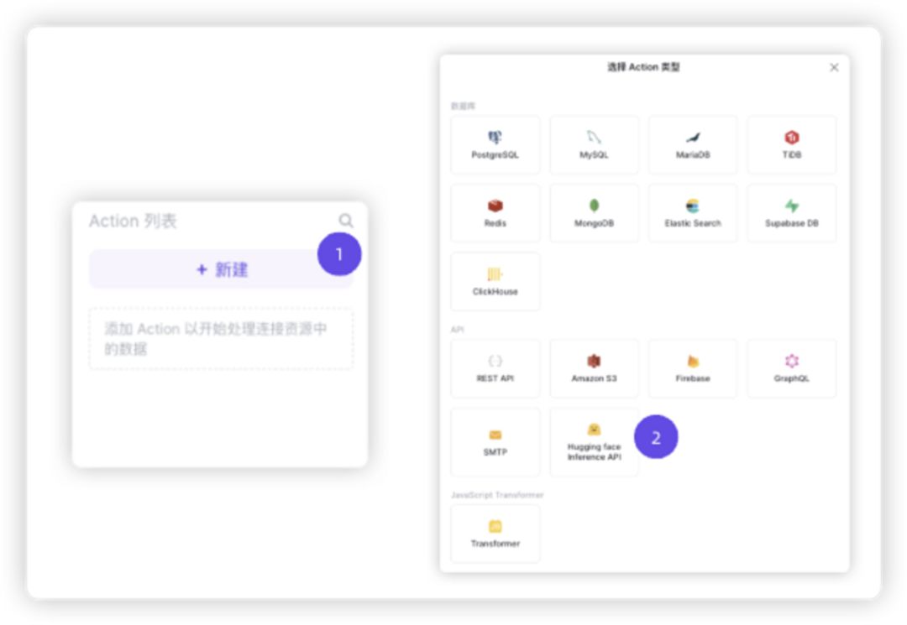
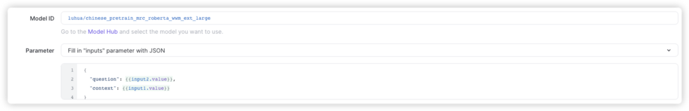

## 背景

ChatGPT 由 由 Chat 与 GPT 两部分组成。

Chat 不重要，GPT 才重要。

那什么是 GPT，它的全英文是 Generative Pre-trained Transformer。

翻译过来就是「通用」「预训练」Transformer（不是变形金刚哦）。

「通用」代表业务领域，不用多说；

「预训练」简单理解为领域已有知识的汇总，有了这个知识储备，就能快速进入某一个领域；

Transformer 则是真正赋予 ChatGPT 生命力的灵魂，Transformer 是 NLP（自然语言处理）领域的变形金刚，自 2017 年出来以后，将之前如日中天的两大神经网络领域的卷王 RNN（循环神经网络），CNN（卷积神经网络）快卷没了。

真所谓，天下武功，唯卷无敌。

之所以介绍这段背景，是因为创建 Transformer 模型背后的公司也非常了不起，公司名叫 HuggingFace（笑脸）。

HuggingFace 提出 Transformer 模型的时候，NLP 领域的资源还比较匮乏，如日中天的还是 CV（计算机视觉）的各种 XNN，于是 HuggingFace 创建了同名开源社区（https://huggingface.co/），并很快成为了 AI 领域开源模型、数据集等最大的社区，目前开源模型超过了 160000+，开源数据集也达到了 25000+，是当之无愧的 AI 领域的 github。

ChatGPT 一夜爆火的背后，其实就像黑夜逐渐泛白一样，当数量持续积累并突破阈值之后，时代的变化浩浩荡荡，一个新的时代正在冉冉升起。

## 低代码和 AI 的关系

在 chatGPT 出现之前，AI 和低代码的形态就已存在。

### 1. AI 推理服务

[ILLA Builder](https://github.com/illacloud/illa-builder) 是一款面向企业的低代码开发平台，对标（抄袭）的是国外知名的 retool（估计 20 亿美金）。ILLA 提供了连接器（link）的概念，可以快速接入外部数据平台（sql/excel/api）等，其中就包括对接了 huggingface inference api：





最终实现的效果如下：


### 2. sql 查询

sql 本质上是特定领域（数据库）的一套结构化语言实现，在 chatGPT 之前已经有很多 NLP 模型实现了两者之间的转译，比如浙大发表的论文：[NL2SQL](https://github.com/yechens/NL2SQL)，在测试数据集上已经实现了 65.3% 的准确率。

目前基于 GPT 实现 sql 查询产品也不少，比如：[sqlchat](https://www.sqlchat.ai/)，是国内 DevOps 创业公司 bytebase 基于 chatGPT 推出了第一款交互式的 sql 生成工具。


### 3. 工作流

Retool 把自然语言查询能力直接集成了低代码的「工作流」模块，[链接](https://retool.com/blog/gpt4-in-retool/)，操作步骤如下：


1. 选择数据源（sql/excel 等），设置触发周期（定时任务）
2. 基于 gpt-4 输入文本描述（instruction），设置上下文变量
3. 完成 sql 转译，并输出结果到下一个节点

工作流 + 物料插件 + AI 模型理论上完全能够实现复杂的业务交互能力，对低代码的能力边界有了更大的想象力。

### 4. 引导式内容生成

引导式则将是通过一些面向用户的标准提问（Prompts），引导用户将需求清晰描述出来，然后用 GPT 生成格式化的输出，并由低代码引擎完成渲染。

和通过 GPT 生成文字和图片不同，代码平台对于 GPT 生成的内容的「准确度」和「结构化」程度要求更高，意味着对 GPT 模型的领域定制也会更深入。

来自杭州本地的创业公司 myBricks 低代码平台已经有了一定的雏形：

https://mp.weixin.qq.com/s/7tzC2_DVaTro7Q0mkXGCzA

以目前自研中的 TARS 低代码平台为例，一段页面级别的 schema 定义如下：

```json
{
  "componentName": "Root",
  "children": [
    {
      "componentName": "Form",
      "props": {
        "layout": "horizontal",
        "disabled": false,
        "style": {}
      },
      "children": [
        {
          "componentName": "FormItem",
          "props": {
            "label": "名字"
          },
          "children": [
            {
              "componentName": "Input",
              "props": {
                "placeholder": "请输入",
                "value": ""
              },
              "x-field": {
                "type": "string",
                "name": "value"
              }
            }
          ]
        }
      ]
    }
  ]
}
```

理论上后续基于大模型推理能力和大量的数据训练，生成针对 TARS 页面搭建的模型能力，就能直接通过录入这样一段 schema 来完成页面的搭建。

## 总结

1. 低代码 和 GPT 可以相互融合，GPT 更适合通过插件集成的方式，进一步降低平台的开发成本；
2. 已有的模型推理服务，可以直接在低代码平台使用；
3. GPT 对于一些结构化、模板化开发场景（sql、文档生成、测试用例）有潜在的优化可能；
4. GPT 和工作流场景天然匹配，补齐了低代码平台自定义交互的天然缺陷；
5. GPT 结合 Prompt 能够快速生成低代码 schema，但需要深度模型定制。
